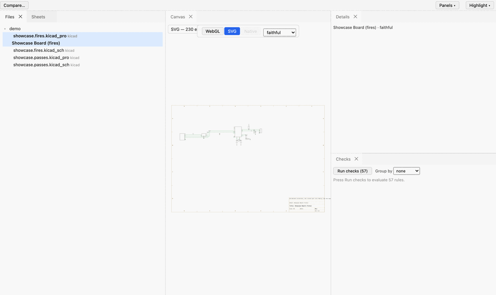

# agni

An engine for electronic design files. It reads schematics and PCBs from several formats
into one neutral, protobuf-defined IR, then checks, diffs, renders, and queries them. The
front-end normalizes formats the way a compiler normalizes languages into one AST, so every
analysis downstream is written once and works on all of them.



## What it does

- **Reads many formats into one IR.** EDIF netlists and schematics, KiCad schematics and
  boards, IPC-2581, xschem, and gEDA all parse into the same `ir.Design`. Adding a reader is
  one entry in `formats/registry.go`.
- **Structural checks (ERC/DRC-like).** Missing I2C pull-ups, unprotected exposed signals,
  power rails without decoupling, boards that fail track-width rules. Findings come out in
  plain language and cite the net or component they fire on.
- **Revision diff over the IR.** Compares two revisions structurally (components, nets,
  connectivity), not as a text diff of the source files, so it survives reformatting and
  rename churn.
- **Rendering.** Faithful schematic and board geometry, or an auto-laid-out netlist graph,
  to SVG or a WebGL canvas.
- **A browser viewer.** `agni serve` opens the tree, renders a design, runs the checks, and
  locates each finding on the canvas.
- **A datalog query surface.** Ask arbitrary questions of the design fact base
  (`agni query`), the same fact base the rules are built on.
- **A datasheet parameter layer.** Join a design against extracted datasheet limits and
  check, for example, that a rail stays inside a part's recommended operating range.

## Try it in 60 seconds

No private data needed. The `demo/` folder holds two shareable KiCad boards: a clean one and
the same board with deliberate design issues.

```
git clone https://github.com/panyam/agni
cd agni
make agni
./bin/agni check demo/showcase.fires.kicad_pro
```

```
findings by rule:
  bulk-cap               2
  decoupling-present     2
  esd-protection         2
  i2c-pull-up            1
  input-protection       1
  test-point-coverage    2

  [error]   i2c-pull-up: SCL (I2C net has no pull-up resistor)
  [warning] input-protection: VBUS (connector feeds a power input with no fuse or TVS in the path)
  [info]    esd-protection: USB_D+ (externally-exposed signal net has no ESD protection)
  ...
```

Then open the browser viewer on the same boards:

```
make demo
```

Load `showcase.fires.kicad_pro` in the left tree, press Run checks, and click a finding to
locate its net on the schematic. See [demo/README.md](demo/README.md).

## How it works

One contract sits in the middle: the protobuf IR (`protos/`, generated into `gen/`). Readers
(`edif/`, `kicad/`, `ipc2581/`, and the xschem/gEDA readers) are the only code that knows a
file format; they produce `ir.Design`. Everything else — `check/`, `diff/`, `render/`, the
query engine, the web service — consumes the IR and never looks at a source file. Add a
reader and every analysis works on the new format for free. Add an analysis and it works on
every format for free.

The same shape repeats at two more contracts: a geometry IR that N producers fill and N
renderers draw, and a parameter IR that N datasheet extractors fill and the checks read.

## Formats read today

| Format | Extensions | Netlist | Faithful geometry |
| --- | --- | --- | --- |
| EDIF 2.0.0 | `.edn` `.edf` `.edif` (netlist), `.eds` (schematic) | yes | schematic |
| KiCad | `.kicad_sch` `.kicad_pcb` `.kicad_pro` | yes | schematic + board |
| IPC-2581 | `.xml` `.cvg` | yes | board |
| xschem | `.sch` (sniffed) | yes | schematic |
| gEDA gschem | `.sch` (sniffed) | yes | schematic |

## Documentation

- [docs/GETTING_STARTED.md](docs/GETTING_STARTED.md) — build, symbol libraries for
  xschem/gEDA, native EDA tools, golden comparisons.
- [docs/userguide/](docs/userguide/README.md) — concepts, the CLI, checks, diff, and the
  query language, written for someone new to the tool.
- [docs/ANALOGY.md](docs/ANALOGY.md) — the hardware-to-software analogy map. If you read
  code but not schematics, start here.
- [examples/README.md](examples/README.md) — runnable walkthroughs, one per feature.
- [docs/README.md](docs/README.md) — the engineering docs: IR and ingestion, geometry and
  rendering, semantic diff, format primers.
- [CONSTRAINTS.md](CONSTRAINTS.md) — the enforceable architectural rules; read before
  proposing changes.
- [docs/25-open-core.md](docs/25-open-core.md) — the open-core split: this public engine,
  and how a private overlay adds proprietary readers and rules without forking it.

## Status

Agni reads real exports from every listed format and runs its full analysis over them. It is
young: the format coverage is bounded (see each reader's notes), the rule catalog is growing,
and the datasheet extraction pipeline is early. The architecture is the settled part; the
breadth is the work in progress. Issues and readers for new formats are welcome.

## Building

Requires Go 1.26 and pnpm (for the web viewer bundle).

```
cd web && pnpm install && cd ..   # once
make build                        # web bundle + go build ./...
make install                      # install the agni CLI to $GOBIN
make testall                      # the full gate: vet, tests, bundle, web unit tests
```

## License

Apache-2.0. See [LICENSE](LICENSE) and [NOTICE](NOTICE).
