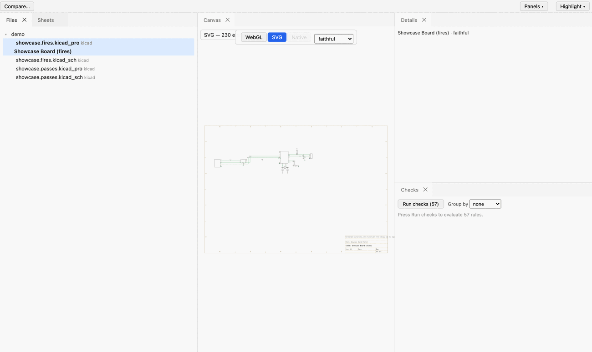

# Agni

[](https://github.com/panyam/agni/actions/workflows/ci.yml)
[](https://pkg.go.dev/github.com/panyam/agni)
[](https://goreportcard.com/report/github.com/panyam/agni)
[](LICENSE)
[](go.mod)

Agni is an engine for electronic design files. It reads schematics and PCBs from several
formats into one neutral, protobuf-defined IR, then checks, diffs, renders, and queries
them. The front-end normalizes formats the way a compiler normalizes languages into one AST,
so every analysis downstream is written once and works on all of them.



## What does it do

- **Reads many formats into one IR.** EDIF netlists and schematics, KiCad schematics and
  boards, IPC-2581, xschem, and gEDA all parse into the same `ir.Design`. Adding a reader is
  one entry in `readers/formats/registry.go`.
- **Runs ERC/DRC-like structural checks.** They catch missing I2C pull-ups, unprotected
  exposed signals, power rails without decoupling, and boards that fail track-width rules. Findings come out in
  plain language and cite the net or component they fire on.
- **Diffs revisions over the IR.** It compares two revisions structurally (components, nets,
  connectivity), not as a text diff of the source files, so it survives reformatting and
  rename churn.
- **Renders to SVG or a WebGL canvas**, drawing either the faithful schematic and board
  geometry or an auto-laid-out netlist graph.
- **Runs a browser viewer.** `agni open <design>` serves one board and prints its URL; `agni serve` opens a
  tree of them. Either renders the design, runs the checks, and locates each finding on the canvas.
- **Answers datalog queries.** `agni query` asks arbitrary questions of the design fact base,
  the same fact base the rules are built on.
- **Checks against datasheets.** It joins a design against extracted datasheet limits and
  checks, for example, that a rail stays inside a part's recommended operating range.

## Try it in 60 seconds

No private data needed. The `demo/` folder holds two shareable KiCad boards: a clean one and
the same board with deliberate design issues.

```
git clone https://github.com/panyam/agni
cd agni
make agni
./bin/agni check demo/showcase.fires.kicad_pro
```

```
findings by rule:
  bulk-cap               2
  decoupling-present     2
  esd-protection         2
  i2c-pull-up            1
  input-protection       1
  test-point-coverage    2

  [error]   i2c-pull-up: SCL (I2C net has no pull-up resistor to a rail)
  [warning] input-protection: VBUS (connector feeds a power input with no fuse or TVS in the path)
  [info]    esd-protection: USB_D+ (externally-exposed signal net has no ESD protection)
  ...
```

Then open the browser viewer on the same boards:

```
make demo
```

Load `showcase.fires.kicad_pro` in the left tree, press Run checks, and click a finding to
locate its net on the schematic. See [demo/README.md](demo/README.md).

## How it works

The protobuf IR (`protos/`, generated into `gen/`) is the one contract in the middle. Readers
(`readers/edif/`, `readers/kicad/`, `readers/ipc2581/`, and the xschem/gEDA readers) are the only code that knows a
file format; they produce `ir.Design`. Everything else (`check/`, `diff/`, `render/`, the
query engine, the web service) consumes the IR and never looks at a source file.

The same shape repeats at two more contracts: a geometry IR that N producers fill and N
renderers draw, and a parameter IR that N datasheet extractors fill and the checks read.

## Philosophy

- **One neutral IR serves every format.** A schematic is a schematic whether it came from KiCad,
  EDIF, or IPC-2581. Normalize each format once, and write every analysis once against the
  IR. Add a reader and every check, diff, render, and query works on the new format; add an
  analysis and it works on every format.
- **Format-neutrality is enforced in CI.** Analyses read the IR, never source
  files, and the IR carries no field a second format could not populate. Architectural
  constraints checked in CI keep the core from accreting format-specific special cases.
- **Silence is never coverage.** A check that cannot evaluate reports "not applicable" or
  flags what it could not model; it never returns a false pass. Findings cite the net,
  component, or datasheet page they come from, and unverified data is marked as such. You can
  always tell "clean" from "not checked".
- **Verify against reality.** Readers and rules are checked against the native tools
  (`kicad-cli` ERC/DRC) and real design exports, not only hand-written fixtures. A feature is
  done when it works on a real file.
- **The core is open, with a clear boundary.** The engine is shareable under Apache-2.0.
  Proprietary formats, house rules, and confidential designs live in a private extension that
  depends on the engine without forking it.
- **Agni stays legible to software engineers.** EDA carries decades of domain vocabulary. It maps it
  to concepts software engineers already know (an IR, a linter, a semantic diff, a lockfile),
  so you can contribute without an EE degree. See
  [the software-analogy map](https://panyam.github.io/agni/reference/analogy/).

## Formats read today

| Format | Extensions | Netlist | Faithful geometry |
| --- | --- | --- | --- |
| EDIF 2.0.0 | `.edn` `.edf` `.edif` (netlist), `.eds` (schematic) | yes | schematic |
| KiCad | `.kicad_sch` `.kicad_pcb` `.kicad_pro` | yes | schematic + board |
| IPC-2581 | `.xml` `.cvg` | yes | board |
| xschem | `.sch` (sniffed) | yes | schematic |
| gEDA gschem | `.sch` (sniffed) | yes | schematic |
| Telesis | `.tel` | yes | none |

## Documentation

Full documentation lives at [panyam.github.io/agni](https://panyam.github.io/agni/).

- [Getting started](https://panyam.github.io/agni/guide/getting-started/) covers installing,
  a first check, reading the report, and gating CI.
- [User guide](https://panyam.github.io/agni/guide/) covers concepts, the CLI, checks, diff, and
  the query language, for someone new to the tool.
- [Software-analogy map](https://panyam.github.io/agni/reference/analogy/) maps
  hardware ideas onto software ones. If you read code but not schematics, start here.
- [Overview](https://panyam.github.io/agni/overview/) opens the engineering docs on IR and
  ingestion, geometry and rendering, semantic diff, and the format primers.
- [examples/README.md](examples/README.md) lists runnable walkthroughs, one per feature.
- [CONSTRAINTS.md](CONSTRAINTS.md) holds the enforceable architectural rules. Read it before
  proposing changes.
- [Open core](https://panyam.github.io/agni/decisions/open-core/) explains the split between this
  public engine and a private extension that adds proprietary readers and rules without forking
  it.

## Status

Agni reads real exports from every listed format and runs its full analysis over them. It is
young, with bounded format coverage (see each reader's notes), a growing rule catalog, and an
early datasheet extraction pipeline. The architecture is settled and the breadth is still
growing. Issues and readers for new formats are welcome.

## Building

`make build` requires Go 1.26.4 and pnpm (for the web viewer bundle). `make testall` also needs
`buf` 1.61 on your PATH, `python3`, a Chromium for the browser tests, and network access to fetch
the pinned sample corpus. `CONTRIBUTING.md` has the details.

```
pnpm install                      # once: the web workspace (web/, web-shared/, datasheet/web/)
make build                        # web bundle + go build ./...
make install                      # install the agni CLI to $GOBIN
make testall                      # the full gate: vet, tests, bundle, web unit tests
```

## License

Apache-2.0. See [LICENSE](LICENSE) and [NOTICE](NOTICE).
