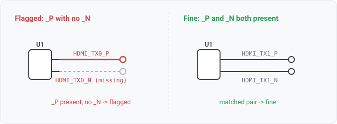

## diff-pair-naming

### What it means

A net named as the positive half of a differential pair (a "_P", "_DP", or
trailing "+" suffix) must have a matching negative half ("_N", "_DN", or trailing "-").

### Why engineers want it

High-speed signals travel as complementary pairs, and the naming
convention is how the pair is declared to every downstream tool that must route the two nets
together with matched length. The two halves are authored separately, and nothing but the name
ties them, so a typo or a deleted net silently breaks the pair.

### Impact

The layout tool never couples the two nets, so they get routed like ordinary
signals and the link fails signal integrity.

### Positive-anchored on purpose

Detection anchors on the positive member. A lone "_N" suffix
is ambiguous with active-low signals (RESET_N, WE_N), so treating every "_N" as an orphaned
pair half would fire on the most common real naming convention. A positive suffix does not
carry that ambiguity. The cost is that a stray negative with no positive is not reported, which
is acceptable for a first rule.

### Only when the design uses the convention

The rule fires only on a design that shows it uses differential-pair naming at all, i.e. at
least one *complete* pair (some `X_P` with a matching `X_N`) exists somewhere. A suffix like
`_P` is weak evidence on its own: combinational netlists (the LGSynth benchmark family, for
example) carry hundreds of `_P`-suffixed signal names that are not differential, and without
this gate every one of them is a finding. Requiring pair-population evidence takes those
designs to zero while a real board, which does declare complete pairs, still surfaces its
broken ones.

The cost is a design whose only differential pair is itself broken (one `X_P`, no `X_N`, and
nothing else paired) stays silent. That is the same weak-signal case, so the trade is
deliberate. An operator who wants a stricter policy can add a naming convention via
`--conventions`.

For software readers: this is the difference between "the string ends in `_P`" and "this
codebase uses a `_P`/`_N` pairing convention that this one member violates." The second is
only a bug if the convention is in use.

### Query structure

Gate on pair-population evidence, then select the positive-suffix nets whose expected
complement is absent.

    diff_convention_present(design)
      and select N in nets where is_pos_diff(N) and not has_net(expected_negative(N))

Reads: net.names. Primitives: pattern (the suffix), pair (the P-to-N lookup and the
convention-present check). Tier R.