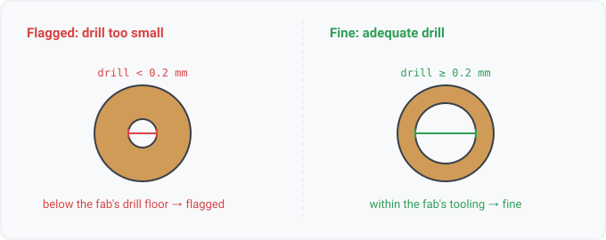

## hole-size

### What it means

A via whose drill diameter is below 0.2mm, the smallest mechanical
drill of the loosest mainstream capability set (the corpus JLCPCB rules).

### Why engineers want it

Drill size is a hard tooling limit. Below it a fab either
rejects the design or substitutes a larger drill, which silently changes annular rings
and clearances.

### Impact

Order-time rejection, or a board that differs from what was reviewed.

### Scope note

Same floor-default posture as track-width; per-design values are WS3-006.
Pad through-holes wait on pad-level drill facts; this rule covers vias, where the tiny
drills actually happen.

### Query structure

select nets with any via drilled below the floor.

    select N in board.nets where count(V in N.vias where drill(V) < 0.2mm) >= 1

Reads: board.copper. Tier P.