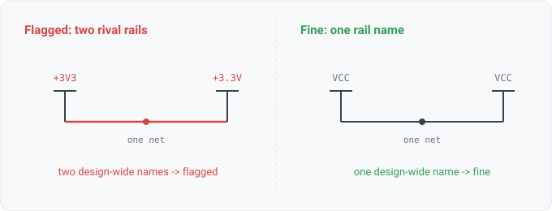

## power-tap-conflict

### What it means

One net's collapsed alias list holds two or more distinct DESIGN-WIDE
names: power-symbol rails or global labels (rank 0 in the docs/22 scoping model).

### Why engineers want it

Design-wide names unify by name across every sheet. Two of them
on one net means every tap of EITHER name anywhere in the design lands on this net — so a
wire joining a +3V3 symbol to a +3.3V symbol does not just alias two spellings, it merges
two design-wide rails. That is either a real short drawn with symbols or a naming split
that scatters one rail's story across two names.

### Impact

Merged rails (a 5V and 3V3 net joined through a mislabeled tap) are a
power-integrity defect; split naming corrupts rail-level review and any per-rail analysis.

### Scope note

Design-wide names only: a rail's local nickname (a sheet label on the VCC
net) is normal aliasing and stays quiet. Netclass consistency (one net, two netclasses) is
NOT covered: netclasses live in the KiCad project file, which the reader deliberately
stubs (OUT_OF_SCOPE.md). Formats whose readers emit every label at rank 0 (xschem, gEDA
inline names) get the strict interpretation: any two names on one net are rivals there.

### Query structure

select nets carrying two or more distinct rank-0 names.

    select N in nets where count(distinct name : name in aliases(N), design_wide(name)) >= 2

Reads: net.attributes. Tier R.