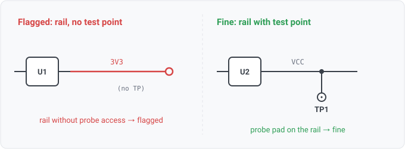
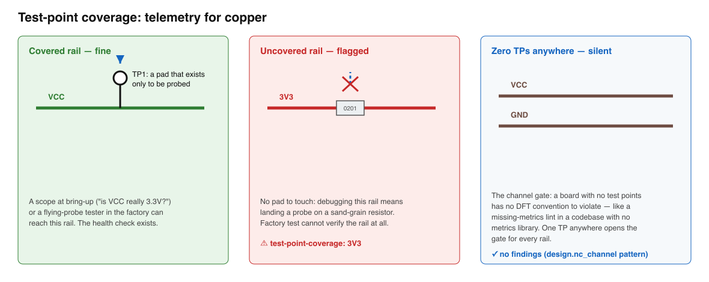

## test-point-coverage

### What it means

A power rail or ground net carries no test-point component, on a design
that places test points elsewhere.

### Why engineers want it

A test point is a dedicated probe pad: its only job is to
expose a net so a scope probe (bring-up debugging) or a bed-of-nails / flying-probe
machine (factory test) can measure it on the assembled board. DFT review checklists ask
for the important nets — rails and ground first — to be probe-able; an unreachable rail
is debugged by touching component pads the size of sand grains, and factory test simply
cannot verify it.

### Impact

The nets you most need to observe when a board misbehaves are exactly the ones
this rule covers: is the 3V3 rail actually at 3.3V, is ground clean, is the supply
sagging under load. Missing coverage costs nothing at design time and everything at
bring-up.

### Scope note

Gated on the DESIGN using test points at all (the design.nc_channel
pattern): a board with zero TPs has no probe convention to violate, so small demo boards
stay silent; a board with some TPs has declared the convention, making an uncovered rail
an omission. "Rail" is the union of the rail FACTS (global, power_driven) and the rail /
ground NAME heuristics — name is the only rail evidence a directionless EDIF netlist
carries. Cross-sheet (external) nets are skipped. Connector pins can also provide probe
access in real DFT flows; counting them is a possible widening if the corpus shows the
TP-only reading too strict. A regulator FEEDBACK / sense node reads as a rail by name (VCC..._FB)
but is a high-impedance sense point that must not be probed (a test point would load the divider and
shift the regulated output), so it is EXCLUDED (WS3-067); the feedback patterns are naming-lexicon
config a project extends (WS3-069). Severity info: DFT posture is a per-project policy and the reviewer
decides, the rule surfaces the genuine rails.

### Query structure

gate on the channel, select uncovered rails, excluding feedback sense nodes.

    select N in nets where has_test_points(design)
      and (rail_fact(N) or rail_name(N.name) or ground_name(N.name))
      and not feedback_name(N.name)
      and not exists T in N.connections where class(T) == test_point

Reads: component.class, net.attributes, net.names, on_net. Tier R.

### For software readers

A test point is a metrics endpoint: a tiny component whose only purpose is observability.
This rule is "every critical path must emit telemetry" — a power rail without a test
point is a service with no health check, fine until the day you desperately need to see
inside it. The channel gate is the interesting part: the rule only fires on boards that
instrument SOMETHING, the way a lint rule for missing metrics only makes sense in a
codebase that has a metrics library wired up at all.

