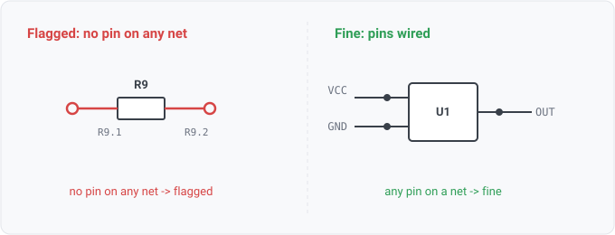

## unconnected-component

### What it means

A component whose pins land on no net at all. It is placed but wired to
nothing.

### Why engineers want it

Parts get dropped onto a sheet and left unwired during a work in
progress, or a block gets deleted and one part survives. The part then ships in the BOM and
gets placed on the board while doing nothing.

### Impact

Either a real missing connection (the part was supposed to be in the circuit) or
wasted cost and board area. Both are worth surfacing.

### Section-aware

Connections key on ref_des, and the IR groups all of a physical part's
sections under one ref_des (WS1-001), so a part counts as connected if any section's pin lands
on a net. A multi-gate IC with one gate wired is connected.

### Query structure

select the components not present in the connected-ref set.

    select C in components where ref_des(C) != "" and not on_net(C)

Reads: on_net (the connected-ref projection). Tier R (a traverse of every net's members builds
the set the select tests against).