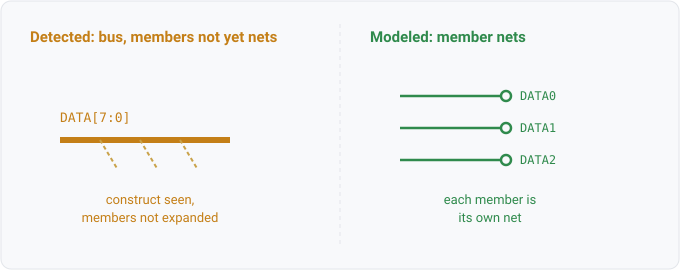

## bus

### What it is

`bus(label, kind)` yields one row per bus construct a reader detected in the source but has not yet
expanded into member nets (WS1-034 Phase 1). `label` is the source's bus name (a KiCad bus-alias
name, an xschem `DATA[7:0]` label, an EDIF array port name), empty for an anonymous bus wire.
`kind` is the source construct token that was seen (`bus`, `bus_entry`, `bus_alias`, `geda_bus`,
`edif_array`, `xschem_bus_label`), so a query can filter to one construct.

This is a detect-and-flag relation, not a defect report. The reader saw a bus and recorded it so
that silence would not read as "no bus here". A row means the construct is not fully modeled yet,
not that the design is wrong.

Distinct from `net.bus_like(net)`, which reports a *solved* net whose electrical role is
shared-distribution (a ground plane, a global rail, or rail-scale fan-out). `bus` is about a
source-file token the reader has not expanded; `net.bus_like` is about a net that already exists
and passed a fan-out/role predicate. Different concepts, similar names.

### For hardware engineers

A bus is schematic shorthand for a group of related signals drawn as one thick line (`DATA[7:0]`,
`ADDR[15:0]`) with the members broken out at bus entries. The reader recognised the bus notation
but has not yet split it into the individual member nets it stands for. You query `bus` during a
review to see which bus constructs a design uses and which reader saw them, so you know where the
connectivity model is still coarse. A row is a coverage note, not an error: the members may be
correct on the sheet and simply not expanded in the read yet.

### For software engineers

This is a syntactic marker the parser emitted for a construct it recognised but did not fully lower
into the connectivity graph. Think of it as a TODO the front end records when it encounters syntax
it can tokenize but not yet desugar, so the omission is visible instead of silent. It is a
projection over `Model.UnmodeledBuses()`, so rows are 1:1 with detected bus constructs. An empty
result means the read found no bus notation (or a later phase has modeled every one), not that the
design has no shared-distribution nets. For those, query `net.bus_like`.

### Go projector

`busFacts` in `check/facts.go` iterates `Model.UnmodeledBuses()` (which returns the reader-emitted
`ir.BusNotModeled` list off `InputDiagnostics`) and emits one `bus(label, kind)` row per entry, with
the construct's provenance as the citation. One row per detected bus construct; empty for a design
whose read detected no bus notation. Every reader populates the same channel, so the relation is
format-neutral.

### Datalog

List every detected bus and its construct kind:

```
bus(?label, ?kind) => ?label
```

Filter to one source construct (here, gEDA buses):

```
bus(?label, "geda_bus") => ?label
```

### Schematic


