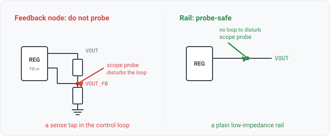

## feedback

### What it is

`feedback(net)` yields one row per net whose name reads as a regulator feedback or sense node: a
leaf name ending in `_FB`, `_VFB`, `_FEEDBACK`, `_VSENSE`, `_SENSE`, `_SNS`, or a bare `FB` / `VFB`.
It is name-derived, the datalog face of the feedback exclusion the test-point rule applies.

### For hardware engineers

A feedback net is the divider tap that feeds a switching or linear regulator's control loop. It is a
high-impedance sense node, so anything you hang on it changes the voltage the regulator reads and
shifts regulation. That is why a scope probe or a test point on a feedback node is a review finding:
the probe's capacitance and loading disturb the loop it is measuring. During a review you query
`feedback` to list the sense nodes, and you subtract it from `rail` so a probe-point or pull-up rule
does not treat a sense tap as an ordinary rail.

### For software engineers

Think of a feedback net as a node you may read but must not tap: observing it changes its value, so
it is off-limits to the instrumentation a normal rail allows. `feedback` is a filtered projection
over `Nets()` with the naming predicate, so rows are 1:1 with feedback-named nets, and an empty
result means no net name matched the sense-node lexicon.

### Go projector

`feedbackFacts` in `check/facts.go` walks `Model.Nets()` and emits a row for each net where
`isFeedbackName(name)` holds. `isFeedbackName` (in `check/rolenames.go`) delegates to the active
naming lexicon's `IsFeedback`, matching the `_FB` / sense-suffix patterns on the hierarchy leaf,
case-insensitive. One row per feedback-named net; empty when no net matches.

### Datalog

List every feedback / sense node:

```
feedback(?n) => ?n
```

A supply rail that is not a sense node (the rails a probe or pull-up rule may treat as ordinary
distribution):

```
rail(?n), not feedback(?n) => ?n
```

### Schematic


