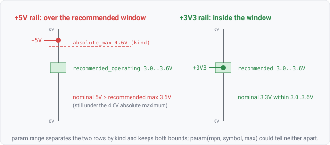

## param.range

### What it is

`param.range(mpn, symbol, kind, min, max)` yields one row per parameter of a datasheet spec that
joined to a part in the design, keyed by manufacturer part number (`mpn`) and the parameter's
datasheet symbol (e.g. `VDD`, `VIN`). Unlike the thin `param(mpn, symbol, max)`, each row carries
BOTH bounds — the lower `min` and the upper `max` — and the `kind` token that says which limit table
the row came from: `absolute_max`, `recommended_operating`, or `characteristic` (`unspecified` when
the source did not label it). A bound the datasheet did not state is absent (the argument binds to
nothing), so `param.range(?m, "VDD", "recommended_operating", ?min, ?max)` with a max-only row leaves
`?min` unbound. Every row carries a citation back to the datasheet page and table.

This is the datasheet tier of the query surface. It is EMPTY unless `agni` is run with
`--params <dir>` pointing at a seeded `PartSpec` corpus — skip-not-false-pass by construction: with
no corpus loaded the relation yields zero rows and every rule that reads it reports not-applicable
rather than a false pass.



### For hardware engineers

A row is one line off a part's limits table, with the table it came from named. The distinction
`param` cannot make is the whole point here: a part often prints `VDD` twice — an absolute-maximum
(exceed it and you may destroy the part) and a recommended-operating window (run outside it and the
guaranteed specs no longer hold). `param(mpn, "VDD", max)` collapses both into indistinguishable
rows; `param.range` keeps them apart by `kind` and gives you both ends of the recommended window, so
you can ask "is this rail inside the recommended range" (a two-sided question) rather than only "is it
under the absolute ceiling". As with `param`, values are presented, not silently coerced: a row whose
conditions survive only as free text is not machine-comparable and is shown beside its citation.

### For software engineers

`param.range` is `param` with the type widened from a single ceiling to a `{kind, min, max}` triple.
Where `param` answers "what is the max", `param.range` answers "what KIND of limit, and what is its
window". The design-side identity is still `component.mpn(ref_des, mpn)`, so the join is unchanged;
you gain the ability to filter by `kind` and to bound-check against `min` as well as `max`. That is
exactly what a two-sided range rule needs: join `component.mpn` to `param.range(?m, ?s,
"recommended_operating", ?min, ?max)`, bring in the design's rail voltage via `net.nominal_voltage`,
and flag `?v > ?max` or `?v < ?min`. The thin `param` relation is kept for back-compat and simple
max search; `param.range` is the superset a limit-kind-aware rule reads.

### Go projector

`paramRangeFacts` in `check/facts.go` iterates `Model.Components()`, reads each component's MPN via
`Model.ComponentMPN` and its spec via `Model.PartSpec`, dedupes by MPN, and emits one row per
`spec.Parameters` entry. `Value` is the kind token (`limitKindToken`), `Min` is `Value.Min` and `Num`
is `Value.Max` (each nil when the datasheet omitted that bound), and `Cite` is the datasheet
provenance. It shares the join and dedup shape of `paramFacts`; the two differ only in which fields
they surface. Empty without `--params`.

### Datalog

Both queries need `--params`. List every recommended-operating window for each part, as MPN, symbol,
and bounds:

```
param.range(?mpn, ?sym, "recommended_operating", ?min, ?max) => ?mpn, ?sym, ?min, ?max
```

Cross to the design and flag a rail sitting above a part's recommended maximum — the two-sided,
kind-discriminated join the thin `param` relation could not express:

```
component.mpn(?ref, ?mpn), param.range(?mpn, ?sym, "recommended_operating", ?min, ?max),
component-on-net(?ref, ?net), net.nominal_voltage(?net, ?v), ?v > ?max => ?ref, ?net, ?v, ?max
```
