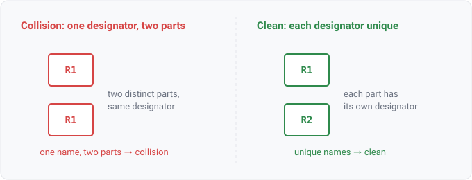

## ref_des_collision

### What it is

`ref_des_collision(ref_des)` yields one row per reference designator that more than one distinct
part claimed. A designator names exactly one physical part (`R1` is one resistor on the board), so a
designator shared by two placements is malformed input, a reader gap or a duplicate in the source,
not a design a person drew. The relation is keyed by `ref_des` so a query joins the collision to the
components and nets it tangles.

This is the query-relation face of the `duplicate-ref-des` integrity rule: the rule fires a finding,
the relation lets you interrogate the same condition ad hoc.

### For hardware engineers

You should almost never see this. A reference designator is the one label that lets a person point
at a single part across the schematic, the layout, and the BOM. Two parts both called `R1` cannot be
told apart, so a row means the tool's *read* of the file collapsed two placements that should have
stayed separate, or the source itself repeated a designator. It is not the legitimate multi-unit
case: a dual op-amp drawn as `U1A` and `U1B` stays one component with two sections and does not
collide. Treat a row as "fix the read (or the source)," not "fix the board."

### For software engineers

A reference designator is the instance's variable name (see ANALOGY.md), so the designator set
should behave like a symbol table with unique keys. This relation reports the keys that got a second
binding, the same duplicate-declaration break a linter flags when one identifier is defined twice in
one scope. Rows are 1:1 with colliding designators (one row per shared name, regardless of how many
placements claimed it). An empty result means every designator resolved to a single part, the normal
state.

### Go projector

`refDesCollisionFacts` in `check/facts.go` iterates `Model.RefDesCollisions()` (the reader-emitted
`ir.RefDesCollision` list off `InputDiagnostics`, where each reader decides duplicate-versus-legitimate
by its own format's rule) and emits one `ref_des_collision(ref_des)` row per collided designator. The
citation is the first colliding instance. One row per shared designator; empty when the read is clean.

### Datalog

Every colliding designator:

```
ref_des_collision(?r) => ?r
```

Join to the nets each colliding designator sits on (which nets the tangled read connected together):

```
ref_des_collision(?r), component-on-net(?r, ?n) => ?n
```

### Schematic


