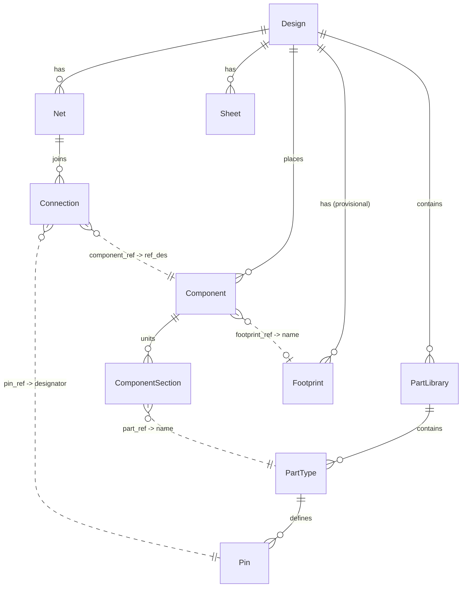

# 17 — IR v0: neutral schema, two layers, provenance

The first versioned IR (roadmap WS1-001). Defines the schema in
[`protos/agni/v1/ir/ir.proto`](../protos/agni/v1/ir/ir.proto) and records the decisions
behind it. Builds on [13 — Ingestion & IR architecture](13-ingestion-ir-architecture.md)
and is governed by [CONSTRAINTS](../CONSTRAINTS.md) C1, C2, C6, and the new C9.

## Decision

The IR is a single neutral model of a hardware design that many readers normalize into
and many writers emit from (the LLVM/Pandoc posture, doc 13). It is named for concepts,
not for any one format's spelling of them. EDIF is the first reader, not the template.

### Two layers

- **Semantic layer**: the normalized messages (`Design`, `PartType`, `Component`,
  `Net`, ...). This is what diff, rules, and analysis consume. Cross-format, so an
  Altium net and a Cadence net look the same here.
- **Fidelity layer**: `FidelityFragment`: raw source a lossless reader retains, keyed to
  a node by provenance, so write-back is byte/semantically identical. Lossy-bounded
  readers (the EDIF netlist reader today, C6) leave it empty. Plus an `attributes`
  string map on every node as the escape hatch for un-promoted named properties.

`Provenance` links the two.

### Two tiers of maturity

- **Tier 1 (netlist), frozen:** `Design`, `PartLibrary`, `PartType`, `Pin`, `Component`,
  `ComponentSection`, `Net`, `Connection`, `Sheet`. Exercised by the EDIF reader and
  verified on a real 3980-component board.
- **Tier 2 (physical), provisional:** `Footprint`, `Layer`, `Stackup`, `Constraint`,
  `BomLine`. No reader populates these yet; they are designed from the IPC-2581/ODB++
  published schemas and are unvalidated by the round-trip oracle until the first PCB
  reader (WS1-002). Names and shape may change. They ship so consumers can plan against
  them, marked provisional in the proto.

## Neutral vocabulary (and why)

Grounded in a cross-format survey of how EDIF, KiCad, IPC-2581, and ODB++ express the
same concepts (kept out of this shareable repo). The names that differ from EDIF's
spelling:

| IR name | EDIF term | Why not EDIF's word |
|---|---|---|
| `PartLibrary` / `PartType` / `Pin` | library / cell / port | Only EDIF says "cell"; KiCad/IPC-2581/ODB++ do not. |
| `Component` + `ComponentSection` | one `instance` each | ref_des is not unique per instance; sections keep multi-gate/bank detail. |
| `Connection` | portRef | Neutral (component_ref, pin_ref). |
| `Provenance.native_id` | rename `&id` | The `&id` is one *kind* of native id, not the universal key. |

### Multi-section components

One physical component (ref_des) is often several source instances: a multi-gate IC, a
connector's banks, a relay's coil and contacts. The reader groups instances by ref_des
into a `Component` with N `sections`; sections may reference different `PartType`s
(heterogeneous). Diff compares the *set* of part references over sections, not a single
value, so a change to one section is reported without false positives from ordering.

### Provenance and identity

`Provenance{ source_file, Span span, native_id, native_id_kind }` is a neutral locator.
`native_id` is a format-native id (`native_id_kind` names its kind: `edif-rename-id`,
`kicad-uuid`, `ipc2581-xpath`, ...) and is **not** assumed stable across exports: EDIF
regenerates the `&id` per export. The stable key for cross-revision diff and the
IR<->geometry join is always the semantic key (ref_des, net name, pin), never the native
id (this is the root of the WS1-004 diff-stability gap). `Span` (byte offset/length,
line/column) exists for lossless reconstruction and surgical edits; the EDIF s-expr
reader does not populate offsets yet (tracked with WS1-004).

## Shape & relationships

The IR is a graph: a **containment** tree of nodes, plus **cross-references** where one
node points at another by a stable key (this is what makes it a netlist rather than a
document). This section maps both. The proto is the source of truth
([ir.proto](../protos/agni/v1/ir/ir.proto)); this is the picture.

**Containment** (what owns what):

- `Design`
  - `PartLibrary`\* → `PartType`\* → `Pin`\*     : the definition side
  - `Component`\* → `ComponentSection`\*         : the placed side (sections = units)
  - `Net`\* → `Connection`\*                     : connectivity
  - `Sheet`\*                                    : logical page refs (geometry is a sidecar)
  - `Footprint`\*, `Layer`\*, `Stackup`(→`StackupLayer`\*), `Constraint`\*, `BomLine`\*: physical tier (provisional)
- Cross-cutting on **every** node: `Provenance` (source locator) + an `attributes` map;
  `Design` also carries the `FidelityFragment` list (the format-fidelity layer).

**Relationships** (who references whom, and by which key):



Solid edges are containment; dashed edges are references by key. The reference keys are the
**semantic** identifiers (names/designators), never the `native_id`: that is the whole
point of the identity model (see above). The join-key table:

| Reference (field) | Targets | Meaning |
|---|---|---|
| `ComponentSection.part_ref` | `PartType.name` | which part definition a section instantiates |
| `ComponentSection.library_ref` | `PartLibrary.name` | that part's library |
| `Connection.component_ref` | `Component.ref_des` | which component a pin sits on |
| `Connection.pin_ref` | `Pin.designator` (on that component's `PartType`) | which pin |
| `Component.footprint_ref` | `Footprint.name` | physical package (provisional) |

The **geometry sidecar** (`agni.v1.geom`, WS1-003) joins back into this graph the same way,
by the same semantic keys: `SymbolPlacement.ref_des` → `Component.ref_des`,
`WireGeometry.net` → `Net.name`, `PinPoint.port_ref` → `Pin.designator`. That is how a
renderer attaches drawing coordinates without geometry ever entering the core IR (C7/C8).

### The domain in plain terms (for non-hardware readers)

The diagram is abstract; the vocabulary is domain-specific. In software terms:

- **Component**: a physical part placed in the design (one resistor, one chip). Like an
  *object instance*. Identified by its **ref_des** (`R1`, `U3`): its unique instance name.
- **PartType**: the *kind* of part a component is. Like the *class* the instance is of.
- **Pin**: a connection point on a part (a leg of a resistor, a pad of a chip). Like a
  *port*. Identified by a **designator** (`1`, `2`, `A7`).
- **Net**: a set of pins that are all electrically the same point, i.e. wired together.
  "These pins are one node." A wire, generalized.
- **Footprint**: the physical package: the copper pads the part solders to. (Provisional.)
- **Schematic vs layout**: the schematic is the *logical* drawing (what connects to what);
  the layout is the *physical* board (where parts sit, copper routing). Both encode the same
  connectivity; the IR takes structure from the schematic and connectivity from the layout.

### A worked example: a voltage divider

The smallest useful circuit: two resistors in series from an input to ground; the midpoint
is a divided-down output.

```
VIN ──[ R1 ]──┬── MID (output)
              │
            [ R2 ]
              │
             GND
```

That circuit as an IR instance, the abstract boxes above, filled in:

| Entity | Instance | Relationships |
|---|---|---|
| `Design` | `divider` | |
| `PartType` | `Device:R` | has `Pin`s `1`, `2` |
| `Component` | `R1` | `part_ref → Device:R`; `Value = 10k` |
| `Component` | `R2` | `part_ref → Device:R`; `Value = 10k` |
| `Net` | `VIN` | connections: `R1.1` |
| `Net` | `MID` | connections: `R1.2`, `R2.1` |
| `Net` | `GND` | connections: `R2.2` |

Reading it back onto the relationship diagram: both `Component`s point at the *one*
`PartType` `Device:R` (two instances of the same class). The `Net` `MID` has two
`Connection`s, `R1.2` and `R2.1`, and that pair *is* the junction in the middle of the
divider. Follow any `Connection`'s `component_ref`/`pin_ref` and you land on a specific pin
of a specific component. That traversal is the whole point of the graph.

### When one physical part is several: sections

Some chips hold several independent circuits in one package. A 74LS00 is a single 14-pin
chip containing four separate NAND gates. On the board it is **one** part (`ref_des U1`),
but logically it is four "gates" (units). The IR models it as one `Component` `U1` with
**four** `ComponentSection`s:

| Entity | Instance | Note |
|---|---|---|
| `Component` | `U1` | one physical chip |
| `ComponentSection` | `U1` index 0 | gate A, `part_ref → 74xx:74LS00` |
| `ComponentSection` | `U1` index 1 | gate B |
| `ComponentSection` | `U1` index 2 | gate C |
| `ComponentSection` | `U1` index 3 | gate D |

So **ref_des is not unique per section**: all four gates share `U1`. This is why
`Component` groups sections rather than the reader emitting `U1` four times (a mistake the
first demo made). In software terms: one object, identified once, exposing several
independent sub-units that happen to share a package.

### Caveats (things that surprise you)

- **Connectivity is in both files.** You *draw* it in the schematic (as wires); the layout
  carries it explicitly on every pad, and the two must agree. Our reader takes the exact
  connectivity from the layout and the logical structure (part types, sections) from the
  schematic (see `kicad/GRAMMAR.md`).
- **Match on the semantic key, never the native id.** A component is matched across
  revisions by its `ref_des`, a net by its `name`. The tool's internal id (`Provenance.
  native_id`) is regenerated on every export; matching on it would report the entire
  design as changed.
- **Geometry is a separate artifact.** *Where* a symbol or trace is drawn lives in the
  geometry sidecar, joined by the same keys, never in this core IR. Diff, rules, and
  analysis carry no pixels.
- **The physical tier is provisional.** `Footprint`, `Layer`, `Stackup`, `BomLine` are
  modeled but not yet populated by a reader; treat them as a sketch until a PCB-fabrication
  reader (IPC-2581 / ODB++) fills them in.
- **"Same net name" is ambiguous in a diff.** A net keeping its connectivity but changing
  name is a *rename*; a net keeping its name but changing connectivity is a *rewire*. A
  semantic diff has to tell those apart: they are very different edits.

## Versioning

`Design.ir_version` ("0") and `Design.source_format` ("edif-2.0.0") are stamped on every
document. Proto3 retains unknown fields on parse, which combined with `attributes` and
`FidelityFragment` gives forward-compatible carry-through.

## Safeguards against overfitting (the point of the neutral IR)

Two mechanisms keep the schema from drifting toward whatever format we read most:

1. **Promotion rule (CONSTRAINTS C9), the gate.** A field enters the semantic layer only
   once a *second* format's reader would populate it. Until then it lives in `attributes`
   or the fidelity layer. This blocks both EDIF-shaped fields and speculative ones.
2. **Reader reconciliation, the trigger.** Every new-reader ticket reconciles its
   concepts against the cross-format map before adding fields: a concept the map missed
   updates the map; recurring `attributes` keys across two readers become promotion
   candidates; a first-class rename updates the proto, this ADR, and the map together.
   This is how we detect drift and absorb concepts new formats introduce over time.

## Status and open items

- Tier 1 verified against the real EDIF board (grouping, netlist, checks run clean).
- Tier 2 is provisional and unverified pending a PCB reader + a real sample corpus
  (WS6-001 is now the gating dependency: nothing in tier 2 is "ready" until verified
  against real IPC-2581/ODB++ files).
- Byte-offset provenance spans are defined but not yet populated by the EDIF reader
  (WS1-004).
- The geometry sidecar (`agni.v1.geom`, WS1-003) joins on the same semantic keys; its
  field comments still say `cell_ref` where the IR now says `part_ref` (value-compatible;
  a comment-only follow-up when WS1-003 closes).
