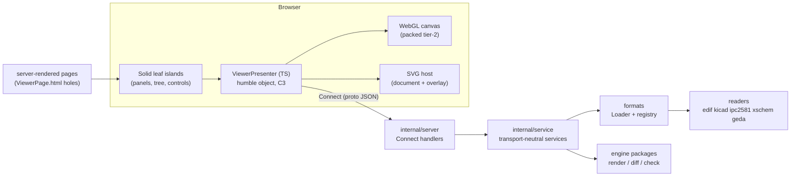

# 23 — The web app: serve architecture and API contract

Enforceable rules in [/CONSTRAINTS.md](../CONSTRAINTS.md); a `CN` reference (e.g. C9) points to constraint N there.

The browser viewer and visual diff over `agni serve`. This doc records
the settled architecture: how designs reach the browser (the mount model), the wire
contract (four Connect services), the render and highlight contracts both renderers share,
the client's composition (islands, presenter, dock, router), and the one recorded deviation
from the presenter constraint (C3). The runnable tour of everything described here is
[WEB_WALKTHROUGH.md](WEB_WALKTHROUGH.md).

The web tier deliberately owns no engine logic. It chooses which reader, layout, packer,
and rule set to invoke per file and serves the result; readers, diff, checks, and render
stay CLI-first engine packages (docs [13](13-ingestion-ir-architecture.md),
[18](18-semantic-diff.md), [19](19-rules-dsl.md), [16](16-geometry-and-rendering.md)).

## Architecture

Two server layers by design: `internal/service` holds the transport-neutral
implementations (loaders in, proto messages out, no HTTP), and `internal/server` wraps them
into Connect handlers. The services are the reusable surface; the handlers are glue. Pages
are server-rendered HTML with `data-dock-panel` holes the client islands mount into (C11): 
there is no client-side HTML skeleton to drift from the server's.

## The mount model

`agni serve [webdir] --mount name=path` (repeatable). The positional argument is the web
asset directory (defaults to `web`), NOT a design folder; designs enter only through
mounts, each exposing one folder to the file browser under a stable name. Every
file-addressing request in the API is a `(mount, mount-relative path)` pair; the server
resolves it inside the mount and rejects escaping paths. The browser never sees or sends an
absolute filesystem path.

File I/O stays at this edge: the Loader (`formats`) opens files and hands readers
`io.Reader`s (C1), including the multi-file cases (KiCad hierarchy, xschem/gEDA symbol
resolution) via openers the reader never constructs itself.

## The API: five services

All Connect (proto-first, JSON or binary; `web/src/gen` is the generated TS client). The
split follows resource lifetimes: workspace navigation, one design's rendering, checks over
a design, the two-design diff, and ad-hoc datalog search are independent concerns with
independent cadences.

| Service | RPC | What it does |
|---|---|---|
| Workspace | ListMounts | the mount names the tree roots on |
| Workspace | ListDir | one directory level: entries + per-file format label (from the reader registry; formatless files are hidden client-side) |
| Design | GetDesign | load + summarize one design: sheet list, effective layout, available layouts, native availability |
| Design | GetSheet | one rendered sheet; `format` picks PACKED (tier-2 bytes for WebGL, C8), SVG (the verification backend), or NATIVE (the format's own tool, golden reference) |
| Design | HighlightSheet | resolve `geom.HighlightSpec` layers against one sheet: PACKED yields primitive-index groups, SVG a transparent same-frame overlay document |
| Design | GetLayoutReport | how an auto-layout drew each component (glyph / box / provided symbol / unresolved) |
| Check | ListRules | the rule catalog with tags + per-design availability (static per build; fetched once) |
| Check | CheckDesign | run a rule subset, return findings; each subject (kind + ref) joins PackedSheet primitive keys for highlighting |
| Check | GetExpectations | the design's `.expect.yaml` sidecar as its own resource; client reconciles against findings |
| Check | GetCheckReport | the canonical severity-organized report (shared shape with `agni check --format report`) |
| Diff | DiffDesigns | semantic diff of two designs' netlist IR + the highlight maps; wire form shared with `agni diff --format json` |
| Query | RunQuery | evaluate an ad-hoc datalog query over the design's fact base, return columns + provenance-linked rows; same engine as `agni query` |
| Query | ListRelations | the relation catalog (built-ins + overlay-registered) with arg labels, summary, and kind; static per build, drives the panel's click-to-insert picker |

Contract notes that bite:

- **Effective values echo back.** GetDesign returns the layout actually used (a request for
  an unavailable layout resolves, not errors), and the client adopts the echo. Same pattern
  for the sheet id: the client must navigate by the ids GetDesign returned, never by index
  guesses (sheet ids are non-numeric on purpose; a numeric selector means positional index).
- **HighlightSheet must mirror its GetSheet.** The overlay is only meaningful over the base
  render it was framed for, so sheet/layout/symbols in the two requests must match. The
  spec message is `geom.HighlightSpec` end to end, one vocabulary for the WebGL local
  resolution, the server SVG overlay, and the packed projection (shapes:
  outline, bounding rect, bounding circle, per entity).
- **The board is a sheet.** A `.kicad_pcb` renders as the synthetic "board" sheet, which is
  why navigation, deep links, and both highlight paths needed zero client plumbing for
  boards.
- **Diff is all-or-nothing.** Either side failing to load fails the call; there is no
  partial diff.
- **Query evaluates server-side, netlist facts only (v1).** RunQuery loads the
  design, builds `check.NewModel`, and runs the same `query.Naive` the CLI runs; a parse
  error or unloadable design is an InvalidArgument the panel shows inline. The datasheet
  `param` relation is empty here — serve wires no params dir and datasheet data is
  deployment-bound (C16) — so a query over `param` returns no rows. The `query` engine is
  WASM-clean, so a later revision can evaluate client-side; v1 keeps it on the server.

## The render contract

Three render surfaces per sheet, one geometry source:

- **PACKED**: the tier-2 columnar form (docs/16): one static int32 vertex buffer uploaded
  once, primitive records with keys (`ref_des` / `net` / `pin`) that make selection and
  highlighting index joins. Text draws in a DOM overlay (GL draws no glyphs).
- **SVG**: `render.SheetSVG`, the verification backend and the default mode (full text
  fidelity everywhere).
- **NATIVE**: the format's own tool as a golden reference, per-format and opt-in
  (`--enable-native`).

The highlight layer is decoupled from the base render: a `HighlightSpec` names components,
nets, and pins plus a style and a shape, and projects to whichever backend is showing. The
WebGL client resolves specs locally against the keys it already holds (no round-trip,
provably the same semantics as the server; the Go and TS resolvers share a twinned test
fixture); the SVG path fetches the overlay document and stacks it.

## The client

- **Presenter (C3, humble object).** `ViewerPresenter` owns the semantic loop (open file →
  sheets → render → checks → highlights) and pushes state snapshots into one typed
  `ViewSink` of view interfaces. It calls views and clients, never DOM or Solid
  primitives, so it tests with plain mocks.
- **Islands (C11).** Leaf Solid components render the pushed state and emit intents back
  up. Panels live in a dockview shell; saved layouts are stamped with the
  panel-id registry at save time, so newly registered panels appear without migrations.
- **Router.** Deep-linkable URLs: `/files/<mount>/<path>` plus `?sheet=`,
  `?mode=` (webgl / svg / native), `?layout=`, `?sym=`. Directories are the same path with
  a trailing slash. The presenter reports location changes; the composition root reflects
  them into the browser URL.
- **Diff view.** Side-by-side synced panes, a changes panel with click-to-locate, and an
  overlay (union) mode gated by an alignment check, netlist-only formats whose auto-layout
  node positions shift between revisions refuse overlay BY DESIGN; faithful-geometry
  revisions pass.

## The C3 deviation, recorded

C3 wants presenter logic behind a contract with the view; the shipped viewer satisfies that
with an in-process TS presenter speaking Connect to the server (the "per-surface runtime"
of docs/15). The WASM-compiled Go presenter remains the plan for offline/in-browser reuse;
nothing in the wire contract assumes the presenter's location, which is the property that
keeps the swap possible. This is the trade docs/15 records: low-frequency semantic events
(file/sheet/mode switches) tolerate a network hop; per-frame interaction (pan/zoom, hit
tests) never crosses the wire.

## Serving pieces worth knowing

- The web bundle (`web/static/app.js`) is a build artifact, not committed; `make testall`
  builds it and asserts exactly one Solid core. A stale bundle is the classic "my change
  does nothing" failure.
- `--theme` selects the render palette server-side for BOTH renderers (the packed payload
  carries group colors), so WebGL and SVG stay color-identical.
- Board layer visibility is client-side in both renderers (CSS strata / draw-loop skips),
  never a render parameter.
