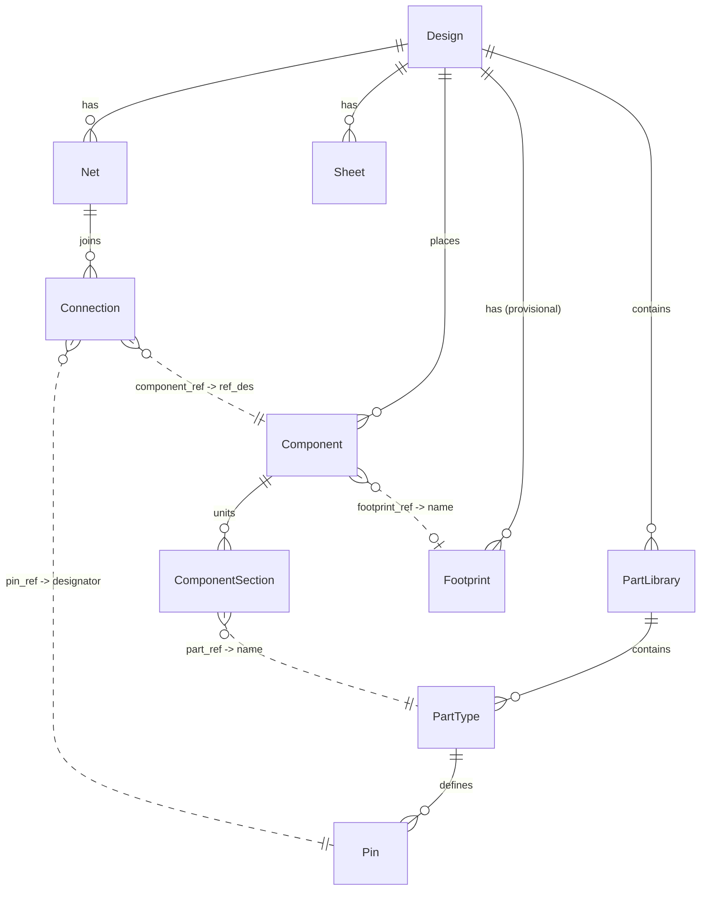

Hardware design files come in many formats: Altium and Cadence binaries, IPC-2581 and ODB++ interchange files, KiCad s-expressions, netlists, SPICE. Each vendor spells the same ideas differently. Agni reads all of them into one neutral intermediate representation (IR) and works from that. This page covers how the reading works and what the IR looks like once a design is in it.

## The shape: many readers, one IR

The architecture is the one a compiler or a document converter uses. A compiler like LLVM has many frontends that all lower into one IR, then many backends that emit from it. Pandoc does the same for documents: every input format parses into one central AST, and every output format writes from that AST. Agni takes that posture for hardware designs. Many **readers** (one per format) normalize into a single **IR**, and writers emit back out of it.

The reader layer is heterogeneous by necessity, because the formats are:

| Format class | Examples | Reader approach |
|---|---|---|
| Binary natives | Altium, Cadence Allegro | Wrap a vendor extractor, or a binary deserializer |
| Text grammars | netlists, SPICE, IBIS, Touchstone, KiCad s-expr | tree-sitter / parser combinators |
| XML | IPC-2581 | standard XML tooling |
| Record/tabular | ODB++ | custom record reader |

They all target one IR. Everything downstream (diff, rules, analysis) reads that IR and never touches a format directly. That is the point of the design: add a reader and every existing analysis works on the new format for free.

EDIF was the first reader written, but the IR is named for concepts, not for EDIF's spelling of them. EDIF is a reader, not the template.

## The neutral IR: two layers

The IR is a single neutral model of a design that readers normalize into and writers emit from. It has two layers.

- **Semantic layer.** The normalized messages (`Design`, `PartType`, `Component`, `Net`, and so on). This is what diff, rules, and analysis consume. It is cross-format, so an Altium net and a Cadence net look identical here. Think of it as the clean domain model the rest of the system programs against.
- **Fidelity layer.** A `FidelityFragment` list holds the raw source a lossless reader keeps, keyed back to a node by provenance, so a write-back can be byte-for-byte or semantically identical to the input. A reader that is only lossy-bounded (the current EDIF netlist reader, for one) leaves this empty. Every node also carries an `attributes` string map as an escape hatch for named properties that have not been promoted into first-class fields.

Provenance links the two layers. This mirrors what programming-language tooling already does with full-fidelity syntax trees (Roslyn's red-green trees, rust-analyzer's `rowan`, tree-sitter CSTs): a concrete layer retains everything (ordering, trivia, fields not modeled) alongside the clean semantic view used for analysis. The normalized layer abstracts detail away, and the fidelity layer is how that detail is not lost.

Three things come from provenance spans at once: lossless reconstruction, "this finding maps to exactly this line or figure" for trust, and surgical edits (rewrite only the changed region and leave the rest byte-identical). Carrying unmodeled fields opaquely means write-back never drops a field the reader did not understand, which also lets "lossless" survive the reader's own incomplete coverage.

## Two tiers of maturity

The schema is split by how well-exercised it is.

- **Tier 1 (netlist), frozen.** `Design`, `PartLibrary`, `PartType`, `Pin`, `Component`, `ComponentSection`, `Net`, `Connection`, `Sheet`. Exercised by the EDIF reader and verified on a real 3980-component board.
- **Tier 2 (physical), provisional.** `Footprint`, `Layer`, `Stackup`, `Constraint`, `BomLine`. No reader populates these yet. They are designed from the published IPC-2581 and ODB++ schemas and stay unvalidated until the first PCB reader fills them in. Names and shapes may change. They ship anyway, marked provisional in the proto, so consumers can plan against them.

## Neutral vocabulary

The names are grounded in a survey of how EDIF, KiCad, IPC-2581, and ODB++ express the same concepts. Where the IR name differs from EDIF's word, it is because EDIF's word is format-specific:

| IR name | EDIF term | Why not EDIF's word |
|---|---|---|
| `PartLibrary` / `PartType` / `Pin` | library / cell / port | Only EDIF says "cell". KiCad, IPC-2581, and ODB++ do not. |
| `Component` + `ComponentSection` | one `instance` each | A ref-des is not unique per instance. Sections keep multi-gate and bank detail. |
| `Connection` | portRef | Neutral: `component_ref`, `pin_ref`. |
| `Provenance.native_id` | rename `&id` | The `&id` is one *kind* of native id, not the universal key. |

## The domain in plain terms (for software readers)

The vocabulary is domain-specific. In terms a programmer already has:

- **Component**: a physical part placed in the design (one resistor, one chip). Like an *object instance*. Identified by its **ref_des** (`R1`, `U3`), which is its unique instance name.
- **PartType**: the *kind* of part a component is. Like the *class* the instance is of.
- **Pin**: a connection point on a part (a leg of a resistor, a pad of a chip). Like a *port*. Identified by a **designator** (`1`, `2`, `A7`).
- **Net**: a set of pins that are all electrically the same point, wired together. "These pins are one node." A wire, generalized.
- **Footprint**: the physical package, the copper pads the part solders to. (Provisional tier.)
- **Schematic vs layout**: the schematic is the *logical* drawing (what connects to what). The layout is the *physical* board (where parts sit, how copper routes). Both encode the same connectivity. The IR takes logical structure from the schematic and exact connectivity from the layout.

## The IR as a graph: containment and cross-references

The IR is a graph. It has a **containment** tree of nodes, plus **cross-references** where one node points at another by a stable key. The cross-references are what make it a netlist rather than a flat document. The proto is the source of truth for the schema. This is the picture.

**Containment** (what owns what):

- `Design`
  - `PartLibrary`\* → `PartType`\* → `Pin`\*     : the definition side
  - `Component`\* → `ComponentSection`\*         : the placed side (sections = units)
  - `Net`\* → `Connection`\*                     : connectivity
  - `Sheet`\*                                    : logical page refs (geometry is a sidecar)
  - `Footprint`\*, `Layer`\*, `Stackup`(→`StackupLayer`\*), `Constraint`\*, `BomLine`\*: physical tier (provisional)
- Cross-cutting on **every** node: `Provenance` (source locator) plus an `attributes` map. `Design` also carries the `FidelityFragment` list.

**Relationships** (who references whom, and by which key):



Solid edges are containment, dashed edges are references by key. The reference keys are always the **semantic** identifiers (names, designators), never the native id. That is the core of the identity model.

| Reference (field) | Targets | Meaning |
|---|---|---|
| `ComponentSection.part_ref` | `PartType.name` | which part definition a section instantiates |
| `ComponentSection.library_ref` | `PartLibrary.name` | that part's library |
| `Connection.component_ref` | `Component.ref_des` | which component a pin sits on |
| `Connection.pin_ref` | `Pin.designator` (on that component's `PartType`) | which pin |
| `Component.footprint_ref` | `Footprint.name` | physical package (provisional) |

The [geometry sidecar](../geometry-and-rendering/) joins back into this graph the same way, by the same semantic keys: a placement's `ref_des` joins to `Component.ref_des`, a wire's `net` joins to `Net.name`, a pin point's `port_ref` joins to `Pin.designator`. That is how a renderer attaches drawing coordinates without geometry ever entering the core IR.

## A worked example: a voltage divider

The smallest useful circuit is two resistors in series from an input to ground, where the midpoint is a divided-down output.

```
VIN ──[ R1 ]──┬── MID (output)
              │
            [ R2 ]
              │
             GND
```

That circuit as an IR instance, the abstract boxes above filled in:

| Entity | Instance | Relationships |
|---|---|---|
| `Design` | `divider` | |
| `PartType` | `Device:R` | has `Pin`s `1`, `2` |
| `Component` | `R1` | `part_ref → Device:R`, `Value = 10k` |
| `Component` | `R2` | `part_ref → Device:R`, `Value = 10k` |
| `Net` | `VIN` | connections: `R1.1` |
| `Net` | `MID` | connections: `R1.2`, `R2.1` |
| `Net` | `GND` | connections: `R2.2` |

Both `Component`s point at the one `PartType` `Device:R`, two instances of the same class. The `Net` `MID` has two `Connection`s, `R1.2` and `R2.1`, and that pair is the junction in the middle of the divider. Follow any `Connection`'s `component_ref` and `pin_ref` and you land on a specific pin of a specific component. That traversal is the whole point of the graph.

## When one physical part is several: sections

Some chips hold several independent circuits in one package. A 74LS00 is a single 14-pin chip containing four separate NAND gates. On the board it is **one** part (`ref_des U1`), but logically it is four gates (units). The IR models it as one `Component` `U1` with **four** `ComponentSection`s:

| Entity | Instance | Note |
|---|---|---|
| `Component` | `U1` | one physical chip |
| `ComponentSection` | `U1` index 0 | gate A, `part_ref → 74xx:74LS00` |
| `ComponentSection` | `U1` index 1 | gate B |
| `ComponentSection` | `U1` index 2 | gate C |
| `ComponentSection` | `U1` index 3 | gate D |

A ref-des is not unique per section: all four gates share `U1`. This is why `Component` groups sections rather than the reader emitting `U1` four times. In software terms it is one object, identified once, exposing several independent sub-units that happen to share a package. Sections may reference different `PartType`s (a heterogeneous part). Diff compares the *set* of part references over sections rather than a single value, so a change to one section is reported without false positives from ordering.

## Provenance and identity

`Provenance{ source_file, Span span, native_id, native_id_kind }` is a neutral locator. `native_id` is a format-native id, and `native_id_kind` names its kind (`edif-rename-id`, `kicad-uuid`, `ipc2581-xpath`, and so on). A native id is **not** assumed stable across exports. EDIF regenerates its `&id` on every export.

The stable key for cross-revision diff and for the IR-to-geometry join is always the semantic key (ref-des, net name, pin designator), never the native id. This matters for diff: matching on a native id would report the entire design as changed on every export. `Span` (byte offset and length, line and column) exists for lossless reconstruction and surgical edits. The EDIF s-expr reader does not populate byte offsets yet.

**A semantic key can be absent while still being present.** Before a designer runs annotation, every unassigned part carries a placeholder designator: `R?`, `C?`, `REF**`, or a partly-assigned `C?1845`. That is annotation *state*, not a name. Every unannotated resistor on the sheet reads `R?`, so the string is a label saying "no identity yet" while occupying the field where an identity goes.

`internal/refdes.IsPlaceholder` is the single definition, and it exists as its own package because the layers that must agree on it cannot import each other: readers take nothing from `core`, and `core` takes nothing from a reader. When those layers disagree about what counts as a designator they do not fail loudly, they quietly answer different questions about the same design.

Consumers **decline** rather than merge. A board reader skips a placeholder-referenced footprint, because a `REF**` on a board is usually a fiducial or a mechanical artifact rather than a part. A schematic reader keeps the part — those are real circuitry someone has not named yet, and dropping them would make the design read short. The check model declines to assert pin uniqueness over one: `(R?, 1)` does not name a pin, and on one export 176 distinct resistors shared that key, so the pin index saw a single pin sitting on 129 nets. Reporting that as malformed input says something false about a netlist that is fine.

The temptation is to repair the identity instead — key those parts on their native id, which really is unique. That is exactly what the paragraph above forbids: the id is regenerated per export, so every unannotated part would read as changed on every revision diff. The absence is the truth, and the honest move is to say so, which is what `unannotated_components` below is for.

## Geometry is a keyed sidecar

Render data (symbol shapes, placements, wire routing, pin coordinates) does not live in the core IR. It lives in a separate artifact that references the core IR by stable keys (`ref_des`, net name, `port_ref`, plus provenance), joined at render time. Diff, rules, and simulation never carry graphics. The renderer loads the core IR plus the geometry sidecar and joins them.

Two things follow. Heavy graphics stay off the analysis hot paths, and geometry can come from a different source than connectivity. A design's connectivity can be read from an EDIF `.edn` netlist while its geometry comes from the `.eds` schematic export. The [geometry and rendering](../geometry-and-rendering/) page covers the sidecar in full.

## Fidelity per reader

"Lossless" is a property of an individual reader, not a blanket platform promise. Each reader declares what it preserves. An IPC-2581 reader can be lossless. An ODB++ reader is lossless with respect to ODB++. An extractor-based reader is lossy and documents what it drops. The round-trip oracle below then applies only where a reader claims losslessness.

## What a reader noticed: input diagnostics

A read can succeed and still be worth complaining about. `InputDiagnostics` is where a reader records what it saw, so that a condition it noticed does not evaporate the moment the IR is built:

| Field | What it records |
|---|---|
| `dangling_endpoints` | a wire end touching nothing |
| `no_junction_endpoints` | a wire end dropped mid-span of another with no junction dot |
| `ref_des_collisions` | one designator claimed by placements that are not sections of one part |
| `unmodeled_buses` | a bus construct recognized but not expanded into member nets |
| `unresolved_symbols` | a symbol file that failed to open, so its placements carry no pins |
| `unannotated_components` | parts whose designator is still a placeholder |

They exist for one reason: **silence must not read as coverage.** Every one of these makes the design report *less* rather than reporting an error. An unresolved symbol yields a smaller netlist, and connectivity rules then pass cleanly over the gap. An unexpanded bus leaves members merged or off-net. Un-annotated parts are fully drawn and connected, so nothing looks wrong at all. In each case a clean run is indistinguishable from a design that genuinely had none of the problem, and the reader is the only layer that ever knew the difference.

Recording is therefore separate from judging. The reader states what it observed; a thin rule in the catalog turns each into a finding with severity and remedy. That split is why the diagnostics are per-reader without being per-reader *policy*: a format that cannot detect a condition contributes nothing, and the rule stays silent for a knowable reason rather than an accidental one.

Two consequences worth knowing. A field is not populated by every reader, and an empty one means "this reader does not detect this", not "the design is clean" — EDIF contributes no `ref_des_collisions` on purpose, because it represents a multi-gate part as several instances sharing a designator and carries nothing to tell that legitimate grouping from a duplicate. And a reader must build the struct **once**: assigning a fresh `InputDiagnostics` per signal silently drops whatever was recorded before it, which is a bug that only appears when the second signal is added.

## Emit: tiered writers

Not every emitter needs to be built in. The write path is tiered.

1. **Built-in emitters for open formats** read and written end to end: IPC-2581, ODB++, Gerber, KiCad. Cheap, no external dependency.
2. **Drive the native tool to write its own format.** Xpedition writes Xpedition and Altium writes Altium, via their automation APIs or by importing IPC-2581 or ODB++ that Agni emitted. Agni never emits a vendor's binary directly. This is also the clean way to produce a native format, using the vendor's own tool as intended.
3. **Community or optional emitters** fill gaps over time.

Like Pandoc, this is a rich but not exhaustive set of writers, not a guarantee of every possible target.

## Round-trip as a test oracle

For unchanged input, `parse then emit` should be the identity function. Running the whole real-file corpus through read-then-write and asserting byte-identical (or semantically identical) output is property-based and differential testing applied to the reader layer. It catches parser regressions and silent breakage from format churn automatically, rather than when a customer file fails to load.

## Two nuances about "lossless"

1. **"Lossless" is relative to the ingestion source, not the native file.** An extractor or export (ODB++, an extractor's output) has already dropped information the native binary held. A reader can be perfectly lossless with respect to the interchange format it reads while still lacking native-only detail. Lossless-to-ODB++ is achievable. Lossless-to-Altium-native is not unless the native file is read directly.
2. **Write-back into a native tool goes through interchange or the API, never by emitting the vendor's binary.** The way back is IR to open interchange to tool (the tool imports the emitted ODB++ or IPC-2581), or the IR drives the tool's automation API, with provenance carrying surgical fidelity. This is still genuinely lossless along the path under Agni's control.

## How formats get ingested

Reading a proprietary binary directly, by reverse-engineering it, sits low on the priority list, mostly for legal reasons (this is not legal advice):

- EULAs typically prohibit reverse engineering. Breaching one risks contract claims.
- Anti-circumvention law applies if any encryption or protection is involved (encrypted SPICE, protected files), a separate and worse category.
- Trade-secret and copyright exposure. Clean-room interop has some footing but is jurisdiction-dependent and expensive.
- Procurement review. Aerospace, defense, and automotive buyers run legal review, and a legally questionable ingestion method gets rejected there regardless of actual litigation risk.

So the ingest ordering prefers sanctioned paths, in this order:

1. Official automation API or export (vendor-blessed).
2. Open standards and documented formats (IPC-2581, ODB++ spec, KiCad, Gerber).
3. Official extractors.
4. Community reverse-engineered parsers. Fine for prototyping, but they inherit the legal questions, so relying on them commercially imports that risk.
5. In-house reverse engineering, as a last resort where no sanctioned path exists, and only after a deliberate legal check.

The technical argument points the same way. Ingesting via a documented export or API is both the easier path and the legally clean one, so the two reinforce each other rather than competing.

## Guarding against overfitting

Two mechanisms keep the schema from drifting toward whatever format is read most.

1. **The promotion rule.** A field enters the semantic layer only once a *second* format's reader would populate it. Until then it lives in the `attributes` map or the fidelity layer. This blocks both EDIF-shaped fields and speculative ones, and keeps the IR genuinely format-neutral: no reader adds a field another format could not fill.
2. **Reader reconciliation.** Every new reader reconciles its concepts against the cross-format map before adding fields. A concept the map missed updates the map. A key that recurs in `attributes` across two readers becomes a promotion candidate. A first-class rename updates the proto and the map together. This is how new concepts introduced by new formats get absorbed over time instead of accreting as one-off fields.

## Derived fields, and the tiers that fill them

Some fields no reader populates. A net's role (rail / ground / feedback) and a component's device
class are *derived* from the already-read IR by a shared, format-neutral pass, so every format gets
them the same way rather than each reader inventing its own answer.

Those passes originally all ran at ingestion, and the rule was one shared pass per field. That
assumed everything a derived field needs is available at read time. It stopped being true when the
datasheet tier arrived: seeded parameters attach at model construction, *after* the read, so a field
derivable from a vendor's pin table cannot be filled by an ingestion pass at all.

So a derived field is now filled by **one pass per evidence tier**, under two conditions that keep
the original guarantees intact.

**The field records which tier established each value.** `ir.Net.roles` is the worked example: each
role carries a `RoleSource`, so a role read off a naming convention is distinguishable from one the
source format declared and from one a datasheet's pin function established. Without that the tiers
union into a flat set and "how do we know this" stops being answerable at the point of use, which is
what made a naming convention and a vendor fact look identical for as long as they did.

**A later tier may only add, never remove or downgrade.** This is what makes admitting a tier safe:
switching one on can reveal more, and can never cost a value an earlier tier would have found. So a
design read without the datasheet tier classifies exactly as it did before that tier existed, and no
tier's absence can silently narrow an answer.

The two instances today are `enrichClassesFromParams` (a datasheet's declared device class) and
`enrichRolesFromParams` (a datasheet's pin functions establishing rail and ground). Both live where
the params tier does, at model construction. The rule they share, including what a duplicate means,
has one home in `classify.AddNetRole`.

Why it is worth the machinery: a net was a rail because of its NAME, and the built-in vocabulary is
start-anchored, so a project naming rails function-first had to declare its own lexicon or the engine
could not see its rails. On a real 1700-net board that was the difference between 13 rails and 91,
with no error and no warning. A vendor pin table settles it without consulting any name.

## Versioning

`Design.ir_version` and `Design.source_format` are stamped on every document. Proto3 retains unknown fields on parse, which together with the `attributes` map and the fidelity fragments gives forward-compatible carry-through across schema changes.

## Caveats

- **Connectivity is in both files.** You *draw* it in the schematic (as wires), and the layout carries it explicitly on every pad. The two must agree. The reader takes exact connectivity from the layout and logical structure (part types, sections) from the schematic.
- **Match on the semantic key, never the native id.** A component is matched across revisions by its ref-des, a net by its name. The tool's internal id is regenerated on every export, and matching on it would report the entire design as changed.
- **Geometry is a separate artifact.** *Where* a symbol or trace is drawn lives in the geometry sidecar, joined by the same keys, never in the core IR. Diff, rules, and analysis carry no pixels.
- **The physical tier is provisional.** `Footprint`, `Layer`, `Stackup`, and `BomLine` are modeled but not yet populated by a reader. Treat them as a sketch until a PCB-fabrication reader (IPC-2581 or ODB++) fills them in.
- **"Same net name" is ambiguous in a diff.** A net that keeps its connectivity but changes name is a *rename*. A net that keeps its name but changes connectivity is a *rewire*. A [semantic diff](../semantic-diff/) has to tell those apart, because they are very different edits.

A lossless IR with provenance is what enables surgical write-back, automated fixes, and transformations rather than read-only review. Everything else (diff, rules, analysis, the corpus) sits on this one representation.
