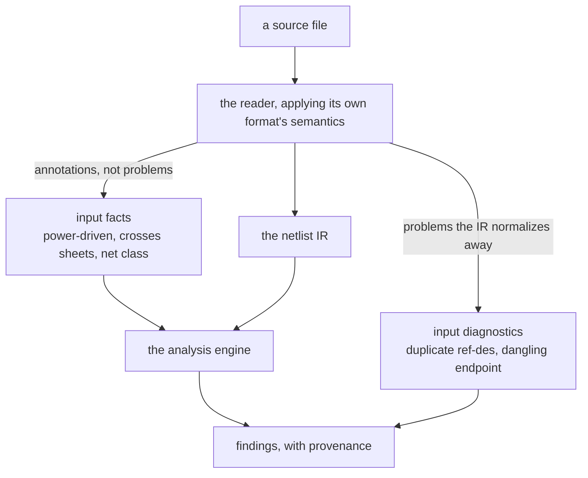

A rule asserts that something must hold over a design and reports where it does not. Examples:
every I2C net has a {{ explainable "pull-up" }}, no output pin drives another output pin. A rule
reads the intermediate representation and produces findings. It does not simulate or solve. This page
covers what a rule is allowed to express, where in the pipeline different rules run, and the
model that evaluates them.

## Rules assert, analysis computes

Worst-case tolerance, timing, and signal integrity are analysis, a different kind of engine that
computes quantities. Keeping that separate from rules keeps the rules layer a query-and-assert
system rather than a general compute environment. The dividing line is what each side does with
a quantity. A rule states that a quantity must satisfy a bound and reports where it does not.
Analysis produces the quantity.

The two cooperate without blurring the line. Some rules assert over a quantity that analysis
computes. An inductor's saturation-current margin needs the peak current through it. A capacitor's
{{ explainable "derating" }} needs a {{ explainable "rail" }}'s worst-case maximum voltage. The rule
references that quantity by name through an interface the analysis engine fills. The rule still only
asserts and reports and never simulates, so the boundary holds even where a rule and an analysis
compose.

Queries that report are a third surface beside rules and analysis. Some questions are not pass or
fail. Group the bill of materials by sub-circuit and roll cost up against an external supply feed,
for instance. A query reuses the same select, traverse, aggregate, and join primitives a rule uses,
but it emits a table instead of findings. Keeping queries a separate surface preserves the rule
layer as a clean pass-or-fail contract.

## Where a rule runs

A rule is a named check a user wants to fire on a design. Rules do not all run in the same place,
though, and conflating that would leak one format's structure into the shared engine. The split
follows a compiler's stages. Parsing catches malformed input. Name resolution catches duplicate
declarations while building the symbol table. Type checking and dataflow run over the built program.
The rules layer maps onto the same stages.

Where a rule runs depends on whether it can be computed from the final
{{ explainable "netlist" }} IR alone.



- If **no**, because it needs detail the reader normalized away, such as the pre-merge
  placements, the raw label set, or the wire geometry, then it is an input diagnostic. The
  reader detects it while building the IR, applying its own format's semantics, and records a
  neutral result. Duplicate {{ explainable "reference-designator" }} is an example. The IR merges
  components by reference designator on purpose, since a multi-unit part is one component with several
  sections, so by netlist time the collision is gone. Only the reader, mid-merge, can tell a
  genuine duplicate from a legitimate multi-unit part. A dangling endpoint is similar, because
  the wire geometry is gone by netlist time.
- If **yes**, because nets, connections, and pin electrical types are enough, then it is an
  analysis check. Output-drives-output, floating input, and
  {{ explainable "decoupling-capacitor" "decoupling" }} presence are examples. These run over the IR
  the same way regardless of source format.

The reader emits two kinds of derived output that are easy to confuse. Input diagnostics are
problems, statements that something is wrong: duplicate reference designator, dangling endpoint,
conflicting net name. They are reportable as findings. Input facts are annotations, statements that
something is so: a net is driven by a power flag, a net crosses sheets, a net has a class. They are
data a later check reads rather than findings. The power-input rule already consumes the reader's
power-driven and external net facts to avoid false positives, so the front end hands an attributed
netlist to the analyzer.

The vocabulary settles as follows. A **rule** is the umbrella term, the thing the catalog and
the viewer track. A **check** is a rule computed by the analysis engine over the IR. A
**diagnostic** is a rule detected by the reader from source structure the IR normalizes away. A
**fact** is reader-derived data a check reads, not itself a rule. A rule's implementation site is
a tag on it, not a separate catalog.

It follows that a check that cannot be computed from the netlist IR does not belong in the analysis
engine. Pushing its format-specific judgment up into a rule, a KiCad unit-index heuristic for
example, is what this split prevents. Detection goes to the reader, the neutral result goes into the
design's input diagnostics, and the reporting rule stays thin and format-agnostic. Input diagnostics
therefore run at read time. They exist before any rule is selected, so a viewer or a stats command
can surface them without invoking the analysis engine.

A reader may legitimately contribute nothing. A diagnostic is only producible by a reader whose
format carries the needed structure. A dangling endpoint needs wire geometry, which only
schematic readers have. A reference-designator collision needs capture-unit semantics, which a
KiCad schematic has and a flat EDIF netlist does not. An empty contribution there is correct, not
a gap, the same way a board or netlist source yields no dangling endpoints.

This creates a blind spot. Because "no diagnostics" is indistinguishable from "diagnostics this
reader cannot observe," coverage cannot be inferred from a clean run. It is pinned two ways. A
labeled corpus fixture, a known-bad design staged as pending in the expectation sidecar until the
reader can catch it, makes the gap a visible row in the test harness rather than tribal memory. And
a source-tool oracle cross-check diffs the findings against the originating tool's own
electrical-rule check. Without both, a missed diagnostic is invisible.

## Expressiveness tiers

The set of hardware rules is effectively unbounded, since the design-intent tail is open-ended,
but the machinery the rules need is bounded. Classifying rules by the expressive power they
require is the useful axis, because it decides the evaluation model.

- **Tier P** is parametric, a fixed, standardized catalog with per-process parameters: geometric
  design-rule checks (clearance, track width, {{ explainable "via" }} and annular ring, courtyard)
  and electrical rule checks (pin-type conflicts, unconnected pins, single-pin nets). The rule types
  are finite, only the values vary. This is config-shaped, not language-shaped.
- **Tier R** is a relational or graph query that selects and traverses the netlist, then quantifies.
  "For every I2C net there exists a pull-up to VCC." "Is this net reachable from
  {{ explainable "ground" }} through only passives," which is a transitive closure. This is the bulk
  of the design-intent tail.
- **Tier A** aggregates, taking counts and ratios over the selections.
  "{{ explainable "test-point" "Test-point" }} coverage of at least 95 percent." "At least one
  decoupling cap per power pin."
- **Tier X** is an external join, bringing in data that lives outside the design, such as an
  approved-MPN list or part parametrics from a spec database. "Every passive has an MPN from the
  approved vendor list."

Tiers R, A, and X together are a Datalog and relational-algebra class with aggregation and external
relations: pattern-match, traverse, quantify, aggregate, join. That is not Turing-complete and not a
general programming language. That bounded ceiling makes a declarative rules layer feasible.
Anything that needs real computation is analysis, by the boundary above.

{{ includeFile "figures/expressiveness-tiers.svg" }}

As orientation on the mechanisms that fit each tier, a fixed parametric catalog covers Tier P,
KiCad's `.kicad_dru` text rules cover Tier P and some of Tier R, Datalog with transitive closure is
a natural fit for Tier R and its aggregate variants, and policy languages such as Rego or a
constraint-unification language such as CUE cover parts of the same space. The design does not adopt
an external engine for these, for reasons in the evaluation model below.

## How a rule gets written

The tiers above classify a rule by the machinery it needs, which decides the evaluation model. A
second axis, independent of that one, is the FORM a rule is authored in, and it decides who can
write a rule at all. A Tier R rule can arrive as Go, as datalog, or as a line of YAML, and the
catalog cannot tell which once it has run.

`check.Rule` is the primitive. Everything below compiles to one and reaches the catalog as a
`check.RuleSource`, the only thing the catalog accepts.

| Shape | Who writes it | Changes | Compiles via |
|---|---|---|---|
| Go | an engineer on the engine or an extension | at build time | a `check.Rule` value, directly |
| Datalog | an engineer, for a question with a set-of-tuples answer | at build time | `query.RuleFromQuery` |
| Interface profile | an architect, shared across boards | rarely | `profiles.Compile` |
| Design-intent declaration | a hardware engineer, per board | every board | `intent.Compile` |

The last two let the engine be extended without a Go toolchain, and each exists as a file because of
who holds the knowledge. An EE describing CAN should not have to open a Go file, and a rail's
declared current draw comes off a power budget, so requiring a rebuild to state one would put the
whole design-intent tier out of reach of the people who own the number.

Two consequences look like accidents until you see the axis.

**The shipped profiles are authored in the same YAML you would write.** They are embedded files
under `stdlib/profiles/builtins/`, parsed at init. Nothing about a built-in is privileged, so an
overriding profile is a supported act rather than a hack, since yours replaces one written the same
way.

**There is no built-in intent, and that absence is deliberate.** A generic statement of what a board
should contain says nothing, and a rule that enumerated its expectations FROM the design would always
pass. So every intent rule iterates the declaration and probes the netlist, never the reverse, and a
design run with no declaration leaves those items not-automated rather than silently clean.

This is [C29](https://github.com/panyam/agni/blob/main/CONSTRAINTS.md) one layer up, and the
argument transfers whole. There, the fact tuple is the primitive and no query engine owns it,
because a shape that owned the tuple would make its limits everyone's limits. Here, the rule is the
primitive and no authoring shape owns it, for the same reason, since datalog cannot express a path
question at all and `check.Spec` answers per-entity questions with no fact base, so a catalog built
around either would foreclose the rules that need the other.
[C30](https://github.com/panyam/agni/blob/main/CONSTRAINTS.md) states it, and `deps_test.go` watches
the arrow in both directions.

A new shape is therefore a package that compiles to rules and registers a source. It is never a new
field on `Rule`, a new case in the catalog, or a second thing a catalog can hold.

## What runs now, what waits

- On the netlist IR today: electrical rule checks and the connectivity, attribute, quantified, and
  aggregate rules of Tiers R and A.
- On the board tier today: the first geometric design-rule class, track width, hole size, annular
  width, and copper clearance, over the board geometry, gated so a netlist-only design reports the
  copper rules as unavailable rather than silently passing. Thresholds are fabrication-capability
  floors, and per-design values are rule parameterization. Two structural notes came out of this.
  Per-net threshold rules are ordinary rules over the set of board nets. Clearance is a pairwise
  cross-entity join that the rule language deliberately does not express, so it stays the catalog's
  one purpose-built Go rule until more rules of that shape justify adding the vocabulary. Its cost
  is a tripwire, roughly 0.7 ms at corpus scale of 400 segments, 16 ms at 2000, and 380 ms at 10000.
- Later: the remaining design-rule classes (pad and zone clearance, edge and silk, hole-to-hole,
  courtyard) need pad-shape and zone-fill facts, and external joins (Tier X) beyond the datasheet
  layer, such as an approved-vendor list, need a parts data source. Both are additive, and the
  evaluation model does not change to accommodate them.

Several rules this list once waited on have shipped: `test-point-coverage` on the pure netlist,
`led-polarity` for diode orientation once pin polarity roles landed, `cap-voltage` for capacitor
voltage derating from the [parameter layer](../datasheet-layer/), and `io-map-pin-mismatch` with its
three siblings for IC pin-mapping against a declared map. The rest, by what each waits on:

- Buildable now on the pure netlist: signal-net naming conventions beyond `diff-pair-naming`,
  transmit and receive connection-role compatibility, and the ordering variants of the ESD and
  protection rules, now that `net.reaches` binds a hop count.
- With the parameter layer: logic-level input versus output margin, and passive value versus
  recommendation. These are the Tier-X category, a rule that proves a margin from datasheet data.
- Touching analysis for an input only: inductor saturation current versus peak current, cap voltage
  versus a computed rail maximum. The assertion stays a rule and the analysis engine supplies the
  number through a named fact.
- Not rules at all: BOM-cost-by-application and similar partition, aggregate, and join reports are
  queries, the same primitives with tabular output and no pass or fail.

### Source-format capabilities

The gate that keeps the copper rules unavailable on a netlist-only design also covers a third axis
besides the board and parameter tiers, source-format capability (WS3-096). A rule that infers a
defect from the absence of a construct the source cannot express declares the capability it needs in
`Rule.RequiresCapability`, and a review over a design that lacks it reads that item as
not-applicable with a reason rather than as a silent pass. Without the gate the rule still produces
no findings there, and a report cannot tell that from a clean pass, so the requirement is declared
rather than inferred.

| Capability | Present when | Missing on | Rule that needs it | Queryable twin |
|---|---|---|---|---|
| `design.types_power_out` | the format types power-OUTPUT pins, so a rail's driver is visible | EDIF (INPUT, OUTPUT and INOUT only) and IPC-2581 (no pin electrical types) | `power-input-not-driven` | `design.types_power_out`, also a spec fact |
| `nc_channel` | the design can mark a pin intentionally open, by a NO_CONNECT pin type or an nc-marker net name | EDIF netlists | `unconnected-pin`, `power-pin-mistyped` | `design.has_nc_channel`, spec fact `design.nc_channel` |
| `netclass` | nets carry tool-assigned net-class membership (WS3-105) | EDIF, IPC-2581, a bare `.kicad_sch`, and a KiCad project that declares no classes | any rule scoped by net class | `design.has_netclass`, also a spec fact |
| `netclass_defs` | the design declares what a class routes at, its clearance, track width and via sizes (WS3-111) | everything `netclass` is missing on, plus a project that assigns classes and defines none | `netclass-track-width`, `netclass-via-drill` | `design.has_netclass_defs` |
| `ref_des_collisions` | the READER looked for duplicate reference designators | EDIF, gEDA, xschem | `duplicate-ref-des` | none, the gate reads `InputDiagnostics.supplied` |
| `junction_taps` | the READER examined wire ends landing on wire bodies and recorded both halves | every format except KiCad | `wire-no-junction` | none, the gate reads `InputDiagnostics.supplied` |

The six fall into three kinds, and the kind decides where the gate looks. `design.types_power_out` is a
property of the format's grammar and is decided from the source format alone. `nc_channel`,
`netclass` and `netclass_defs` are properties of the design's CONTENT, so a KiCad project with no
classes lacks `netclass` as surely as an EDIF netlist does. `ref_des_collisions` and
`junction_taps` are properties of the reader's implementation, so they are declared per read in
`InputDiagnostics.supplied`, because only the reader knows whether it looked.

`netclass_defs` is separate from `netclass` on purpose. A KiCad project's `net_settings` carries
membership and definitions in independent blocks, so a project can assign nets to a class it never
defines. A declared-versus-actual rule needs the LIMIT, and gating it on membership would let such a
project run the rule over zero comparisons and report a clean pass.

`junction_taps` gates on the JOINED half of the diagnostic rather than on the diagnostic as a
whole. A reader could record the silent taps without the joined ones, which is what the KiCad reader
did until agni issue 420, and the considered set must not claim coverage the reader did not have.

<details>
<summary>The rule that forced that second kind of capability</summary>

The axis exists because of `duplicate-ref-des`. That rule IS a reader diagnostic, so on a reader
that never computed it the rule finds nothing, and a clean design looks exactly the same. It read as
passing on four of five formats until the declaration existed (agni issue 309). A rule whose entire
subject is a reader diagnostic should declare the matching capability.

</details>

## The evaluation model

Rules evaluate over the neutral IR, producing findings tied to provenance so each violation
points back to a place in every affected revision, the same posture as the [semantic
diff](../semantic-diff/). That makes rules format-agnostic and review-integrable.

The layer was built library-first, in two phases. Phase 1 is the rules library in Go below. Phase 2
was planned as a rule DSL, and it arrived as the datalog, interface-profile and design-intent shapes
in [How a rule gets written](#how-a-rule-gets-written), each compiling to a `check.Rule`.

### A rules library in Go

Phase 1 is an embedded rules library. Rules are Go predicates over the IR that emit provenance-tied
findings, built on a small set of query primitives: `select`, `traverse`, `forEach` and `exists`,
`count`. Phase 1 exists to validate the primitives and the starter rule set against real designs
before committing to any syntax.

The rule shape carries a deliberate split. Only the fields the engine acts on are typed: the
rule's name, severity, the facts it reads, its evaluation function, and the prose that describes
it. Everything classificatory, such as category, tier, and any provider-defined axis, lives in an
open string map. Classification is data, not columns, so a rule from an operator, from a later
DSL, or from an integrator embedding the engine can add its own axes with no change to the core,
and a browsable catalog can group and filter by whatever tags are present.

Availability derives from what a rule reads, not from a stored flag. A rule that reads a fact
whose provider layer is absent, a datasheet parameter before the parameter layer is loaded for
instance, reports as unavailable. That keeps a green "no findings" distinguishable from "never
ran." When the missing layer arrives, the same rule becomes available with no change to its code.

The catalog is composed from sources rather than being a global. A rule source yields rules, the
built-ins are one source, an embedder's Go suite is another, and the datalog, profile and intent
compilers are others. The built-ins keep bare names and every other source is namespaced, with the
source stamped as a tag so a suite can be selected as an ordinary facet. A name collision after
composition is rejected at wiring time rather than shadowing silently. An overlay in a separate
module registers its own suite through a process-global registry, so the engine's CLI and server
pick it up with no rewiring.

Findings carry their subject kind, whether the subject is a net, a component, or a pin, so a
consumer can group and highlight by entity instead of guessing from a string.

### A rule is a value

Phase 1 gained a second authoring form. A rule body can be a small tree of the query primitives
over named facts, evaluated by a tiny interpreter, instead of a Go closure. The typed core of the
rule is unchanged. The value form supplies the evaluation function. What the value form buys:

- Rules become data, inspectable and serializable. Phase 2 stops being a rewrite. The DSL
  parser's job is to produce one of these values, and the interpreter is already the runtime.
- Metadata is derived from the body. A value-built rule's declared reads and primitives are
  computed from what it actually does, so they cannot drift from the rule.
- Go stays a primitive, not the whole rule. A call node invokes a registered Go function by name,
  so a multi-clause heuristic can stay in Go without making the whole rule opaque. This is the
  escape hatch a datasheet-joined rule or an integrator uses for the awkward ten percent.
- Optimization has one entry point. The interpreter resolves every fact through a `Model` interface,
  never the raw IR. Storage and indexing questions therefore have one answer. The naive
  implementation uses precomputed maps and linear scans, and an indexed fact base is a drop-in
  replacement no rule would notice.

The original rules carry both forms. The Go evaluation stays canonical and a declarative twin is
held to it by a parity test, identical findings over every fixture, plus a metadata check that the
hand-written reads and primitives equal the derived ones. Writing those twins was the acceptance
test that fixed the primitive set, since every rule fit the tree plus a handful of Go helpers and
none needed a new primitive.

<details>
<summary>Which rules get both forms, and what the second form costs</summary>

Which rules get both forms follows what a twin checks. For the soaked original rules the Go side
was an oracle, so their twins are the interpreter's standing regression suite and they stay. For
a new rule on proven vocabulary, a Go twin is a second guess by the same author, weaker evidence
than the fixture pair every rule ships anyway, so a new rule is value-only. A new rule that
introduces interpreter vocabulary ships with a Go twin as a bring-up reference until that
vocabulary has more users.

The two forms are close in cost. On a synthetic 2000-net design the Go closures run in about
1.6 ms and the interpreter in about 8.7 ms. Both are far below interactive thresholds, so the
value form is affordable, and the benchmark pair is the standing evidence for when an indexed
fact base would earn its complexity.

</details>

## The fact base and querying it

A rule declares the facts it reads. The vocabulary the model exposes includes the entity
selections (nets, components, and the part-type pin set), the reader input diagnostics, pin
direction, net membership, per-pin net identity, component class, pin role, and the design-level
channel that records whether a source can even express "intentionally unconnected." That last one
is the gate that keeps per-pin absence rules quiet on bare netlist exports, where absence of a
connection does not mean the pin was left unconnected on purpose.

Two derived facts encode judgment a raw netlist does not carry. `component.class` classifies each
placed part into a stable device class such as resistor, capacitor, diode, TVS, connector, crystal,
IC or transistor, or unknown when nothing establishes one (`model.ComponentClasses` holds the full
vocabulary). No format states it as source data, so it is derived at ingestion from the
reference-designator prefix, refined by part-type text and value and, when a datasheet corpus is
loaded, by the part's spec, and stored as `ir.Component.device_classes` with each tag's evidence
tier. `pin.role` classifies a pin as anode, cathode, gate, source, drain, power, or ground from its
name within the component's device class, so an IC's "K" pin never reads as a diode cathode. Pin
electrical direction, by contrast, comes from the source library and is unreliable across formats.
Some libraries type a passive's pins as inputs, and diode terminals arrive typed as inputs too. A
direction-based rule therefore gates on class and role rather than trusting direction alone, which
removes a whole family of false positives.

The declared reads are materialized as named, typed, provenanced relation tuples, the substrate a
rule asserts over and an engineer's ad-hoc search queries over, so rules and search unify on one
set of relations. Each relation names a subject, an object, an optional numeric value for range
and compare, and a citation that is never empty, since a fact you cannot cite is not verifiable.
The projection is derived and regenerated on demand, never a second authoritative store, and a
design read without a seeded datasheet set simply yields no parameter facts.

The `core/query` package, agni's adapter over the `jaala` datalog engine, runs ad-hoc queries over
these relations, every answer carrying the provenance of the facts that produced it. The query
language is a small declarative Datalog rather than relational algebra, because circuits are
graph-structured and the core queries are transitive closures, and because a declarative query says
what, not how, so the evaluator behind it is swappable. The shipped fragment is conjunction and
comparison, a built-in bounded transitive closure, stratified negation, aggregation (count, min,
max, sum, list, each optionally `distinct`, with `having` filtering the groups), string predicates
(contains, prefix, suffix), and user-defined recursive rules evaluated to a stratified fixpoint. An
overlay can register its own relations and pure filter predicates, so a private house database
becomes a first-class query relation with no change to the evaluator.

The datalog engine imports only the Go standard library, so it builds for WebAssembly as well as
running on the server. The command form prints answers with provenance:

```
$ agni query regulator.fires.kicad_sch --params seed/ \
    'component.mpn(?r,?m), param.max(?m,"VIN",?vmax), component.net(?r,?n), net.max_voltage(?n,?rail), ?vmax < ?rail => ?r, ?m, ?vmax, ?n, ?rail'
r   m       vmax  n     rail  provenance
U1  LM1117  20    +24V  24    …/regulator.fires.kicad_sch ; datasheet "SNOS412Q …" page 4, "7.1 Absolute Maximum Ratings"
```

The evaluator joins relation tuples without caring which IR tier produced a fact, so a tier
becomes queryable by adding projectors. The board tier does exactly this, exposing per-net track
width, via drill, and layer, so a single cited query can span board, netlist, and datasheet at
once, for example finding a net routed thinner than 0.25 mm that carries a part rated for high
current.

## What the kernel cannot do, and what is actually slow

A rule body is already subgraph matching: a conjunctive query over a labelled graph is graph pattern
matching, and the pull-up check is a three-node, two-edge pattern. So the question is which specific
things are missing, and whether the evaluator can carry the load if more rules move out of Go and
into queries. Both halves were measured rather than argued.

### Bounded repetition is solved, and what remains is migration

Plain datalog gives unbounded transitive closure through recursion, but says nothing about distance.
That is the one hole a circuit question keeps falling into, because protection questions are all
bounded: a clamp near the pin, a series element within two hops. The fix is shipped. `net.reaches` takes
an optional third argument binding the exact number of crossings, so a radius is written

```
net.reaches(?n, ?rn, ?h), ?h <= 2, component.net(?t, ?rn), component.class(?t, "tvs")
```

and not `net.reaches(?n, ?rn, 2)`, which means exactly two crossings and silently skips a part sitting one
away.

**The consequence is that several Go escape hatches are now redundant rather than necessary**, which
is a migration backlog and not an expressiveness gap. No new syntax makes those rules simpler,
because the syntax already exists.

<details>
<summary>Which Go functions are redundant, and which are not shape problems at all</summary>

The catalog reaches into Go through a small set of registered functions for things the query
language could not say. Five of those functions are one shape repeated with a different payload: is
there a TVS, a Zener, a power pin, or a datasheet-rated part within the two-hop series reach of this
net. All of them are expressible in the form above, and the equivalent is already written down in
the fact documentation. The rules that use them have simply not moved.

The remaining Go functions are mostly not shape problems at all. They consult the naming lexicon,
transform strings, or fold over entities. A path operator does not remove them, and a survey that
counts every Go function as evidence for new kernel features will overstate the case.

</details>

### What the evaluator cost, and what fixed it

The interpreter's own documentation says a naive join is sufficient because one design's fact base
is small. That assumption did not survive a real board. Measured, before jaala indexed its joins,
against synthetic designs bracketing the size of a production industrial netlist (roughly 4,000
components and 1,600 nets):

| query shape | 100 components | 4,000 components | scaling |
|---|---|---|---|
| flat conjunctive (two atoms sharing a variable) | 12 ms | **15.7 s** | quadratic |
| bounded reach (`?h <= 2`) | 18 ms | **1.4 s** | roughly linear |
| recursive transitive closure | 22 ms | **28.3 s** | quadratic |

Two of those results inverted the obvious expectation.

**The simplest shape was the slowest.** A two-atom conjunction with no recursion and no traversal
cost 15.7 seconds at board scale. Once the first atom bound the shared variable, the evaluator
satisfied the second by scanning every fact of that relation, so the join was an unindexed nested
loop. Nothing exotic was required to hit this, since nearly every rule is written this way.

**The traversal everyone worried about was fine.** The bounded reach walk was the only shape that
stayed near-linear, because the walk is fan-bounded by construction.

That ordered the work by measurement rather than by sophistication, and both fixes have since landed
in jaala. The evaluator now indexes facts by bound argument position (`datalog/index.go`), which
addressed the common case and was the cheapest thing on the list. Deduplicating a derived tuple is a
bucket lookup in `addTuple` rather than a linear scan, which addressed recursion as a separate cost
with a separate fix. Worst-case-optimal join algorithms are the right answer for cyclic patterns and
were not the first problem, because the query measured above is acyclic and was already quadratic.

Rerun with `go test ./core/query/ -bench BenchmarkEval` on one arm64 machine in September 2026, the
same three shapes at 4,000 components took about 0.28 s (flat), 1.25 s (bounded reach) and 0.32 s
(closure). The machine differs from the original measurement, so read those as the new order of
magnitude rather than a precise ratio. The bounded reach walk is now the slowest of the three.

The migration described in the previous section runs through this evaluator, which is why the join
had to come first. Moving rules out of Go over an unindexed join would have made the catalog slower
in exchange for making it more declarative.

### Matching is by homomorphism, and circuits usually mean the opposite

Datalog matches patterns by homomorphism, so two variables in a body may bind the same node. Circuit
intent is nearly always injective: a divider's two resistors must be two distinct parts, and a
pull-up's rail must not be the signal net it pulls up. The language has no way to say that, so every
author writes a disequality by hand, and several shipped rules already carry them.

Forgetting one produces no syntax error and no crash, just a silently wrong answer. The profile
compiler now refuses a generated rule in that shape at init (`query.NonInjectiveRules`, WS3-127),
but a hand-written query or rule gets no such check. Drop the disequality from the
interface-presence rule and a single matching signal satisfies "two distinct signals are present",
so an interface reports itself in use on half the evidence, and every completeness check downstream
inherits that. This is the cheapest of the three problems to address and the only one whose failure
mode is a wrong verdict rather than a slow one.

## LLM-assisted authoring

Authoring even a well-designed rule language has a learning curve, and the rules that matter are
held by engineers, not language experts. Natural-language-to-rule translation removes that
barrier. An engineer writes intent in English, "every I2C net needs a pull-up to VCC," and gets a
draft rule.

The safety comes from the division of labor. The model authors the rule, the engine evaluates the
design. The model is used only for structured translation, natural language into a formal rule,
never as the judge. Its output is a verifiable artifact, since the draft must parse, run, and
produce the expected findings on a labeled fixture before a human accepts it. The verdict stays
deterministic and the model never enters the evaluation path. This is the opposite of a model
judging the design directly, where the result cannot be proven.

Two earlier decisions make this reliable. The bounded expressiveness ceiling is a small, typed
generation target, far cheaper to synthesize into and to validate than free-form code. And the
fixtures close the loop: intent, draft rule, run on a labeled fixture, show findings, engineer
confirms or edits, commit. The committed rule is code, so it is reviewed in a pull request and
diffable. The translation direction runs backward too, turning an existing rule into a
plain-language explanation during review.

## A grammar sketch

This sketch is historical. It predates the datalog, profile and intent shapes that shipped, and
nothing parses it. It shows the syntax the library was expected to grow into, where rules select
over the IR, quantify, and report, with severity and message driving the finding.

```
rule single-pin-net (warning):
  for net N where count(N.connections) < 2:
    report N "net has fewer than two connections"

rule i2c-pull-up (error):
  for net N where N.name matches "SDA|SCL":
    require exists pin P in N.connections
      where P.component.part_type in {"R", "Resistor"}
    else report N "I2C net has no pull-up resistor to a rail"

rule gnd-test-point (error):
  for net N where N.name == "GND":
    require exists pin P in N.connections
      where P.component.footprint_ref matches "TestPoint"
    else report N "GND has no test point"
```

For a software-reader orientation to the hardware terms these rules lean on, see the [software
analogy](../../reference/analogy/).
