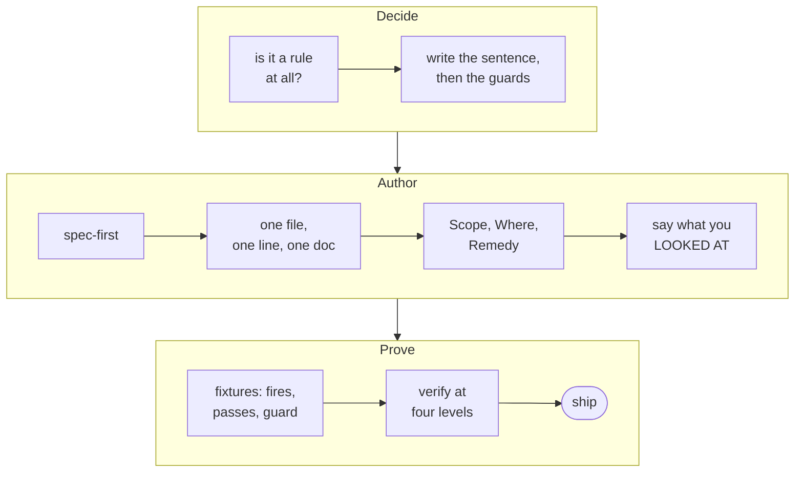
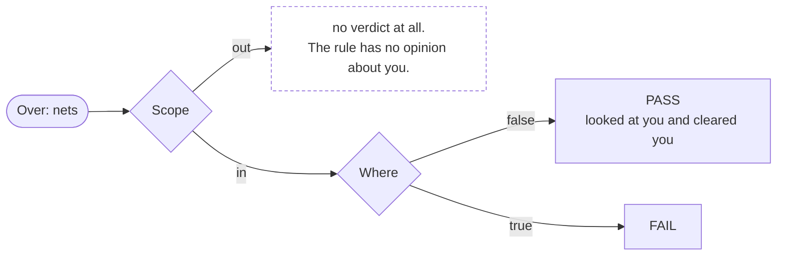
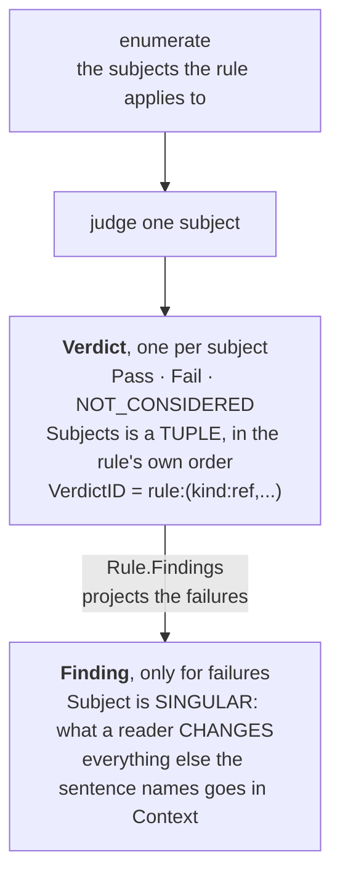
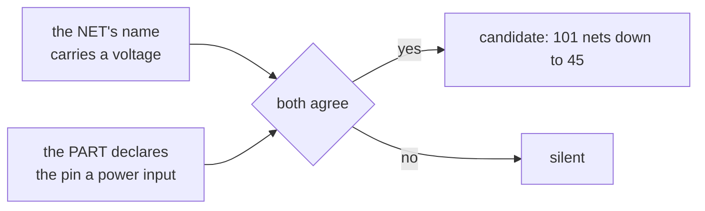

A check rule asserts something about the design as it was read: "every rail carries a test point". It
does not compute the way analysis does, it does not fix anything, and it has to be checkable from the
IR the readers produce today. The architecture behind the pieces lives in
[Rules and checks](../../architecture/rules-and-checks/) and
[Net solving and hierarchy](../../architecture/net-solving/). This page is the practical path, worked
through one real rule, `test-point-coverage`.

## Is it a rule at all?

Ask what the rule reads. If the answer includes data no reader emits yet (net classes, datasheet limits
before the parameters tier exists), the reader work comes first and the rule waits.

The worked example comes from a design-for-test checklist: rails and {{ explainable "ground" }}
should be probe-able. It reads component classes, net membership, and rail-ness, all three present in
the IR. So it is a rule.

## Write the sentence, then the guards

A rule is one sentence plus its exceptions, and the exceptions are what keep an engineer from muting
it. Write the sentence first:

    A power rail or ground net must carry a test-point component.

Then interrogate it the way a real corpus will.

| The question | What it settled here |
|---|---|
| What if the board has no test points at all? | A demo board is not wrong, it just has no test-point convention. Fire only where the design places test points somewhere. This kind of channel gate once took a rule from 1836 findings to zero. |
| What is "a rail" when the format carries no direction data? | Name is the only rail evidence a bare EDIF netlist has, so fall back to rail facts or rail/ground name heuristics. |
| What about nets the read did not fully cover? | Skip nets marked external. |
| Who decides the policy edge cases, like a feedback node named like a rail and deliberately left unprobed? | The reviewer does. Use `info` severity and say so in the rule's doc. |
| If you do read a name, is the net actually a rail? | `net.nominal_voltage` token-scans a whole name, so a level encoded in a SIGNAL net's name parses as a rail nominal (agni issue 194: `U3_12_U7_4_3V3` yields 3.3 while classifying as neither rail nor ground). Gate on `Model.IsRailNet` first. |

Three of the questions carry a lesson wider than this rule.

**1. Is there a tier of evidence better than the name?** A rail's voltage comes from
`check.NominalVoltageFromName`, a convention that is silent on a rail nobody named for its voltage and
wrong on a name that outlived a design change. Connectivity sometimes answers outright: the pin-tracking
rules bound the difference between two pins, and two pins on ONE net are one node, so that difference is
exactly zero with no name read. That tier settles a "must not exceed 0V" bound as satisfied and a "must
be at least 1V" bound as violated on a design whose nets carry no voltage token at all. Reach for the
convention as the fallback, not the first answer.

**2. What does a role gate cost when the project has not configured it?** It inherits the role's whole
configuration surface. `IsRailNet` reads a stamp derived from the naming lexicon, and the built-in
vocabulary is start-anchored (`VCC`, `VDD`, `+3V3`), so a project naming rails function-first matches
almost none of it. On a real 1700-net board, declaring the project's patterns moved the rail count from
13 to 91. Gate anyway, and make the gap visible rather than assuming the config is there.
`rail-not-classified` is the tripwire that does it.

  Measured end to end since (August 2026, against the catalog of the day): on a real board naming
  rails function-first with no lexicon declared,
  18 supply nets classified as rails and 91 did not, and `rail-not-classified` fired 45 times.
  Declaring the project's conventions moved recognition to 62 and the tripwire to **zero**. The
  tripwire works, and the remedy it points at is configuration rather than more rules.
**3. Is your evidence tier actually asking your question?** Preferring connectivity over a name is
right, and it is still possible to pick a connectivity fact that is wider than the property you mean.
`decoupling-present` selects "a net with a non-virtual `power_in` pin and no capacitor" and calls that
a supply rail. On the same board every one of its 14 findings was a false positive: gate drives, buck
switching nodes and sense lines all carry a power-input pin, and two of them were advising a capacitor
that would short a switch node to ground. Write the sentence, then check that the fact you selected on
cannot be satisfied by something the sentence would exclude.

## If the sentence names two entities, carry both

A `Finding` has one `Subject`, and the subject is what a reader has to CHANGE. That is not always the
entity the sentence is about, and when it is not, the reader gets sent somewhere the message never
mentioned. `crystal-load-caps` is the case this exists for. Its message reads "crystal terminal net
XOUT1 has no load capacitor" and its subject is the crystal, correctly, because the crystal is the part
someone edits. But the sentence is about a NET, so clicking the finding highlighted a part, and both
terminals sit inside that symbol, so the drawing could not say which one was at fault.

So **when a message names a design entity other than its subject, carry it in `Finding.Context`**, each
entry with a `Role` naming the part it plays. The panel renders them as clickable chips.

    // Go
    Context: []check.ContextSubject{
        {Kind: check.KindNet, Subject: n.Name, NetID: n.Id, Role: "terminal"},
    }

    // datalog: the entity is already bound in the answer row
    ContextVars: []query.ContextVar{
        {Var: "net", Kind: check.KindNet, Role: "terminal"},
    }

| Rule | Why |
|---|---|
| Never repeat the subject as its own context | the chip would navigate to where the reader already is. On a `KindPin` rule the subject is the ref/pin pair, so `{pin}` is the subject and only the net is context |
| Order is yours and it is significant | chips render in declaration order, so declare them in the order your message names them |
| A role is a short lower-case noun | `terminal`, `rail`, `source`, `sense`. Open vocabulary, deliberately, and roles need not be unique within a finding ("A and B both strap to address N") |
| Entities only, never values | thresholds, voltages and units belong in the message. A chip is something a reader can click and land on in the drawing |

Set `NetID` on a net context entity where you have it, so a net sharing its name with another
highlights the right instance rather than all of them.

## Author spec-first

Proven vocabulary goes in the Spec AST. Anything multi-clause goes behind a registered SpecFunc that
declares its own reads and primitives, so the derivation stays honest across that boundary. The example
is one FFI (`has_test_points`, the channel gate) plus existing facts:

    Over: nets
    Where: has_test_points(design)
       and not external(N)
       and (global(N) or power_driven(N) or rail_name(N) or ground_name(N))
       and not exists T in N.connections where class(T) == test_point

Bind it with `spec.Rule(check.Rule{...})`. `Reads` and `Primitives` derive from the body, so they cannot
drift from what the rule does. One init-order trap: register a rule's own FFI inside the rule variable's
own initializer, because package variables initialize before `init` funcs run and binding validates the
Call targets. Shared helpers like `rail_name` need no such care, since `stdlib/rules/builtin` imports
`core/check` and `check`'s package init registers them first.

The twin discipline: proven vocabulary is spec-only, as here. New interpreter vocabulary (a new entity
set, a new fact, a new traversal) ships with a Go `Eval` as the canonical twin until it soaks, with
parity asserted between the two.

## One file, one line, one doc

| Path | Holds |
|---|---|
| `stdlib/rules/builtin/rule_<name>.go` | the rule |
| `stdlib/rules/builtin/register.go` | one line adding it to the `rules` slice |
| `stdlib/rules/builtin/docs/<name>.md` | the single source of the rule's `Detail`, embedded at build time |

The built-in catalog is its own package, not part of the core engine. It installs itself through the
same public `check.RegisterBuiltins` seam an overlay uses, so `core/check` owns no rules of its own.

The harness fails CI without the doc. Write it as proper `###` sections under the rule's `##` title,
not bold run-ins: What it means, Why engineers want it, Impact, an ASCII sketch of fires-versus-fine, a
Scope note recording every guard decision from the step above, the query structure, and a "For software
readers" section mapping the EE concepts to structural analogies (a test point is a metrics endpoint,
and the rule reads as "critical paths must emit telemetry") with a diagram beside it.

## Say what to do about it

A rule carries four pieces of prose. `Summary` is the one-liner, `Impact` is what goes wrong when the
rule is violated, `Detail` is the long-form markdown, and `Remedy` is what to DO about it, in the
imperative, as one engineer would say it to another. `Remedy` is the easiest to leave off, and without
it a reader who accepts that the finding matters still has to already know the fix.
`TestEveryRuleStatesARemedy` (in `tools/catalogdocs`) holds the whole catalog to it.

| Keeping it honest | |
|---|---|
| **Generic over the RULE, not the subject** | name the class of change ("add a bulk capacitor where the rail enters"), never a designator. A remedy templated on the bound subject is a later tier |
| **Where the fix needs a value the engine cannot derive, say what to size it from and stop** | the pull-up an I2C bus wants depends on its capacitance and clock rate, neither of which the netlist states, so `i2c-pull-up` names no resistance. Inventing a plausible number would be the same silent-authority problem verdicts exist to remove, one layer up |
| **Where the finding is about the ANALYSIS rather than the design, say so** | `rail-not-classified` and `symbol-unresolved` are remedied by giving the tool more (`--conventions`, `--symbol-path`), and their remedies say explicitly that nothing is yet known to be wrong with the board |

**Write it in the field, never in the rule's `docs/<name>.md`.** `tools/catalogdocs` projects `Remedy`
onto the docsite reference page as its leading `### Remedy` section, so a doc that also wrote one would
print the fix twice. This is the opposite of the convention for Impact, whose field and whose
`### Impact` doc section may both exist and say the same thing differently.

A rule generated per-declaration (the `intent` and `profile` families) keys its remedy by KIND rather
than writing it at the builder, because the fix for a missing OV clamp is the same sentence on every
rail that declares one. See `docRemedies` in `stdlib/rules/intent/docs.go` and `requirementCaption` in
`stdlib/profiles/docs.go`.

## Scope and Where, for a spec rule

A spec has two predicates and they are not interchangeable. Both filter. The difference is where the
elements they discard end up.

Old-style rules put both in one `And`, harmless while a spec only reported violations. It stops being
harmless the moment the interpreter states a considered set, because then a subject the rule was never
about is reported as fine. `test-point-coverage` had five conjuncts over `Over: "nets"`, of which only
the last is the rule:

    has_test_points(design)                      <- scope: does this board use test points at all
    not net.attr.external                        <- scope: the read did not cover this net
    global or power_driven or rail or ground     <- scope: is this even a rail
    not feedback_name(net)                       <- scope: a sense node must not be probed
    not exists(connection with class test_point) <- THE VIOLATION

On the tutorial gateway design that is 15 nets narrowed to 4 rails, so without the split the rule would
assert that 11 signal nets carry a test point. The first clause is worse: it is design-wide, so a board
using no test points anywhere would report every net as passing, which is a rule that declined to run
claiming universal success.

**Splitting cannot change what fails.** The old predicate is exactly `Scope AND Where`, so only the
meaning of the non-failing subjects changes. `TestScopeAndWhereProjectToTheSameFindings` pins it.

| Rule of thumb | |
|---|---|
| A clause belongs in `Scope` when a pass over it would be meaningless | "this capacitor is not an LED" is not a useful thing for `led-polarity` to say. "This LED is the right way round" is |
| `Scope` contributes to `DerivedReads` | so moving a clause must not change what a rule declares it reads. `TestScopeContributesDerivedReads` holds that |
| A spec stating no `Scope` claims every element of `Over` is its subject | a real claim, so leave it out only when it is true |

**A pass states the VALUE that refuted `Where`, not the expression that tested it.** The interpreter
renders the first false conjunct and reads the subject's actual value: `claims is 1, not >= 2` rather
than `claims >= 2 does not hold`. The threshold survives, so a reader can see what would have made the
rule fire. A `!=` that came out false is the one case with no threshold to name, so `labels != ""`
passing reads `labels is empty`. This costs an author nothing but it does make a `Let` binding name
READER-FACING, so name a binding for the fact it holds.

**A predicate that measured nothing still cannot say anything.** `IsTrue{Call{...}}` decides on a bare
bool, so `led-polarity` passes with `led_reversed does not hold` and no value to offer. Closing that
needs a SpecFunc that hands back what it saw rather than only what it concluded.

## Say what you looked at, not only what failed

`Eval` returns one `check.Verdict` per subject the rule was applied to, passes included. It MAPS the
design onto outcomes rather than filtering it down to failures, and the findings contract is the
projection of that map, taken by `Run` through `Rule.Findings`. There is one body, so a rule cannot
report findings that disagree with its verdicts.

| The discipline | Why |
|---|---|
| **Enumerate, then judge** | two functions, one yielding the subjects the rule applies to and one deciding a single subject, with `Eval` as `map(judge, enumerate)`. Every rule converted so far factored this way without a fight, and it is what makes a single verdict answerable on its own |
| **Produce the outcome and its evidence in ONE call** | `check.CompareToBound` returns both from one comparison. A rule that decided the outcome and then separately assembled a witness would fail nothing when the second step was skipped |
| **An enumerator that drops a subject must say so** | a pin that will not resolve, a net with no voltage in its name, a datasheet binding no row of the kind. Those used to skip silently, reporting the same nothing as a rule that never looked, and are now `NOT_CONSIDERED` verdicts carrying the step that stopped them. Distinguish from OUT OF SCOPE, where a pin that is not a supply terminal yields no event at all |
| **`StatesConsideredSet` is a declaration, not an inference** | a failures-only rule returns Fail verdicts structurally identical to a considered set whose every subject failed, so only the author can say which. Forgetting it under-reports a converted rule and can never over-report one |

### The two rules that still decline

| Rule | How it declines | Why |
|---|---|---|
| `dangling-endpoint` | `check.FailuresOnly`, conspicuous at the call site | it reads a diagnostic list holding the offenders and nothing else. `internal/netgraph`'s `dangling` already decides per endpoint against an `occupied` map and discards it into a bool, so the obstacle is volume rather than the reader: 28 distinct endpoints for 20 wires on the showcase fixture, against 132 subjects across the whole catalog (agni issue 420) |
| `cap-voltage` | `StatesConsideredSet = false` directly, no wrapper, since it is built from a spec | `capVoltageDetail` returns `""` both for a capacitor that clears its rating and for one with no datasheet seeded, so inside scope it cannot tell a pass from a gap |

Grepping for `FailuresOnly` therefore misses one of them. Converting a rule means deleting the wrapper,
writing the map, and setting `StatesConsideredSet`. `bus-not-modeled` is the diagnostic rule that always
CAN state a set: `unmodeled_buses` holds every bus construct the reader saw, so the rule partitions it
and a resolved bus is a countable pass.

### The general fix is usually the READER

Two rules were in that position and left it by changing what the reader records.

| Rule | What the reader now records | Why it makes a pass evidence |
|---|---|---|
| `symbol-unresolved` (agni issue 418) | the references that DID resolve, with the pin count each supplied | a stale library entry resolves as successfully as the real symbol, answers with no pins, and costs the netlist what a missing file does. The count moves when the library does |
| `wire-no-junction` (agni issue 420) | the taps something JOINS, beside the ones nothing does | `splitWiresAt` runs at every junction dot and mid-span label before the detection pass, so running the same detection once more before the split recovers the set |

`wire-no-junction` was the most expensive silence in the catalog. Its own `Impact` calls a dotless T-tap
the most dangerous silent connectivity slip in schematic capture, and a sheet whose every tap carried its
dot reported exactly what a sheet with no tap reported.

**The reader fix comes with a capability, not just a field.** Only the KiCad reader examines wire
geometry, so `wire-no-junction` declares `RequiresCapability: CapJunctionTaps` and reports
not-applicable with a reason on xschem, gEDA and EDIF. Without that it would contribute a considered set
of nothing on three formats, which reads as a clean sheet. `symbol-unresolved` needed no gate, because
all three symbol-resolving readers supply the diagnostic.

**A rule that seems to have no fixed arity is usually being asked the wrong question.**
`strap-address-collision` declined because its subject is the SET of devices sharing an address, two on
one bus and four on the next, while `SubjectShape` is fixed per rule. That describes the FINDING. The
question the rule answers is binary: do these two devices strap to the same number. Three devices at one
address is three yes answers, so the subject is a PAIR (agni issue 391). Its message got less wrong too,
since the old single finding said "U12 and U13 and U14 BOTH strap to", and the two cases the old body
dropped with a bare `continue` became `NOT_CONSIDERED` verdicts. A body that filters has nowhere to put
a subject it declined.

### Subjects: a tuple in the verdict, one entity in the finding

{{ includeFile "figures/verdict-subject-grain.svg" }}

**A verdict's subject is a TUPLE, and for most rules it holds one entity.** A rule whose question is a
RELATION names every entity in it. `copper-clearance` measures a distance between two nets and belongs
to neither. `regulator-output-exceeds-abs-max` compares a regulator against a part it feeds ACROSS a
rail, and all three are needed, because one source feeding one load over two supplied rails is two
different answers. Naming fewer than all of them gives several answers one id, which is wrong now that
the report links every row by id. Five rules used to decline for exactly this reason and no longer do.

| Rule | Why |
|---|---|
| Order is yours and it is significant | a tracking bound reads subject-pin minus reference-pin, so swapping the two inverts the sign of the claim |
| A SYMMETRIC relation canonicalises INSIDE the rule | `copper-clearance` orders its pair by name. A framework that sorted every tuple would break the directional ones |
| Declare the shape | `Rule.SubjectShape` lists the kinds, so a person can construct an id without running the check and `TestSubjectShapeHolds` can fail a rule whose arity moves between designs. Leave it empty for the ordinary one-subject case, which the same test enforces |
| Do not reach for a subject that is nearly unique and hope | two seeded regulators feeding one load, and a high-side FET above breakdown on both its rails, are ordinary topologies |

**A Finding's subject stays SINGULAR, and that is a different question.** The verdict's tuple is identity
and has to be complete. The finding's subject is the one entity a reader has to CHANGE, and an answer
with three entities in it is not one they can act on. `TestFindingSubjectComesFromTheVerdictsTuple` holds
the two together, and consumers wanting equal standing read `Context` instead.

**The two may differ in GRAIN, and often should.** A verdict about a supply terminal carries a finding
about the whole part, because "why is this pin fine" is asked of a pin while the sentence a reviewer
reads names what they will change. `pin-exceeds-abs-max` established it. Plan for the consequence: a part
with three VDD pins on one rail produces three verdicts and the one finding it always produced, so the
extra terminals carry no `Finding`.

**Converting a rule that has a spec twin has one trap.** `check.VerdictsToFindings` returns a NON-NIL
empty slice, matching `check.Report`, and `TestSpecParity` compares with `reflect.DeepEqual`, where a nil
slice is not equal to an empty one. A converted rule would otherwise diverge from its twin on every clean
design while agreeing about every finding. Twinned rules have three things that must agree, the Go body,
the spec twin, and the verdicts, and that affects about a quarter of the catalog.

## A rule has one severity, so a severity axis means two rules

`check.Run` stamps `Finding.Severity` from the rule's own metadata over whatever `Eval` set, because the
docsite catalog and `--fail-on` both read the declared severity as the truth about a rule's findings. So
a fact carrying its own severity axis becomes TWO rules sharing one walker. Both instances are in the
datasheet tier: `pin-exceeds-abs-max` and `pin-out-of-recommended` split one comparison by `LimitKind`,
and `pin-tracking-violated` and `pin-tracking-advisory` split one by the datasheet's `Modality`, because
"shall never exceed" and "should be at least 1 V higher for best operation" are different claims. The
split is also what a caller wants, since separate rule names let a team gate CI on the requirement and
merely report the recommendation.

Where a value is legal but leaves the severity unknown, send it to the louder rule and mark the finding
`Inconclusive` rather than dropping it. `param.Validate` requires a pin relation's kind, bound and
provenance but not its modality, so an unstated modality is a legal spec: reporting it as an error would
invent a requirement, and dropping it would pass a breach in silence.

## Comparing is safe, subtracting is not

A rule that SUBTRACTS two name-derived voltages meets binary floating point head-on. `3.3 - 1.8` is
`1.4999999999999998`, which prints as noise in a finding and misjudges a bound of exactly 1.5. The older
datasheet rules only ever compared a rail against a limit, so this first appeared with pin tracking.
Round the result (microvolt resolution is finer than any bound a datasheet states) and assert the PRINTED
number in a test, which is how it got caught.

## Two independent channels, when one channel is ambiguous by construction

Some questions cannot be answered from one signal no matter how carefully you read it. Is a net named
`..._3V3` a 3.3 V rail, or a signal that swings at 3.3 V? Both are named that way, legitimately, by the
same teams. No naming grammar separates them, and a rule firing on the name alone is noise dressed as a
finding.

`rail-not-classified` works this way. The channels come from unrelated sources, one off the net and one
off the part's own pin declaration, so their agreement is evidence in a way either alone is not, and it
separated a board with a genuine configuration gap (45) from one without (5).

Two things keep it honest. **Name the channels in the rule's doc**, because a reviewer needs to know the
finding rests on a coincidence of two weak signals. And **check what happens when a channel is
structurally absent**: on a format that cannot type power pins the second channel is always missing, so
the rule is a no-op there rather than a partial answer, and the doc should say so.

## Fixtures are the rule's contract

Conformance fixtures are executable expectations, and the sidecar drives both the harness and the
viewer's expectations panel. Author three shapes:

- **fires**: the defect, plus every incidental firing listed, because the harness is exhaustive.
- **passes**: the same topology done right. `fires: {}` is the strongest assertion the harness holds.
- **the guard case**: the channel fixture proving the rule stays silent where the convention is absent
  (rails, zero test points, nothing fires).

KiCad authoring details that bite everyone once: pins bind at wire endpoints while labels and junction
dots bind mid-span, the pin connect point is origin + (local_x, −local_y), and power-symbol fixtures need
the `{}` `.kicad_pro` stub or their nets stay external.

Expect the showcase boards to react. They are the load-bearing anti-false-positive gates, so a new rule
firing there is a deliberate decision. Cover the passes board, which must stay silent, and list the fires
board's incidental firings in its sidecar.

## Verify at four levels

| Level | What it buys |
|---|---|
| Unit guard matrix | one test exercising every guard both ways |
| Conformance | the fixtures above, in CI |
| Corpus plus the real exports | sweep old-versus-new binaries and attribute every delta per-file, per-rule. The corpus alone is not enough: the real exports carry the scale and the tool dialects that expose whole classes of false positive (the 1836-finding lesson) |
| A reference implementation, when one exists | agreement with `kicad-cli sch erc` or `kicad-cli pcb drc` is the strongest evidence a rule's semantics are right, and it pinned the connection-point rules and the naming priorities |

Hand-trace what fires at level 3. The example's five real-board findings decomposed into three genuine
gaps and two policy-edge feedback nodes, and that decomposition set the severity. Design-for-test has no
open reference implementation, so say that in the PR.

## Ship it

The PR carries the reviewer's guide, the hardware-context primer, the before/after transcript, and a
record of every deferred edge. The rule's doc is already written, so the catalog, the viewer, and the
next reader all get the explanation the day it merges.
