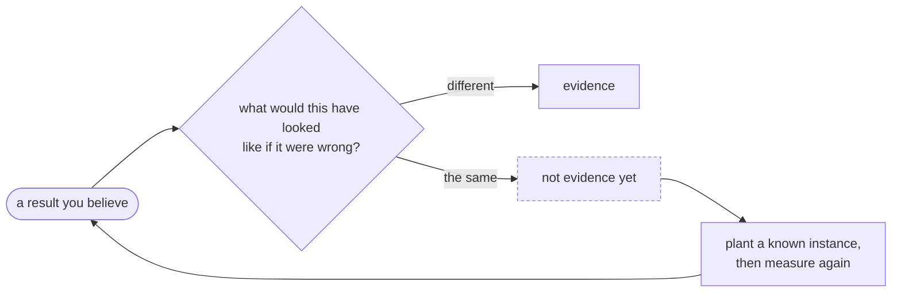
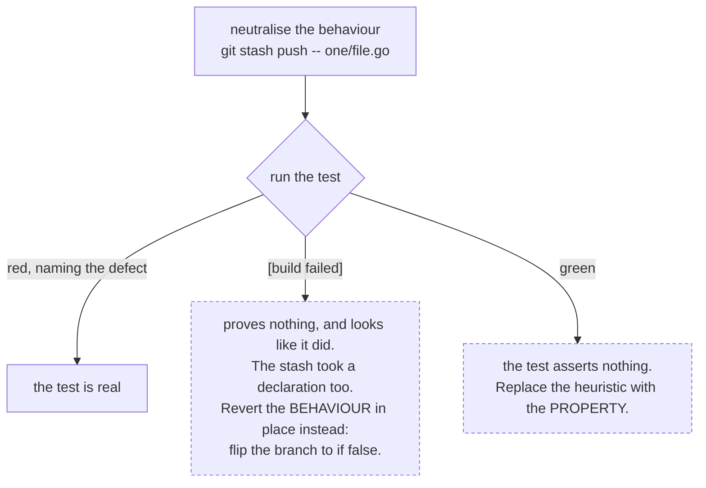
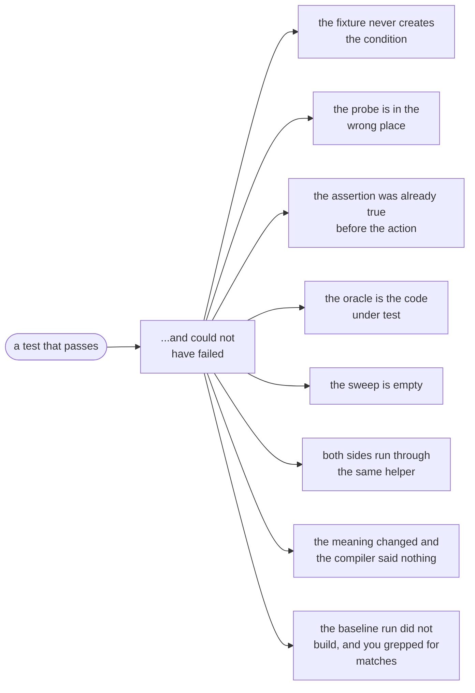

# Evidence: measuring, testing, and trusting a result

The expensive mistakes here have not been wrong code. They have been a correct-looking *result* nobody
could have falsified: a sweep that found nothing because the detector was broken, a rate nobody checked
for precision, a green test that could not have gone red. This page is the accumulated set of those.

Everything on it is one question in different clothes.

## Measuring, and trusting a measurement

Nine rules, grouped by what was doing the lying.

### The instrument

**1. A NEGATIVE RESULT NEEDS A POSITIVE CONTROL.** "Zero hits across 62 documents" is a claim about the
instrument until you show the instrument can find a known instance. Three absence claims here were
artifacts of the detector: a table shape the heuristic could not see, a regex that could not match
`V CC`, and a corpus sweep running a different code path from the one shipping. Plant a known instance
first. The fixtures usually already contain one.

Two habits make that cheap. **Instrument the gates**, counting what each filter REJECTED and not only
what it matched. And **exercise the shipped configuration**, because a sweep run with different flags
has validated a different program.

{{ includeFile "figures/positive-control.svg" }}

**1a. A CHECK RUN BEFORE THE EDIT IS NOT EVIDENCE ABOUT THE EDIT.** The instrument can be right, the
invocation can be right, and the run can still be stale, because it happened before the code it is
being cited about existed. A `tsc --noEmit` passed, two more files were written, the gate then failed
on one of them, and the pass was reported as proof that the gate and the local check "resolve
differently". They do not: all three spellings of that command catch the error, and re-running it
would have said so in two seconds. Nothing about the output looks stale, which is what makes this
worth a rule rather than a shrug.

The habit is cheap: re-run the check as the LAST thing before you believe it, and when a local pass
and a gate failure disagree, suspect the ordering before you theorise about the tools. The theory is
the expensive answer and it is almost never the right one.

**2. A detector that FIRES is a claim about the instrument too.** A sweep for "does this document print a
document number" reported 86% coverage on a regex that accepted `TPS22918` and `TCAN1145`, both PART
numbers, while missing `SLVSAG5`, a real one. Wrong in both directions, and the headline would have
justified building an extractor on it. Run a new detector past known positives AND known negatives by
hand before quoting a rate. When it cannot tell the two apart, that is the finding.

**3. A SUBSTRING count is not an occurrence count, and it fails upward.** Sizing the glossary sweep meant
counting how often each term appears, and a case-insensitive substring match reported `TP` 47 times in
a section where the word-boundary count is ZERO: it was matching inside `http` and `output`. The same
sweep read `pull-up` at 89 and `ESD` at 43 until rule names like `i2c-pull-up` and fenced code were
excluded, after which both roughly halved, to 44 and 13. Every error ran the same way, inflating the
work. Scoping off the first numbers would have oversized the job about twofold and, worse, would have
recorded a term as well covered when the course never mentions it. Anchor the pattern, strip code and
identifiers, and re-count before the number decides anything.

### The fixture

**4. A feature premised on a house CONVENTION needs its base rate measured on real designs, and the
fixtures cannot tell you.** Every fixture here names things the way the built-in vocabulary expects,
which is what made them work, so a convention-shaped feature always looks well-founded against them.
The endpoint-encoding net-name convention an issue was written around covered 1.1% and 0.06% of nets on
two real boards, and the tutorial project does not use it at all. It is one query, and it has twice
changed what was worth building.

**5. A feature no fixture EXERCISES cannot fail a test, and that reads exactly like working.** The
datasheet role tier shipped against a corpus where not one seeded spec declared pins: every test
passed, the real boards were unchanged, and nothing could have gone red if it were wrong. Giving the
shipped fixture the data the feature consumes turned it from unfalsifiable into demonstrable, 0 rails
to 3 on the tutorial netlist.

**6. A fixture written to test a behaviour may be unable to EXHIBIT it, and then the finding is about
the fixture.** `hier_bus_root.kicad_sch` labels its bus `DATA[1:0]`, and a session concluded from it
that KiCad keeps bus members apart across a sheet boundary, which held up a fix for a while. KiCad's
vector syntax is `[first..last]`, so that fixture contains no bus at all and could never have shown
members crossing. Change nothing but the spelling and `kicad-cli` joins them. The fixture is kept as
the control it actually is, with a comment saying so, and a sibling fixture carries the real case; the
pair is only meaningful together. Before trusting a negative result from a fixture, check that a
POSITIVE one was reachable from it.

**7. Ask the reference tool rather than reasoning about the format.** Three defects in one session
turned on a detail no reasonable derivation got right: bus members pair off by ascending index and not
in written order, a symbol is rotated before it is mirrored, and a colon-spelled range is not a bus.
Sign conventions, a Y-flip and two composition orders were all in play. Build the smallest input that
distinguishes the cases, run it through the tool that owns the format, and read the answer off the
output. A schematic with labelled wire stubs at the compass points reports where a pin landed; one
with a tap per bus member reports which members crossed.

### What reading cannot see

**6. Reading the code is not running it.** Three passes through one read path did not reveal that no
producer fills `SourceDoc.title` as its contract specifies. Opening the app and looking at the field
showed it immediately, and invalidated part of a PR merged an hour earlier. Review catches a layer that
is wrong. It does not catch layers that are each internally consistent and collectively wrong, because
every file reads fine on its own.

**7. A claim about LAYOUT needs a paint-level check, not a rectangle comparison.**
`getBoundingClientRect` knows nothing about an ancestor clipping the box, so a child of a scrolling cell
reports coordinates far outside that cell while being perfectly contained on screen. Reading those
numbers as "it still overflows" is wrong in the safe direction, which is the worst kind. Ask the
document instead: `elementFromPoint` inside the NEIGHBOURING element returns whatever actually paints
there. An A/B that flips the rules on a live page has to re-measure in each layout, since restoring the
old rules reflows the row and moves the element you were probing.

{{ includeFile "figures/clipped-rect-vs-paint.svg" }}

### When the world moved underneath

**8. When a run contradicts your PREDICTION, the contradiction is the finding.** A test written to prove
that a malformed `project.yaml` fails the run came back saying the run had SUCCEEDED. Chasing the gap
rather than blaming the fixture found that the descriptor was never reachable at all, which was the
actual content of agni issue 312 rather than the two call sites it named.

**9. A long-lived ticket's PREMISE erodes silently.** Three substantial issues in one month had aged out
before anyone picked them up: one mostly shipped already, one resting on a convention the only real
boards contradicted, one landed in pieces under other work. Nothing was wrong with any of them when
filed. Adjacent work moved underneath while the ticket text kept asserting the old world. Read the
comment thread as well as the body.

**10. A ratio needs its DENOMINATOR constrained, not just its numerator.** Counting the passives with
exactly one probe-covered net returned a number that was plausible, within a few percent of an
independent tool's, and read correctly in English. It was wrong. The query constrained how many nets
were COVERED and never how many the part HAD, so it also matched parts with one net whose only net was
covered, and multi-pin arrays with one of four covered. Two opposite errors, one missing clause.

Nothing internal could have caught it: the query returns rows, the rows are all real parts, and the
count is stable across runs. It took a second tool's answer to falsify. The general form is worth
carrying, because it is not specific to coverage: **whenever a result is "the things where N of M hold",
a filter on N alone silently admits every row whose M is not what you assumed.** State M as a clause
even when you believe every subject has the same one.

**11. A positive control catches a fixture that satisfies part of a check.** A test asserting that a
complete directory passes validation failed, because the fixture listed four of the six files the check
wants. Had the fixture been used only in the NEGATIVE test, it would have failed for the missing files
and read exactly like the guard working. A fixture that is supposed to pass has to actually pass, and
that is what the positive control is for.

## Trusting a test

A new test is a measurement too, and the red-check is its positive control: neutralise the behaviour
the test is meant to catch, and confirm the test fails. Stashing ONE tracked file
(`git stash push -- path/to/file.go`, run, pop) is the cheap way.

A compile error is not a failing assertion, so read the red output before believing it. And the green
branch has a worked example: a render test built on a gap heuristic ("the two notes must be at least N
apart") passed with the fix removed, because another mechanism shrank the fixture enough that the gap
held either way. Asserting the PROPERTY instead (add a marker at the same anchor, assert the two render
at the same y) failed with the actual defect named. Run the red-check on every new test, not only the
ones you doubt.

**The neutralisation is code too, and it can silently do nothing.** A red-check here reported the test
correctly finding no difference, which read as "the check is decorative". The edit had not applied: the
string being replaced was not in the file, so the mutation was a no-op and the run was measuring an
untouched tree. A red-check that does not confirm its own edit landed is a green run wearing a red
hat. Assert the substitution (`assert old in s`, `grep -c` the new text) before believing what the
suite then says.

**Count WHICH tests flip, not merely that the suite went red.** Neutering `reviewGate.trip()` failed 6
of 8 gate tests, and the two survivors were the opt-in guard and the flag-parse guard, neither of which
has any business depending on `trip`. "The suite went red" would have been equally true if the wrong six
had failed. Naming which ones should survive costs one sentence of thought.

### Ways a test passes while asserting nothing

That last one is about MEASURING a change rather than testing it, and it produces a confident number
out of nothing. Comparing a branch against `main` by stashing one file gives a baseline only if the
tree still compiles: a test file elsewhere referencing a symbol that file defines breaks the build,
and a pipeline that greps the output for differences then reports none. Three such comparisons in a
row came back clean and were all empty. Build the baseline in a `git worktree` at the commit you mean,
where nothing can half-apply, and check that the run produced output at all before reading it.

| The shape | The case that taught it | What makes it real |
|---|---|---|
| **The fixture never creates the condition** | Two versions of one browser test went green with the containment CSS deleted. The public fixtures top out at three sheets, so with short names nothing overflowed whatever the rules said. | Squeeze the column to its 48px minimum by dragging its own grip. |
| **The probe is in the wrong place** | The second version still passed, because it probed the neighbouring cell's CENTRE. The escaping chip reached 66px past its own cell while the neighbour was 301px wide, so the probe sat 84px clear of the bleed. | Bleed arrives at the BOUNDARY and fades. Probe just inside the edge nearest the offender. |
| **`innerText` does not mean visible** | An assertion written `expect(await locator.innerText()).toBe("...")` passed with `display: none` on the element, because the spec falls back to `textContent` for a node that is not rendered. The comment above it claimed it tested visibility. | Assert a non-zero `boundingBox()`, or read the computed style. |
| **The assertion was already true before the action** | A composition test clicks a finding and asserts `expect(called).toContain("HighlightSheet")`. It passes with the handler unwired, because deep-link restore highlights during boot, so it asserts that the page booted. | Count across the action (`before` and `after` filtered lengths) or clear the log first. Every "did X happen" assertion over a running system has this shape. |
| **The oracle is the code under test** | `if skipRefDes(x) { t.Error(...) }` went green under a deliberately broken `skipRefDes`, while its siblings written against literals went red. The test and the code agree by construction. | Assert against literals, or against a set the production path produced. |
| **The round trip goes through the forgiving half** | `TestWriteRoundTripsIR` read an EDIF file, wrote it, read it back and compared, and stayed green through four defects that made the output unreadable to anyone else. Our reader resolves references after parsing the whole file, takes any token as an identifier, and guesses a port reference is a pin designator when no mapping says otherwise. The writer leaned on all three, and the test could not see it because the same reader closed the loop. | Assert the emitted TEXT, or bring in an implementation that did not grow up with yours. Both, if the format is one other tools read. |
| **The sweep is empty** | A catalog-wide test iterating "every rule that sets this field" passes trivially when no rule sets it. | Count the rules it asserted over and fail at zero. A positive control belongs IN the test, not beside it. |
| **The fixture encodes the rule's own assumption** | Two `i2c-pull-up` fixtures gave their "pull-up" resistor exactly one net, no second end and no rail, so a rule correctly requiring a rail turned them red. | Complete the fixture. Loosening the check until it passes again looks identical from inside the failing run. |
| **The counter-example survives for the wrong reason** | A considered-set test asserted that a NO_CONNECT pin stayed OUT of a rule's domain, and still could not tell a supply-scoped domain from one sweeping in every pin on the part, because the NC pin sat on no net and dropped out of both. | A fixture case differing from the failing one in EXACTLY the property under test, here a signal pin alone on its own net. |

These five need their own room rather than a row.

**1. A test can compare a function against itself.** A parity test held a rule's `Eval` to its verdict
projection, `VerdictsToFindings(Eval(m))` against `Eval(m)`. For a converted rule those are the same
call, so it ran one function against itself and would have passed for any projection including a
broken one. It now rebuilds the expectation independently, keeping the failing verdicts and taking
their findings. The tell is structural rather than about the assertion: **if both sides of an equality
flow through the same helper, the helper is untested no matter how the assertion reads.**

**2. When two types carry the same field names, the compiler cannot help you.** `check.Verdict` and
`check.Finding` both have `Subject`, `Kind`, `Pin` and `NetID`, so when `Rule.Eval` moved from
returning findings to returning verdicts, every

    for _, f := range rule.Eval(m) { got[f.Subject] = true }

kept building and quietly started counting passes as failures. Two tests were already wrong this way
and passed only by accident, because their rules were still wrapped in `check.FailuresOnly`. What
finds this is asking, for every call site the compiler did NOT complain about, whether the meaning
survived. Use `Rule.Findings(m)` where a test means violations.

**3. `scrollTop` is always 0 under jsdom, so a scroll assertion passes with the bug present.** jsdom has
no layout engine, so nothing scrolls and nothing has a size. A panel that threw the reader back to the
top on every click would have satisfied `expect(el.scrollTop).toBe(prev)` perfectly. Assert the CAUSE
instead: the scroll reset because the rows were recreated, and node identity across the action
(`expect(after[i]).toBe(before[i])`) is visible in jsdom and goes red on the real defect. A symptom
needing a browser often has a cause that does not, and the cause is the better assertion anyway
because it names why.

**4. A test that SKIPS asserts nothing, and reads like a pass.** A browser case written with
`if (findings.length !== 1) t.Skip(...)` for the fixture it needed reported PASS in the suite output
and had never executed its assertions. Skips are for a genuinely absent capability (no browser on the
machine), never for a fixture that did not produce the state you wanted: that is a setup bug, and
skipping hides it behind the same green tick as a real pass. Find the input that reaches the branch,
or the test does not exist.

**5. A `-run` filter that misses the test you care about still prints `ok`.** `go test -run "Supersed"`
ran three tests in `cmd/agni` and passed all three, so the package reported `ok`. It never ran
`TestCheckReportsAProjectsOwnSupersessions`, because the filter is an unanchored regexp over the test
name and `Supersessions` carries `Superses` rather than `Supersed`. The zero-match case is the safe
one, since Go says `ok ... [no tests to run]` when a pattern matches nothing at all. A PARTIAL match
is what lies, because the passes it reports are real and belong to other tests. Run a new test by its
exact name once and read the `--- PASS` line carrying that name, before trusting any filtered run that
claims to include it.

### An out-of-tree oracle, for a format someone else reads

A round trip proves the two halves of ONE implementation agree. That is worth having and it is not
portability, and the gap between the two claims is where agni issue 580 lived: four defects, none
visible to the round trip, all of them fatal to a reader that had not been written alongside our
writer.

Two oracles have paid for themselves, and both are free.

**kicad-cli** answers questions about what a KiCad file MEANS. Export the netlist, read the `(net ...)`
blocks, compare which pins share a net. The technique that matters is asking rather than reasoning:
build a fixture that isolates exactly the question, and let the answer decide the code. Twice now the
answer has been the opposite of the obvious one. A vector bus crossing a sheet boundary pairs its
members by bit POSITION, so a child's bit 0 joins the parent's `A0` whatever the parent's range is
spelled; a group bus pairs by member NAME, so two buses of equal width with different member names
join nothing at all. Guessing either would have shorted unrelated signals while moving the net count
the flattering way. `readers/kicad/testdata/*.oracle` are those answers, committed beside their
fixtures with the regenerate command in each header, so the expected result is not one we chose.

**GNU Electric** answers whether a file we WROTE is one another tool can read. Its EDIF reader is an
independent implementation with source bundled in the jar. Its batch mode asserts before reaching the
importer, so drive it through BeanShell, which runs inside the initialized database:

    curl -O https://ftp.gnu.org/gnu/electric/electric-9.08.1.jar
    curl -o bsh.jar https://repo1.maven.org/maven2/org/apache-extras/beanshell/bsh/2.0b6/bsh-2.0b6.jar
    java -Dagni.edif=<file>.edn -classpath electric-9.08.1.jar:bsh.jar \
         com.sun.electric.Electric -batch -s check.bsh

where `check.bsh` reaches the importer by reflection on `EDIF$EDIFPreferences.doInput` and prints the
cell, node and arc counts. Passing `-s` is what removes the script from the argument list and so
avoids the batch-mode assertion. It prints a bogus `0 errors` summary after printing every `Error,`
line, so count the lines rather than trusting the total.

Neither belongs in the gate: one needs a 19MB corpus, the other a 23MB Java download. What belongs in
the gate is a test asserting the PROPERTY the out-of-tree oracle established, over the emitted text,
which is what `readers/formats/e2e_edif_conformance_test.go` is. The oracle says which properties are
the right ones; the committed test keeps them true.

Read a foreign tool's diagnostics as evidence about the FILE and not about the standard. Electric
takes a cell rename's display string as the cell's name where ours takes the identifier, and reads
exactly one token as a design's name where the grammar allows a rename. The first is a real
disagreement worth conceding, since a name it rejects is a file nobody can load. The second costs
nothing, verified by loading the same file both ways and getting identical counts, and conceding it
would have meant discarding the design's name.

## Text you cannot match literally

| Source | What moves | Match with |
|---|---|---|
| `prototext` | an unstable extra space after a colon, inserted ON PURPOSE to discourage byte-comparison | `: +`, or parse the proto |
| `protojson` | one or two spaces after a colon, so two runs over one message differ | parsed values, or `strings.Fields` joined by a single space |
| symbol text out of a doc-IR | flattened subscripts, so `VCCA` arrives as `V CCA` (~850 occurrences in one corpus) | a pattern tolerating the injected space |

A before/after table built with a one-space `prototext` pattern read ZERO for every "before" and was
nearly shipped. The tell was an internal contradiction, a file showing 0 typed pins and 2 supply pins at
once, rather than the number itself. Distrust any count whose parts do not add up. The injected space
has bitten three times in unrelated places: a prose sweep, the derive pin path where it would have
produced pin ids no symbol library could match, and in-document search.

One consequence of `EmitUnpopulated`: a newly added field appears as its zero value in every existing
consumer's output. Adding one to a response message is additive on the wire and visible in the JSON, so
"no data changed" and "byte-identical output" are different claims and only the first survives.
