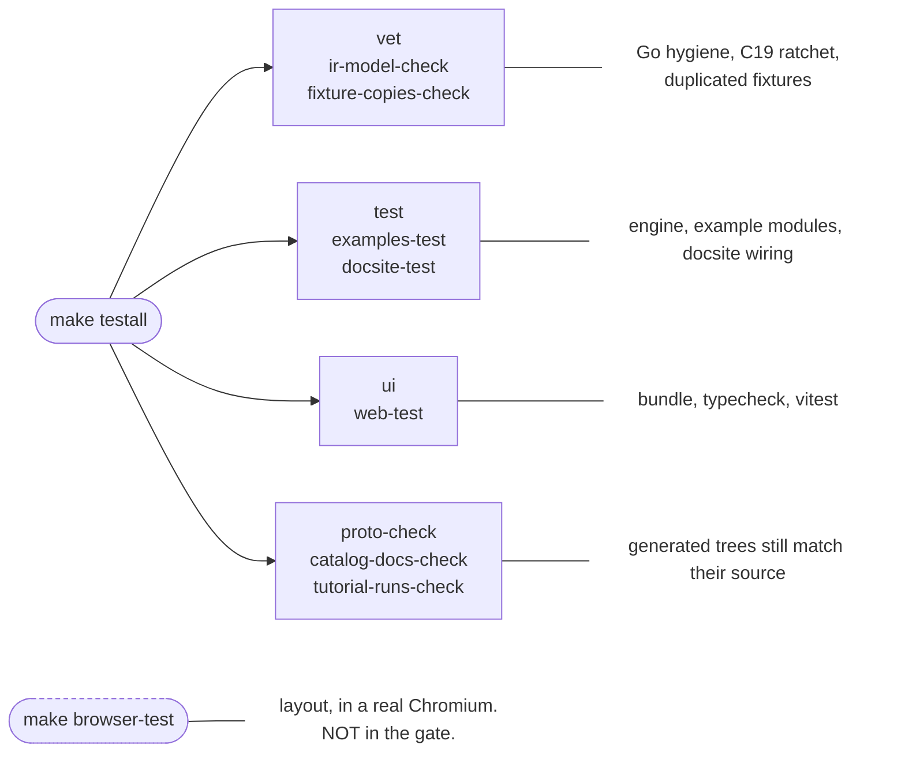
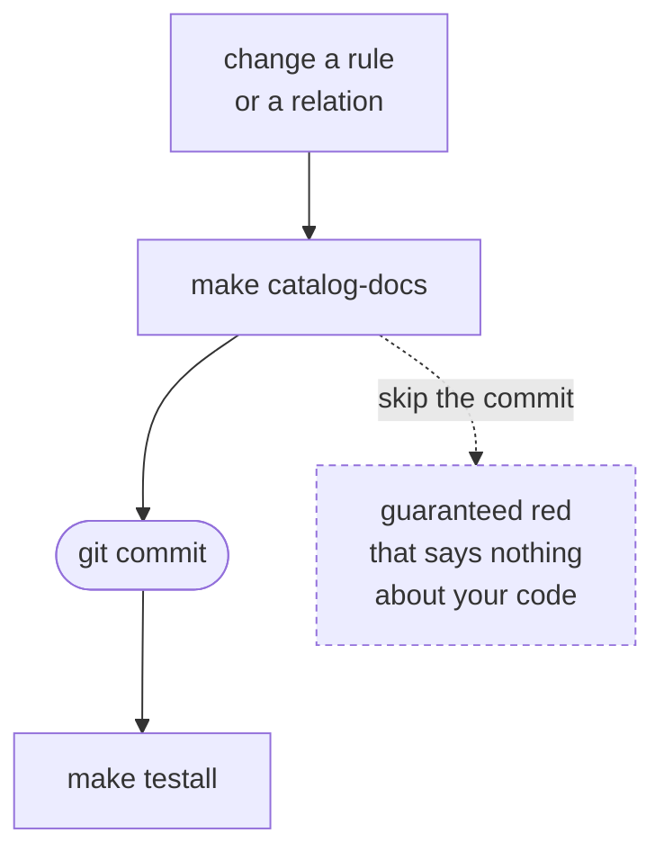
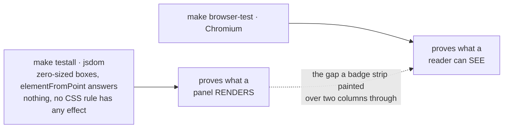

`make testall` is the full gate and CI runs exactly this command. Green means ship-ready. It also
lies to you in three specific ways, and most of this page is about them.

## Some boards are fetched, not committed

`make samples` downloads a pinned tarball from
[agni-samples](https://github.com/panyam/agni-samples) and extracts it into `tools/samples/`, which is
gitignored. `testall` depends on it, so the gate always has the corpus.

Those boards are real designs published by other people, each under its own licence (Apache-2.0,
CERN-OHL-P). Keeping them out of this tree is what lets this repo stay uniformly Apache-2.0. They are
worth having because every fixture we authored was built to the reader's own assumptions, so none of
them can catch an assumption that is wrong. The first one added found three reader bugs.

`hack/samples.pin` names the release and carries a checksum per artifact. To bump it, change the
version, replace the checksums with the ones from the release's `SHA256SUMS`, and run `make samples`.
The stamp is a hash of the pin file, so editing it re-fetches without anyone remembering to clean.

**There is no offline escape hatch, and that is deliberate.** Every failure path in
`hack/fetch_samples.sh` exits non-zero: a download that fails, a checksum that does not match, a
tarball that extracts to no schematics. A test whose corpus quietly failed to arrive does not fail, it
passes over an empty set, which is the third trap below wearing different clothes. For the same reason
a test that reads the corpus calls `t.Fatalf` when it is absent rather than `t.Skip`.

A checksum mismatch means the published artifact changed or the download was corrupted. Do not update
the pin to match without establishing which, because a released artifact is meant to be immutable.

Two tarballs, and one stamp per artifact so the targets compose. `tutorial-board` is one board's
schematics, about 3MB. `oracle-corpus` adds every board's copper for the reader cross-checks, about
19MB, and the gate takes that one.

The per-artifact stamp is worth knowing about, because a single stamp over the requested SET made the
two targets alternate: each wiped what the other had fetched. So `make testall` deleted the corpus a
cross-view test needed, that test skipped, and it ran on nobody's machine for as long as it existed.
A skipped test reports the same green as a passing one, which is why the tests that read the corpus
now call `t.Fatalf` when it is absent rather than `t.Skip`.

## A fixture that exists twice is checked against its twin

`fixture-copies-check` reads `hack/fixture_copies.txt`, which declares every group of files meant to
be byte-identical, and fails on two things: a declared group that has drifted, and a copy in the tree
that the manifest does not declare.

The second half is the one that keeps working. Twenty-four groups are declared, so duplication here
is a habit rather than an accident, and the failure it guards against is a false green rather than a
missing check. `demo/showcase.passes.kicad_pro` was a snapshot that lost three commits of net-class
work while the conformance copy kept them, and every check in the repo passed from either file
because none of them compared the two (agni issue 509).

It cannot infer which files are MEANT to match, and that is settled rather than pending. The tree is
full of near-twins that must differ: `tjunc.fires` against `tjunc_labeled` and `tjunc_dotted`,
`rev-a` against `rev-b`, `twosheet.fires` against `hier_root`, which are identical but for the sheet
filename each names. Nothing in the content separates those from a copy that drifted, so the manifest
declares intent and the check enforces it.

On a red, fix by hand. The check names both paths and does not know which is right.
`hack/fixture_copies_check.sh --dump` prints the tree's copy groups for SEEDING a new entry, writes
nothing, and would drop a drifted group rather than repair it, because two files that differ are no
longer a copy.

It reads new unstaged files as well as committed ones, so it has no commit-first trap.

## The architectural constraints are tests, not a checklist

`CONSTRAINTS.md` holds C1 to C30 and sixteen of them fail the gate. They ride in under `go test ./...`
rather than a target of their own, so nothing in the diagram above names them, which is easy to read
as the document being advisory. It is not.

Where a constraint's test lives follows from what it READS, and there are three homes:

| Reads | Home | Examples |
|---|---|---|
| the package graph, or the module | `deps_test.go` at the repo root | C13's embedding surface, C17's reader tier, C18's `go.mod`, C30's rule primitive |
| one package's own rule | a test beside that package | C13's transport clause in `service/transport_guard_test.go`, C29 in `core/facts`, C19 as `hack/ir_model_check.sh` |
| a line of source somewhere nobody would think to guard | `internal/constraints` | C6, C12, C20, C22, C24, C25, C28 |

The other thirteen are REVIEW questions and say so. C5 turns on whether an ingestion path was
approved, which is a fact about a conversation. C21 forbids sourcing component identity from a
geometry model, and a rule that did would compile and pass. A proxy test for those would pass and
read as the rule holding, which is worse than prose. The reasoning is in `DECISIONS.md`, under "A
constraint's Verify is a test, or it says why it cannot be".

**A new rule owes a test, never a command typed into the document.** The September 2026 audit read
every constraint against the tree and found that a Verify written as a `grep` rots in four distinct
ways. Two returned hits on clean code, because the tree beneath them had grown legitimate new call
sites. Two deferred themselves to work that had since landed. One could not fail at all, because what
it grepped lives in a separate Go module. And two rules had no Verify while the tree already violated
them, both found by reading rather than by anything failing. That last part is the whole argument:
both halves of a structural violation compile and pass, so nothing surfaces one until somebody
re-reads the rule.

Two shapes are worth copying when you write one. A graph or single-writer check needs a POSITIVE
CONTROL, so a pattern that matched nothing fails instead of reading as clean; that is what keeps a
check alive through the rename that would otherwise make it vacuous. And when the invariant is
narrower than anything a sweep can express, use a RATCHET with an allowlist rather than weakening it.
C24 wants "the raw unit is never COMPARED outside `datasheet/param`", no sweep can tell a comparison
from a display, so the two display sites are listed in the test and a new one is a deliberate
addition. That addition is the review moment the constraint is asking for.

Red-check every one of them, per [evidence](evidence.md): break the thing it guards, watch it fail,
put it back.

## Generated captures are checked by REGENERATING them

`tutorial-runs-check` deletes every `docsite/content/**/runs/*.output`, rebuilds them, and fails on
any difference. It costs about 15 seconds.

Regenerating is the only thing that works, because a capture's freshness stamp hashes its SPEC and its
FIXTURE and never the engine. An engine change that alters output leaves every stamp valid, so an
ordinary docsite build rewrites nothing. Measured: after changing the coverage line's wording, a plain
build rewrote 0 captures and a forced regeneration rewrote 12. A capture edited BY HAND keeps its
stamp too, and used to pass the entire gate.

One capture is exempt, listed with its reason in `hack/tutorial_runs_check.ignore`. The force layout is
not bit-identical across architectures (agni issue 472), so `agni render --compare` legitimately
answers differently on arm64 and amd64 and no amount of regenerating makes it agree. That file is the
gate's only exemption, a capture belongs in it only when its command is not a function of this repo,
and a capture that merely went stale is stale.

**It checks the capture and not the prose around it.** A page that quotes a run's last line in a
hand-written fence keeps whatever numbers it was written with, because the check regenerates
`*.output` files and never reads the markdown citing them. `05-your-interfaces.md` carried
`14 finding(s) ... 32 rule(s)` through a change that moved the run to 27 and 36, and the gate was
green the whole time. When a change moves a capture, grep the docsite for the numbers that moved
before believing the tutorials still read correctly.

It snapshots and restores, so it carries no commit-first trap and leaves the tree as it found it
whether it passes or fails. That matters more here than for the catalog, because captures move on any
fixture or output change and the natural loop is to regenerate and run the gate before committing.

**The GENERATOR has the ordering rule the checker does not.** A stamp hashes `git ls-files` for the
fixture directory, so it is a hash of COMMITTED content and of the tracked file LIST. `make
tutorial-runs` run before you commit a new fixture file computes a stamp that does not know about it,
and the gate then goes red after the commit lands. Commit the fixtures first, regenerate second.

That has a consequence worth knowing before it surprises you: **a file added to a fixture directory
restamps every capture reading that directory, whatever the file is for.** The directories are shared
test-data trees, not per-capture folders, so an addition made for an unrelated reason moves captures
that have nothing to do with it. Adding bus fixtures to `readers/kicad/testdata/` restamped five
captures across `guide/` and `learn/`.

| fixture directory | captures riding on it |
|---|---:|
| `examples/tutorial-project` | 58 |
| `cmd/agni/testdata/conformance` | 23 |
| `demo` | 8 |
| `readers/kicad/testdata` | 5 |
| `cmd/agni/testdata/intent` | 4 |
| `examples/common/designs` | 2 |

`readers/kicad/oracle_corpus.baseline` used to sit in `readers/kicad/testdata/`, so regenerating it
churned those five captures for no reason anyone could act on. It was moved out to break that. The
coupling is gone in both directions now, which is the point and also the catch: a reader fix that
shrinks the baseline no longer moves the captures, and a change touching the fixtures still needs its
own `make tutorial-runs` after the commit.

## The three traps

**Never judge it through a pipe.** `make testall | tail` reports *tail's* exit code, so a red gate
reads green and an `&&` chain sails on. Twice now. Run it redirected and read the tail from the file:

    make testall > /tmp/t.log 2>&1; echo $?

**`catalog-docs-check` is git-status-based**, so a regenerated docsite file that is not yet COMMITTED
reads as stale. Anything touching the shipped rule or relation catalog regenerates
`docsite/content/reference/`, which makes the order load-bearing:

**`pnpm install` is per clone**, and this has bitten four times. After merging main, `cd web && pnpm
install` if web deps changed. A plain re-install can be INSUFFICIENT: a partially-populated
`node_modules` survives it and the bundle dies deep inside a transitive dep, which reads as a code bug
rather than a toolchain one. **When the second error differs from the first**, stop re-installing and
go to `rm -rf web/node_modules && pnpm install`. Match on the SHAPE, a failure inside a dep you did
not touch right after a checkout switch or a fresh clone, not on the message.

## A red gate that is none of your business

The three above make a red gate read green. This one is the other direction, and it wasted an
afternoon being mistaken for a regression on `main`.

**A server already listening on :8080 fails three verdict-link tests.** `--url-base` asks the server
at that address whether it serves the mount a link would name, and withholds the link when the answer
is no. That is the feature working. But a development `agni serve` left running from earlier answers
the probe, does not serve the tests' `demo` mount, and every link is withheld:

    note: http://localhost:8080 serves no mount named "demo", so every link would resolve to nothing

`TestVerdictRowsCarryAProofURL`, `TestEveryFormatComposesTheSameLink` and
`TestAPlainPathThroughADeclaredMountIsLinkable` then fail on a tree that is fine. Before believing a
failure in that trio, check the port. The general rule is worth more than the instance: this suite
reaches out of the process, so **reproduce a suspected regression against unmodified `main` before
reporting it**, which is what turned this one from a bug report into a `pkill`.

## What the gate does NOT run

`make browser-test` drives layout assertions through a real Chromium against a real server (agni
issue 323), deliberately outside `testall`. It runs two suites against two servers: the viewer's own
layout assertions against `agni serve`, and a geometry sweep of every hand-authored docsite figure
against the docsite, which the Go gate can check for a resolving path, an uncalled file, a colour
literal and a blank line, and cannot check for anything about the RESULT.

`make oracle` cross-checks the KiCad reader against real boards, and is outside `testall` for a
different reason: cost. It reads a design's schematic our way, reads the same design's `.kicad_pcb`
for the netlist KiCad itself resolved, and requires the two to agree on which pins share a net. That
needs the 19MB both-views corpus rather than the 3MB the gate already fetches, so the target pulls it
first.

It compares the PARTITION, never net names and never counts, and both halves of that cost time to
learn. Names cannot match, because an unnamed net is auto-named by each tool in its own vocabulary
(`N$37` against `Net-(C104-Pad1)`) and KiCad writes a root-sheet label as `/AN0` where we write `AN0`.
Counts hide compensating errors: on one demo board we read 47 nets against KiCad's 47 while
disagreeing about 19 of them, because a swapped pin pair moves one connection out of a net and
another in. See `build/evidence.md` on why a matching total is not agreement.

It asserts a COMMITTED BASELINE of the disagreements rather than demanding zero, because several
reader defects are still open and a test that has never passed teaches nothing.
`readers/kicad/oracle_corpus.baseline` names the nets we still get wrong, so a fix shrinks
the file and a regression grows it; `AGNI_ORACLE_UPDATE=1 make oracle` rewrites it. Two boards is not
a survey, and the file says what it does not cover: neither crosses a sheet boundary with a bus
vector, so it does not move when that fix is reverted. The in-gate fixture pair
(`hier_busvec_root.kicad_sch` against kicad-cli's own netlist) is that guard.

`make -C docsite figures` and `make -C docsite designs` re-render the images the docs embed, and
nothing checks those for staleness at all (agni issue 453). The captures got a check; the pictures
have not.

Keeping the browser suite out of the gate means a machine without a browser never turns CI red for a
reason unrelated to the change under test. It needs one installed per machine (`cd web && pnpm exec
playwright-core install chromium`) and starts its own server on a kernel-picked port, so it will not
fight a dev server you already have.

**Add to it sparingly.** Anything assertable in jsdom belongs in `src/*.test.ts`, where it runs on
every gate rather than when somebody remembers. Pixels are the claim. Read the layout traps in
`build/evidence.md` first: two versions of the first test there went green with the CSS under test
deleted.

## What a run leaves behind

| Artifact | Why | What to do |
|---|---|---|
| `examples/render-board/render-board`, `examples/validate/validate` | built binaries | per-example `.gitignore` covers them; never `git add` |
| `readers/kicad/testdata/*.kicad_prl` | `kicad-cli` writes one beside ANY board it reads | ignored there; never part of a change |
| golden SVGs | fail by design on any render-affecting change | `go test ./core/render/ -run Golden -update`, then read the diff |

**A tutorial run's committed output should no longer go stale on you.** It carries an `#agni-run`
stamp that is a hash of its inputs, and that hash used to cover every file in the fixture DIRECTORY.
The tutorial's own `make report` target writes into `examples/tutorial-project/`, gitignored, so
anyone who had followed the tutorial hashed two files nobody else had and every gate run rewrote a
committed output they had not touched. `git checkout --` on it became part of the routine.

It now hashes the fixture's git-TRACKED files, so a committed stamp is valid in every checkout (agni
issue 357). If you add another generated artifact of this kind, a value written INTO a committed file
has to be a function of committed content, or no single value can be correct for two people at once.
Regenerating and committing is the fix that looks right and only moves the staleness to whoever has
not run the thing yet.

That ignore rule is SCOPED to `readers/kicad/testdata/` rather than a blanket `*.kicad_prl`, because
the two under `cmd/agni/testdata/conformance/` are tracked on purpose so a project read sees the full
sibling set. Do not "clean them up". Point kicad-cli at a new folder and you add an ignore rule there,
and stage by explicit path, since a directory-wide `git add` sweeps them all up.

## Generated code

**After ANY proto change run BOTH `make proto` (Go) AND `make proto-web` (TS).** Additive fields build
green, so a skipped TS regen used to go unnoticed until the next regen churned. `make proto-check` now
fails the gate on either half being stale, and names which half drifted and the command that fixes it.
Unlike `catalog-docs-check` it carries no commit-first trap, because it generates into a throwaway
tree and diffs.

**Never hand-edit a generated file, and that includes reformatting it.** A commit that regrouped the
imports in `gen/go/agni/v1/param/param.pb.go` turned main red, because `proto-check` compares the
generated tree byte for byte, and **every open PR inherited the failure** since CI checks out the
merge with main. The same commit sanitized a generated rule page differently from its `stdlib/`
source, which the next `catalog-docs` run would have silently undone. Edit the SOURCE and regenerate,
and exclude `gen/` and the generated docsite directories from any tree-wide sweep.

**An editor reporting the generated types as MISSING is usually a stale language server.** After a
branch switch the LSP can insist `Module ... has no exported member 'Foo'` for symbols that are
present in the file. It reads exactly like real staleness, so tell the two apart with the FILE and a
fresh `cd web && npx tsc --noEmit`, never the editor. Genuine staleness fails the gate.
