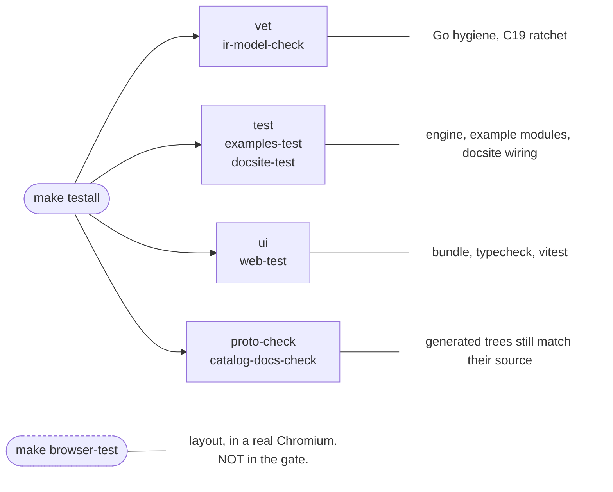
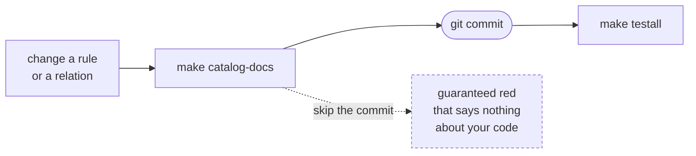
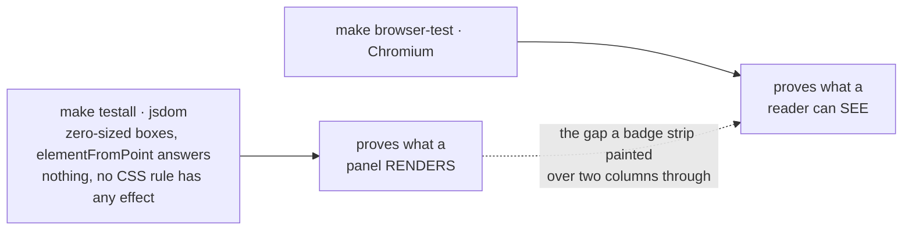

`make testall` is the full gate and CI runs exactly this command. Green means ship-ready. It also
lies to you in three specific ways, and most of this page is about them.

## The three traps

**Never judge it through a pipe.** `make testall | tail` reports *tail's* exit code, so a red gate
reads green and an `&&` chain sails on. Twice now. Run it redirected and read the tail from the file:

    make testall > /tmp/t.log 2>&1; echo $?

**`catalog-docs-check` is git-status-based**, so a regenerated docsite file that is not yet COMMITTED
reads as stale. Anything touching the shipped rule or relation catalog regenerates
`docsite/content/reference/`, which makes the order load-bearing:

**`pnpm install` is per clone**, and this has bitten four times. After merging main, `cd web && pnpm
install` if web deps changed. A plain re-install can be INSUFFICIENT: a partially-populated
`node_modules` survives it and the bundle dies deep inside a transitive dep, which reads as a code bug
rather than a toolchain one. **When the second error differs from the first**, stop re-installing and
go to `rm -rf web/node_modules && pnpm install`. Match on the SHAPE, a failure inside a dep you did
not touch right after a checkout switch or a fresh clone, not on the message.

## What the gate does NOT run

`make browser-test` drives layout assertions through a real Chromium against a real server (agni
issue 323), deliberately outside `testall`.

Keeping the browser suite out of the gate means a machine without a browser never turns CI red for a
reason unrelated to the change under test. It needs one installed per machine (`cd web && pnpm exec
playwright-core install chromium`) and starts its own server on a kernel-picked port, so it will not
fight a dev server you already have.

**Add to it sparingly.** Anything assertable in jsdom belongs in `src/*.test.ts`, where it runs on
every gate rather than when somebody remembers. Pixels are the claim. Read the layout traps in
`build/evidence.md` first: two versions of the first test there went green with the CSS under test
deleted.

## What a run leaves behind

| Artifact | Why | What to do |
|---|---|---|
| `examples/render-board/render-board`, `examples/validate/validate` | built binaries | per-example `.gitignore` covers them; never `git add` |
| `readers/kicad/testdata/*.kicad_prl` | `kicad-cli` writes one beside ANY board it reads | ignored there; never part of a change |
| golden SVGs | fail by design on any render-affecting change | `go test ./core/render/ -run Golden -update`, then read the diff |

**A tutorial run's committed output should no longer go stale on you.** It carries an `#agni-run`
stamp that is a hash of its inputs, and that hash used to cover every file in the fixture DIRECTORY.
The tutorial's own `make report` target writes into `examples/tutorial-project/`, gitignored, so
anyone who had followed the tutorial hashed two files nobody else had and every gate run rewrote a
committed output they had not touched. `git checkout --` on it became part of the routine.

It now hashes the fixture's git-TRACKED files, so a committed stamp is valid in every checkout (agni
issue 357). If you add another generated artifact of this kind, a value written INTO a committed file
has to be a function of committed content, or no single value can be correct for two people at once.
Regenerating and committing is the fix that looks right and only moves the staleness to whoever has
not run the thing yet.

That ignore rule is SCOPED to `readers/kicad/testdata/` rather than a blanket `*.kicad_prl`, because
the two under `cmd/agni/testdata/conformance/` are tracked on purpose so a project read sees the full
sibling set. Do not "clean them up". Point kicad-cli at a new folder and you add an ignore rule there,
and stage by explicit path, since a directory-wide `git add` sweeps them all up.

## Generated code

**After ANY proto change run BOTH `make proto` (Go) AND `make proto-web` (TS).** Additive fields build
green, so a skipped TS regen used to go unnoticed until the next regen churned. `make proto-check` now
fails the gate on either half being stale, and names which half drifted and the command that fixes it.
Unlike `catalog-docs-check` it carries no commit-first trap, because it generates into a throwaway
tree and diffs.

**Never hand-edit a generated file, and that includes reformatting it.** A commit that regrouped the
imports in `gen/go/agni/v1/param/param.pb.go` turned main red, because `proto-check` compares the
generated tree byte for byte, and **every open PR inherited the failure** since CI checks out the
merge with main. The same commit sanitized a generated rule page differently from its `stdlib/`
source, which the next `catalog-docs` run would have silently undone. Edit the SOURCE and regenerate,
and exclude `gen/` and the generated docsite directories from any tree-wide sweep.

**An editor reporting the generated types as MISSING is usually a stale language server.** After a
branch switch the LSP can insist `Module ... has no exported member 'Foo'` for symbols that are
present in the file. It reads exactly like real staleness, so tell the two apart with the FILE and a
fresh `cd web && npx tsc --noEmit`, never the editor. Genuine staleness fails the gate.
