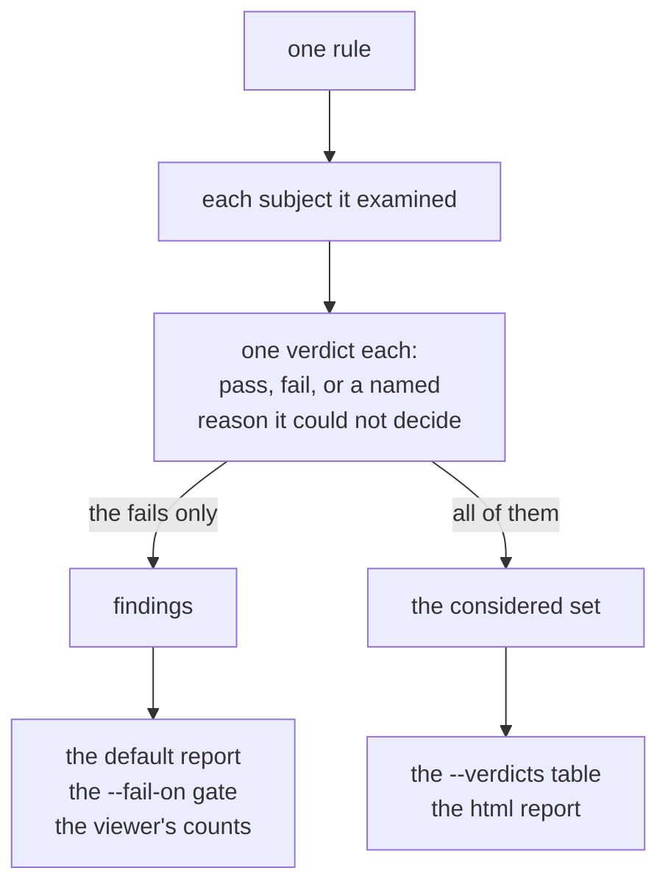

[Getting started](../getting-started/) ran the whole catalog and read the first few
findings. This page is about working the report: narrowing to what you care about, reading
it in different shapes, and following a finding back to what the tool actually saw.

Everything below is a view onto one thing, which is what each rule concluded about each subject it
looked at:



## Narrow what runs

By default every rule runs. Two flags cut that down.

**One rule by name** (`--rule`, repeatable):

```
agni check showcase.fires.kicad_pro --rule i2c-pull-up
```

```
findings by rule:
  i2c-pull-up            1

first 1:
  [error] i2c-pull-up: SCL (I2C net has no pull-up resistor to a rail)

1 finding(s) total
2 subject(s) considered by 1 rule(s) (--verdicts for the detail)
```

**A whole group by tag** (`--tag key=value`, repeatable). Every rule carries catalog tags
(category, tier, and more), so you can run one family at a time:

```
agni check showcase.fires.kicad_pro --tag category=power
```

This runs only the power-related rules and skips the rest. `--tag category=connectivity`
runs the connectivity group, and so on. Combine `--rule` and `--tag` to build exactly the
set you want.

## Read the report in the shape you need

`--format` takes six values, and the first five are the findings report in different shapes:

| `--format` | what you get |
|---|---|
| `text` (the default) | a per-rule summary |
| `markdown` | a severity-organized report, worst first, for pasting into a review |
| `csv` | one row per finding |
| `json` | one object per finding, for tooling (see provenance below) |
| `report` | the same report as JSON, the wire shape the web viewer consumes |
| `html` | a self-contained page, and the one form that reports the considered set rather than the violations alone ([below](#the-html-report)) |

The markdown one:

```
agni check showcase.fires.kicad_pro --format markdown
```

```
# agni check — showcase.fires.kicad_pro

| severity | findings |
|---|---|
| error | 1 |
| warning | 5 |
| info | 4 |

10 finding(s), 29 rule(s) run.

## error

### i2c-pull-up — An I2C net (SDA/SCL) reaches no rail through a pull-up resistor.
- `SCL` — I2C net has no pull-up resistor to a rail (showcase.fires.kicad_sch)
```

The header line (`10 finding(s), 29 rule(s) run`) is your coverage receipt. It says how many
rules actually ran, so a clean report is distinguishable from a report that had little to
check. See "silence is not a pass" in [Concepts](../concepts/).

## See what was checked, not only what failed

A findings report lists violations, so a clean subject says nothing at all and you cannot tell it
apart from one no rule looked at. `--verdicts` answers the other question:

```
agni check showcase.fires.kicad_sch --verdicts
```

```
fail            SCL  no rail is reachable from SCL through a resistor within 3 hops
pass            SDA  SDA reaches rail +3V3 through R1

2 verdicts, 1 pass, 1 fail
```

SDA is fine, and now it says so and names the resistor and the {{ explainable "rail" }} holding it
up. That second line
is the thing a findings report cannot print.

It honours `--format text|csv|json|html`, and `--format html` turns it on by itself, since the HTML
report has no findings-only form. The CSV carries a `verdict_id` per row
(`i2c-pull-up:net:SDA`), plus `context` (the entities to look at, as `role=ref` pairs) and `terms`
(the values a conclusion rests on):

```
agni check showcase.fires.kicad_sch --verdicts --format csv
```

Paste an id into a running viewer as `?verdict=<id>` and it opens on that verdict with the proof
drawn: the subject in focus, the resistor and rail behind it.

**It is a separate table, not extra rows.** `--format csv` without `--verdicts` is unchanged, so
anything already reading the findings CSV keeps working and never sees a pass counted as a defect.

**Only some rules report one so far.** A rule missing from the output is declining to say what it
looked at, which is not the same as reporting that it looked at nothing. Expect the table to be thin
until more of the catalog converts.

## Follow a finding to its source

Every finding carries **provenance**: the record of exactly what the tool saw. `--format
json` exposes it:

```
agni check showcase.fires.kicad_pro --format json
```

```json
{
  "rule": "bulk-cap",
  "severity": "warning",
  "subject": { "kind": "net", "ref": "+3V3", "pin": "" },
  "message": "power rail has no bulk capacitor",
  "provenance": { "sourceFile": "showcase.fires.kicad_sch" }
}
```

- `subject` is what the finding is about: a `net` (`+3V3`), a `component` (its
  {{ explainable "reference-designator" "ref des" }}), or a component `pin`.
- `provenance.sourceFile` is the file the fact came from. For datasheet-backed rules the
  message also names the datasheet page and table (see [Datasheets](../datasheets/)).

This is why you never have to take a finding on faith. It points at the net, pin, or
datasheet row you can go open yourself.

### Start from the thing instead of the finding

In the viewer you can also go the other way. Click a part, a net or a {{ explainable "bus" }}, on
the drawing or in a query result, and the selection bar tells you how many findings already name it,
split by severity.
Clicking that count opens them in the checks panel. A query's results footer does the same for every
entity the query returned at once, so "what is flagged on the twelve things I just searched for" is
one number.

Nothing re-runs when you click. These are the findings from the run you already have, filtered, which
is what keeps them consistent with the report beside them.

Two things sit beside the count rather than in it. **"N unresolved"** means a rule examined this
thing and could not decide, which is never a pass and never a failure; the message says what it could
not resolve, and often you can clear it by supplying that. **"N rule(s) could not run"** means rules
you selected were gated before they evaluated, on this whole design, so they report nothing anywhere.
Hover for which and why.

**Read the wording, not just the number.** A count is only meaningful once the rules have actually
run, so the bar says "not checked yet" rather than "no findings" before you press Run, and reports a
half-finished run as a floor ("2 so far").

A count beside one entity is also narrower than a report, in two ways it names on screen: it covers
only the rules you have selected, and only findings that name that entity. A rule about the whole
design has no single subject and will never appear there. A rule comparing two pins is filed under
one of them, so the other pin looks quiet in the count even though the finding names it.

The finding itself does say so. A message that names an entity other than its subject carries that
entity as a chip you can click, so you can get from the sentence to the other end. An entity view
tells you where to look. It is not a statement that anything is fine.

## Understand a rule

Each rule ships with a short explainer describing what it looks for and why the condition
matters electrically. In the viewer it appears beside the finding. On the command line the
rule name is the handle you look it up by. The catalog is open, so your team can add house
rules on top of the built-ins. [Naming conventions](../naming-conventions/) is the simplest
form of that, configured without any code, and [interface profiles](../interface-profiles/)
are the same idea for a bus: declare its signals, get a rule per requirement.

Here is one, in full, so you know what to expect before you go looking. Every rule in the
[rule catalog](../../reference/rules/) carries the same shape: what it checks, why it matters in the
circuit, and what its silence does and does not mean. That last part is the one worth reading
before you trust a green result.

<details>
<summary><strong><code>cap-voltage</code></strong>, a capacitor's rating against the rail it sits on</summary>

{{ includeCard "content/reference/rules/cap-voltage.md" }}

</details>

A rule that could not evaluate never reports a pass. It reports not-applicable, needs-data, or
inconclusive, each naming what was missing. That distinction is the whole reason a clean report from
this tool is worth something, and it is why the cards spend as much space on absence as on the check
itself.

## Gate a build

`--fail-on <severity>` exits non-zero when any finding sits at or above the threshold, so
`check` gates CI:

```
agni check showcase.fires.kicad_pro --fail-on error   # non-zero here (1 error)
agni check showcase.passes.kicad_pro --fail-on error  # exit 0 (clean)
```

That gate reads **severity**, which is a statement about consequence. It has nothing to say about the
distinction the section above is built on: a check that decided, versus one that never ran. A design
whose datasheet corpus moved keeps passing this gate, because a rule that could not evaluate produces
no findings and no findings is what clean looks like.

`review` gates on the other axis:

```
agni review designs/gateway --checklist review.yaml --fail-on-outcome fail
agni review designs/gateway --checklist review.yaml --min-answered 13
```

`--min-answered` counts the items that produced an answer (`pass`, `fail`, `provisional`,
`computed-n/a`), which is stricter than the covered count the report also prints. Covered subtracts
only `not-automated`, so an item whose rule is present and whose inputs are gone still counts as
covered. Both gates are off by default, and a tripped one exits `2` where a failed run exits `1`. See
the [CLI reference](../cli-reference/#gating-a-pipeline-on-a-review) for the full vocabulary.

## Where to go next

- [Datasheets](../datasheets/): turn on the rules that compare your design against a part's
  real limits.
- [Comparing revisions](../comparing-revisions/): diff two versions of a design.
- [CLI reference](../cli-reference/): every flag in one place.

## The HTML report

`agni check --format html > report.html` writes one self-contained page: what each rule
looked at, what it concluded, and what to do about the parts that failed.

    agni check --format html \
      --url-base http://localhost:8080 \
      --mount board=. mount://board/design.kicad_sch > report.html

Rules with something to act on come first and open expanded; rules that cleared everything collapse to
a one-line summary you can expand to check their working. That ordering is the whole design: a board
with three problems and two thousand passes has to show you the three problems.

**A rule that reports violations without stating what it examined is labelled as such**, and its rows
are captioned "absence here is not evidence of correctness". Presenting a failure list beside a
considered set as though they were the same kind of answer is the false-coverage claim this whole
layer exists to remove, and a report is where it would be most convincing.

**Links are emitted only when they are real.** `--url-base` says where the viewer is. The other half
is that the mount was DECLARED, with `--mount` or in `agni.yaml`, rather than minted for this run: a
minted name means nothing on a server that was not started with it, so it gets no links rather than
links resolving on nobody's server. Either way the reason is printed.

<details>
<summary>What the server is asked, and the three answers it can give</summary>

Declaring the mount says the operator named it, which is not the same as the server agreeing about
it, so `--url-base` also asks that server for its mount table. A name served from a different root
means every link would open a different board, and those links are dropped. A server that does not
answer leaves the question open rather than settling it, so the links stay and the run says they went
unverified, which keeps the case where a report is written before the viewer is up.

A report with no links used to look like a broken renderer, because nothing named which half was
missing.

</details>

**Each link also carries the design's content hash**, so the viewer can say a link was computed
against different bytes rather than silently highlighting whatever now sits at that subject. The hash
is of the ENTRY the design declares, not of the argument you typed, so a report run against the design
folder and one run against a companion view carry the same revision identity.

Opening such a link, the viewer compares that hash against the revision it just read and says so
before it draws anything. A match is silent. Different bytes get a banner saying the highlight may be
about a different net, because a verdict id is built from a rule name and a subject ref and resolves
against an edited design just as readily. A server that could not hash the file gets its own, weaker
banner rather than the benefit of the doubt: a link that could not be checked is not a link that
checked out, and reading the two the same way is the false confidence the hash exists to remove.

The easiest way to get all of this right is not to assemble it by hand. `agni open <design>` serves
the board and prints the matching `agni check --mount … --url-base …` line, and because one process
mints the mount and serves it, the two cannot disagree.

The page needs no JavaScript and loads nothing from the network, so it survives being emailed,
committed, or opened from a `file://` path.
