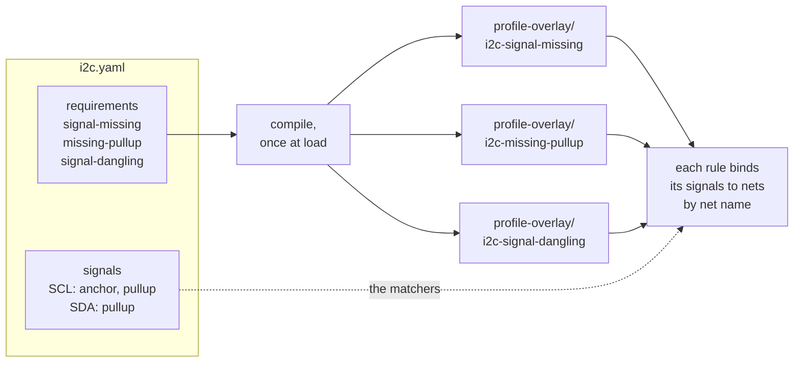
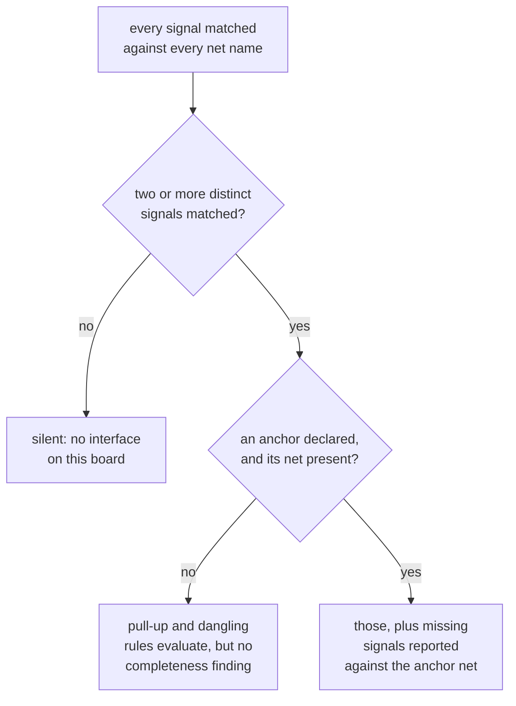

A {{ explainable "bus" }} has a shape. CAN is a CANH/CANL {{ explainable "differential-pair" "pair" }} with a
{{ explainable "termination" }} resistor across it, driven by a {{ explainable "transceiver" }} with
TXD and RXD. I2C is SCL and SDA, both pulled up.

An interface profile writes that shape down as YAML, and the engine compiles it into check rules.
Agni ships profiles for SPI-NOR, eMMC, CAN, LIN, A2B, PCIe, SGMII and MDIO. Your own interfaces, and your
own reading of a standard one, go in a directory you hand to `--profile-path`. No Go.

## Write a profile

I2C is not one of the built-ins, which makes it a short first example. Two signals, both
needing a {{ explainable "pull-up" }}:

```yaml
# profiles/i2c.yaml
name: I2C
signals:
  - {name: SCL, suffix: SCL, pullup: true, anchor: true}
  - {name: SDA, suffix: SDA, pullup: true}
requirements:
  - {type: signal-missing}
  - {type: missing-pullup}
  - {type: signal-dangling}
```

Point `check` at the directory holding it. `--tag profile=I2C` narrows the run to this
profile's rules:

{{ agniRun "content/guide/runs/profile-i2c.yaml" }}

Three rules came out of that declaration, one per requirement, and the last line is how you know all
three ran rather than one. On the variant of the same board with the pull-ups fitted, they run and
stay quiet:

{{ agniRun "content/guide/runs/profile-i2c-clean.yaml" }}

Rules from `--profile-path` are namespaced `profile-overlay/`, so an overlay rule is never
mistaken for a built-in one.



The requirements decide how many rules there are. The signals decide what each one looks at.

## The shape of the file

| key | what it is |
|---|---|
| `name` | the profile's name. It appears in rule names, in every finding's message, and as the `profile` tag. |
| `signals` | the interface's roles, each with a `name` (the role, e.g. `SCL`) and one matcher. |
| `requirements` | the checks this profile declares, each naming a registered type. |
| `host` | optional. Binds the interface to the component that declares it. |

`host` takes `{attr: <key>, value: <val>}` to match a component attribute the design carries
(`interface=CAN`), or `{class: <device-class>}` to match what a part's datasheet says it is.
Either or both, and a component matching either one is a host. The class form needs a seeded
parameter set, so without [`--params`](../datasheets/) it finds nothing rather than guessing.

## The four matcher forms

A signal is found by net name, and declares exactly one of these:

| form | example | when it earns its place |
|---|---|---|
| `suffix` | `suffix: _CANH` | the readable default. The role is the tail of the net name. |
| `prefix` + `suffix` | `prefix: PCIE_`, `suffix: _TXP` | the tail is shared with a foreign bus, and a bus prefix tells them apart. |
| `glob` | `glob: ETH_SW*_A_H` | the identity is in the head of the name and the tail is not distinctive. |
| `regex` | `regex: ^ETH_SW\d+_P\d+_.*_H$` | multi-instance naming a glob cannot express. RE2, not auto-anchored, so anchor it yourself. |

Prefix and suffix are conjunctive and count as one form together. Declaring two forms on one
signal is an error, because a signal that can be found two ways has no single convention to
enforce.

## Requirements

| type | what it checks | params |
|---|---|---|
| `signal-missing` | every declared signal appears on a bus that is in use | |
| `host-incomplete` | a declared host is wired to all of the interface's signals | |
| `missing-pullup` | a signal marked `pullup: true` reaches a {{ explainable "rail" }} | |
| `signal-dangling` | a signal net has at least two connections | |
| `termination` | a terminating device bridges the bus pair | `high`, `low` |
| `esd` | a signal leaving through a connector has an ESD clamp | |

`termination` is the one that takes params, naming the two bridged net-name suffixes. The
shipped CAN profile is the worked example:

```yaml
# stdlib/profiles/builtins/can.yaml
name: CAN
host: {attr: interface, value: CAN}
signals:
  - {name: CANH, suffix: _CANH, anchor: true}
  - {name: CANL, suffix: _CANL}
  - {name: TXD,  suffix: _TXD}
  - {name: RXD,  suffix: _RXD}
requirements:
  - {type: signal-missing}
  - {type: host-incomplete}
  - {type: termination, params: {high: _CANH, low: _CANL}}
  - {type: signal-dangling}
  - {type: esd}
```

Those files are the built-ins themselves, not copies of them, so they are safe to read as
examples.

## A profile with no host, and signals that differ from each other

The shipped MDIO profile is the one to copy when the boards you check are exports nobody is going to
annotate for you. It declares no `host:` at all.

```yaml
name: MDIO
signals:
  - {name: MDIO, regex: '(?i)(^|[^A-Z])MDIO([^A-Z]|$)', pullup: true, anchor: true}
  - {name: MDC,  regex: '(?i)(^|[^A-Z])MDC([^A-Z]|$)'}
requirements:
  - {type: signal-missing}
  - {type: missing-pullup}
  - {type: signal-dangling}
```

`missing-pullup` and `signal-dangling` gate on the in-use test below, which is two distinct signals
matching by name, and not on a host part. So this profile evaluates on any board whose nets are named
conventionally, with nothing asked of the design.

The asymmetry is the more important half. **MDIO carries `pullup` and MDC does not**, because they
are not the same kind of line. MDIO is bidirectional and open-drain, undriven between frames and
through every turnaround cycle, so a resistor is what holds it high and IEEE 802.3 clause 22 calls
for one. MDC is a clock sourced by the station side, push-pull, driven whenever it matters. Requiring
a pull-up on it would report a failure on every correctly-built board that omits one.

That is the general point rather than a fact about Ethernet. `pullup` belongs on the signals that
float when nobody is driving, not on every signal of a bus that has a pull-up somewhere. Marking a
whole bus is how a profile starts producing failures a reviewer has to learn to ignore, and a
checklist whose failures are routinely ignored is worse than no checklist.

The pattern also shows why a signal's match is bounded. `MDCLK` opens with the letters `MDC` and is
an unrelated clock, so both patterns require a non-letter on each side of the match. RE2 has no
lookaround, so the boundary is written as explicit character classes.

## The anchor, and when a profile decides it is looking at your board

A profile that finds none of its signals has to stay silent. A board with no CAN on it is not
a board with a broken CAN bus. Two gates decide this, and both have to clear before the
completeness check runs.

The **in-use gate** wants at least two distinct signals of the profile to appear as nets. One
match is not evidence, because a real design has many `_CS` nets belonging to many things.

The **anchor** is the signal you mark `anchor: true`, the one that is always present when the
interface is. Completeness is reported against it, so a finding reads `CAN interface
(anchored at net CAN_CANH) is missing required signal RXD` rather than naming a net that is not
there. At most one signal may be the anchor, and a profile that declares none generates no
completeness rule at all.



## Re-bind a built-in instead of re-writing it

When the engine already reads your interface and only the net naming differs, a naming map
re-binds the roles and leaves the structure alone:

```yaml
# profiles/can.yaml
override: CAN
suffixes:
  CANH: _CAN_P
  CANL: _CAN_N
```

Unmapped roles keep the built-in's suffix. Requirements, host binding and anchor come across
unchanged. A profile carrying a built-in's name replaces that built-in's rules rather than
running beside it, and the CLI says so on stderr:

```
note: profile-overlay supersedes 5 rule(s): profile/can-signal-missing, profile/can-host-incomplete, profile/can-termination-missing, profile/can-signal-dangling, profile/can-esd-missing
```

Two readings of one interface running together would invent failures rather than merely
duplicate them, since the built-in still anchors on its own naming and reports each re-bound
role as missing. [Authoring an overlay](../../build/overlay/) covers the mechanism.

## Where the flag reaches

`--profile-path` takes a directory of these YAML files, and three surfaces accept it:
`agni check`, `agni review`, and `agni serve`, where the composed profiles reach the web check
panel too. The interface-coverage matrix in the viewer is the exception. It projects the
built-in profiles only, so an overlay profile's findings appear while its coverage row does not.

## What the tooling tells you when the declaration is wrong

A profile that cannot do what it says is refused at load, with the error naming what was available.

<details>
<summary>The three load-time refusals, verbatim</summary>

A requirement type nothing registers:

```
error: profiles: i2c.yaml: profile "I2C": unknown requirement type "pullup" (known: esd, host-incomplete, missing-pullup, signal-dangling, signal-missing, termination)
```

A requirement missing a param it cannot work without:

```
error: profiles: mybus.yaml: profile "MYBUS": requirement "termination": needs the low param, naming the two bridged net-name suffixes (e.g. high: _CANH, low: _CANL); got map[high:_H]
```

A signal declaring more than one matcher form:

```
error: profiles: mybus.yaml: profile "MYBUS": signal "H" declares 2 matcher forms: set exactly one of suffix/prefix, glob, or regex
```

</details>

A matcher that is merely too loose cannot be caught that way, because whether `_H` names one
role or half the board depends on the board. `check` judges that against the design in front of
it. A profile whose signals claim an implausible share of the nets:

```
warning: profile "ETH100": signal "AP" (regex "_H") matches 8 of 32 nets (25%) — the matcher looks too broad to name one role; narrow it with a prefix, a glob, or an anchored regex
```

And a profile that cannot tell two of its own roles apart:

```
warning: profile "MYBUS": signals "DATA" and "CLK" both match net "CAN_CANH" — the profile cannot tell these two roles apart, so whichever rule runs first claims the net
```

Both describe the profile you wrote, not the board, so neither is a finding. They go to stderr,
they never change the exit code, and they stay out of `--format json`.

## What a profile cannot do

A suffix-named profile only fires on designs that follow that naming. Rename the nets and the
interface goes invisible, silently. `host` binding exists to stop that: a component that
declares `interface=CAN` anchors the check no matter what the nets are called. When the
naming is merely different rather than absent, a naming map is the cheaper fix.

## Where to go next

- [Checks and reports](../checks-and-reports/): profile findings read like any other, and
  `--fail-on` can gate on them.
- [Authoring an overlay](../../build/overlay/): shipping profiles alongside private readers
  and rules in your own module.
- [CLI reference](../cli-reference/): the `--profile-path` flag.
