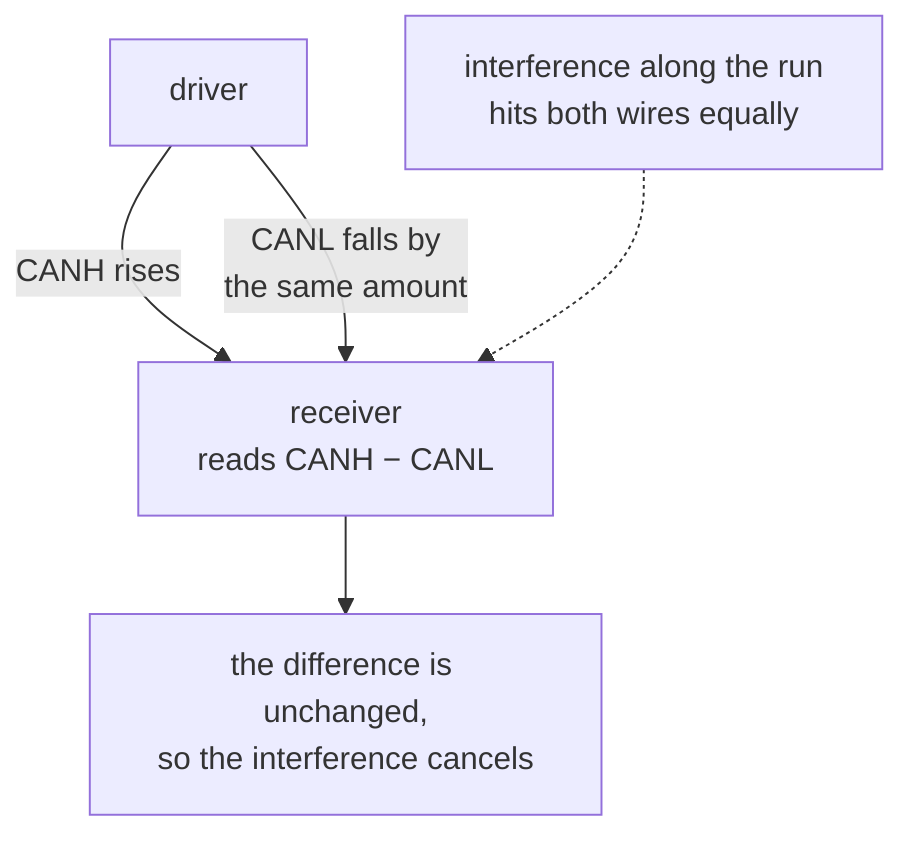

Two nets carrying one signal, one rising as the other falls by the same amount. The receiver does not
read either wire against ground. It reads the **difference** between them.

That is the whole trick. Interference picked up along the run hits both wires more or less equally,
which moves both by the same amount and leaves the difference untouched.

The two halves are conventionally named as a pair, `X_P` and `X_N`, or for CAN `_CANH` and `_CANL`.
A pair with only one half wired is not a pair at all, and the layout tool will route the survivor as
an ordinary signal, which is what [`diff-pair-naming`](../../rules/diff-pair-naming/) exists to catch.

A pair almost always needs [termination](../termination/) at each end, for a reason that has nothing
to do with noise.

**Where the course teaches it:** [chapter 1](../../../learn/01-what-a-board-is-made-of/), reading a
resistor's job from the nets it touches.
