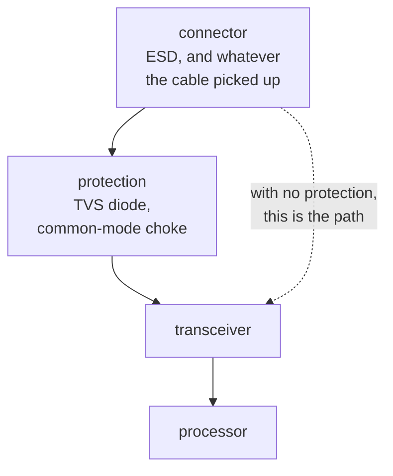

Anything leaving the board through a connector is exposed. A cable is an antenna, and a person
touching the connector is a static discharge of a few kilovolts arriving at a pin rated for a few
volts.

Protection is whatever is placed at the connector to absorb that before it reaches anything expensive:
a TVS diode or diode array for the discharge, a common-mode choke or ferrite for the interference.

The ordering is the point. Protection has to sit between the connector and the part it defends, so a
board that has the right parts in the wrong order has no protection at all, and nothing in the netlist
distinguishes the two.

That is why it is declared in a profile rather than inferred, the same as
[termination](../termination/).

**Where the course teaches it:**
[chapter 10](../../../learn/10-interfaces-and-what-they-require/), a bus as a contract.
