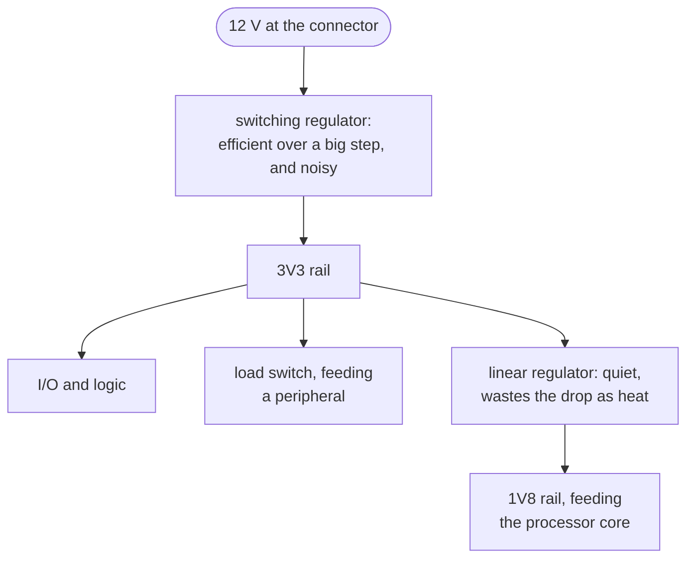

Power arrives at a board as one voltage and has to become several, because the parts do not agree
about what they want. A processor core might run at 1.8 V, its I/O at 3.3 V, and a motor driver
straight off the 12 V input. The chain of regulators that does the converting is the power tree.

Stacking the stages, rather than running every regulator straight off the input, buys something. A
switching regulator holds its efficiency across a big voltage step and pays for it in electrical
noise. A linear regulator throws away the voltage it drops as heat, which only stays reasonable over
a small step, and it is quiet. So the common shape is a switcher doing the heavy lifting and a linear
part cleaning up whichever rail feeds something sensitive.

The tree matters because it is what the system-level questions are asked about. Whether a rail can
supply everything hanging off it, what order the rails come up in, and what a part reads while they
do are all questions about the cascade rather than about any one part in it.

None of it is recoverable from a netlist. Nothing in a connectivity graph states that a rail was meant
to be 3.3 V, how much current its loads draw, or which stage is supposed to feed which. The rail's
name says the voltage, and a name is a convention somebody followed rather than a measurement. So the
tree is declared beside the design, in `voltage_domains`, `rail_budgets` and `sequences`, and the
checks compare the board against the declaration instead of against physics.

Rules that read it. [`intent-rail-current-capacity`](../../rules/intent-rail-current-capacity/) asks
whether the supplying part's rating clears the rail's declared peak, and
[`intent-rail-current-margin`](../../rules/intent-rail-current-margin/) asks whether it clears it with
headroom. [`intent-load-switch-trip-below-budget`](../../rules/intent-load-switch-trip-below-budget/)
catches a load switch set to trip under the current the rail is budgeted for, so the protection
becomes the fault. [`intent-sequence`](../../rules/intent-sequence/) checks the declared power-up
order against the enable chain in copper. And
[`regulator-output-exceeds-abs-max`](../../rules/regulator-output-exceeds-abs-max/) is the one that
needs no declaration, because a stage driving a rail above what a part downstream can survive is a
fact about two datasheets.

**Where the course teaches it:**
[chapter 8](../../../learn/08-the-power-tree/) is the whole chapter, and
[A board is fed by a cascade](../../../learn/08-the-power-tree/#a-board-is-fed-by-a-cascade-ee6)
reads one off the tutorial board's regulators.
[Chapter 9](../../../learn/09-sequencing-and-straps/) covers the order the tree comes up in.
