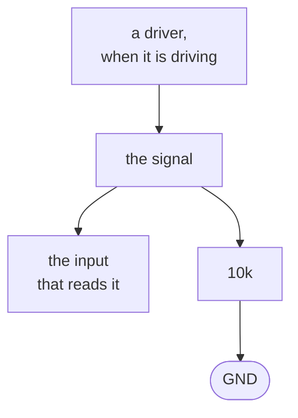

The same idea as a [pull-up](../pull-up/) with the other default. One end on the signal, the other on
ground, so an undriven line settles low instead of high.

Which one a design wants is a question about the safe state, not about preference. A line that enables
something usually gets a pull-down, so the thing stays off until firmware deliberately turns it on. A
line that holds something in reset usually gets a pull-up, so the part stays held until something
releases it. Getting the choice backwards gives a board that powers up doing the thing nobody asked
for.

Both appear as strap resistors, where the level a pin reads at power-on selects an address or a boot
mode.

**Where the course teaches it:**
[chapter 1](../../../learn/01-what-a-board-is-made-of/) for the role, and
[chapter 4](../../../learn/04-pull-ups-and-undefined-states/) for why an undefined level is the
error case.
