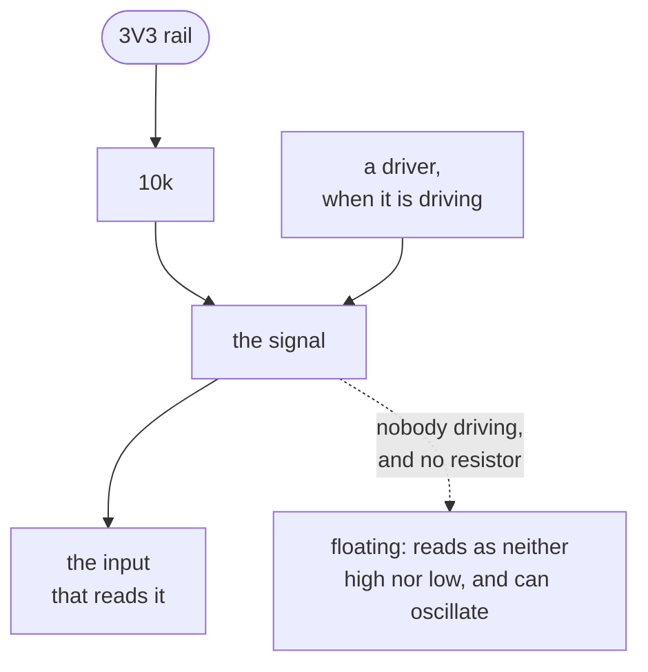

A resistor with one end on a signal and the other on a rail. When something drives the signal, it wins,
because a driver is far stronger than the resistor. When nothing drives it, the resistor gently pulls
the line up to the rail.

A floating input is the failure this prevents. A CMOS input left undriven does not read a sensible
default; it drifts, picks up noise, and can switch fast enough to draw real current. Anything that is
undriven some of the time needs a defined level, which covers a reset line before the driver comes up,
an open-drain bus, and an input to a chip that has not been fitted.

Two rules read this shape. [`floating-input`](../../rules/floating-input/) looks for inputs with no
defined level, and [`i2c-pull-up`](../../rules/i2c-pull-up/) checks the pair an I2C bus requires,
because I2C drivers can only pull DOWN and the bus cannot return high without them.

The value is a compromise rather than a constant. Lower means a faster return to high and more current
wasted while the line is held low. `i2c-pull-up` names no resistance for that reason, and says to size
it from the bus capacitance and clock rate instead.

The mirror image is a [pull-down](../pull-down/), to ground rather than to a rail.

**Where the course teaches it:**
[chapter 1](../../../learn/01-what-a-board-is-made-of/) reads one off a query, and
[chapter 4](../../../learn/04-pull-ups-and-undefined-states/) is the whole chapter about them.
