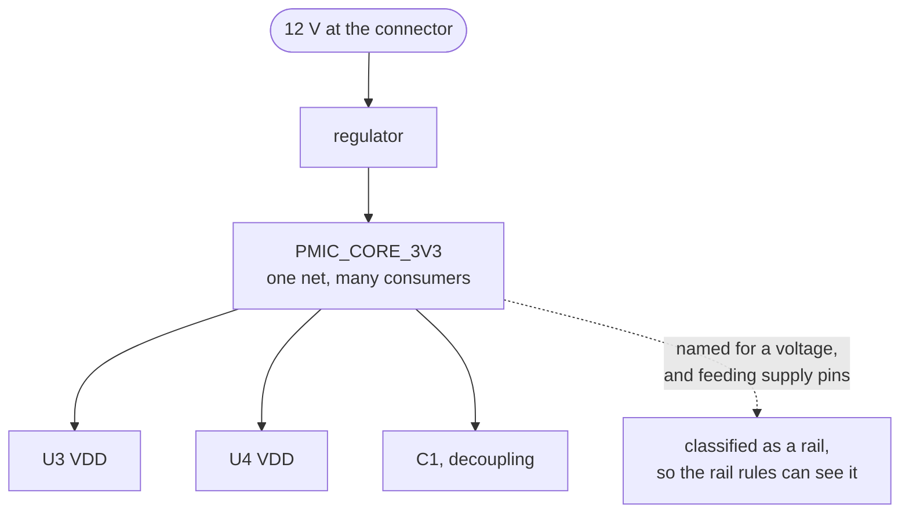

A net that distributes power. One thing decides its voltage, usually a regulator or the input
connector, and everything needing that voltage taps the same net. `PMIC_CORE_3V3` is a rail.
`MCU_NRST` is not.

The distinction matters because a rail behaves nothing like a signal net. A signal usually has one
talker and a listener or two. A rail fans out to dozens of pins, carries the current all of them draw
together, and is the number the rest of the board is sized around. So a rule quantified over rails is
asking a different question from one quantified over signals, and the engine keeps rail-ness as a role
stamped on the net when the design is read.

Here is the part that costs people an afternoon. **Nothing in a netlist states that a net is a rail.**
The engine has two channels of evidence, the net's name and the fact that it feeds a power-input pin,
and both are conventions somebody followed rather than measurements. A board that names its rails
function-first, `SYS_MAIN` or `VDD_ANALOG`, matches none of the built-in patterns, and every
rail-quantified rule then skips those nets in silence. Declaring the project's vocabulary under
`--conventions` is what fixes it, and
[`rail-not-classified`](../../rules/rail-not-classified/) is the rule that tells you the analysis is
running short.

Once a net is classified, a family of rules opens up.
[`power-input-not-driven`](../../rules/power-input-not-driven/) asks whether a supply pin is on a rail
that anything actually feeds. [`rail-nominal-out-of-recommended`](../../rules/rail-nominal-out-of-recommended/)
compares the voltage a rail's name declares against what the parts sitting on it accept.
[`intent-voltage-domain-mismatch`](../../rules/intent-voltage-domain-mismatch/) and
[`intent-rail-current-capacity`](../../rules/intent-rail-current-capacity/) go further and check the
rail against a declaration of what it was meant to be, because at that level there is nothing outside
the design to check against.

A name is a claim rather than a fact, which is worth remembering in both directions. Two spellings of
one rail merge two supplies nobody meant to merge, which is
[`power-tap-conflict`](../../rules/power-tap-conflict/). The zero-volt member of the family is
[ground](../ground/), and it gets its own vocabulary and its own handling.

**Where the course teaches it:**
[chapter 1](../../../learn/01-what-a-board-is-made-of/) shows how to spot one from what a resistor
connects to, and
[chapter 8](../../../learn/08-the-power-tree/#a-board-is-fed-by-a-cascade-ee6) puts the whole set of
them into a tree.
