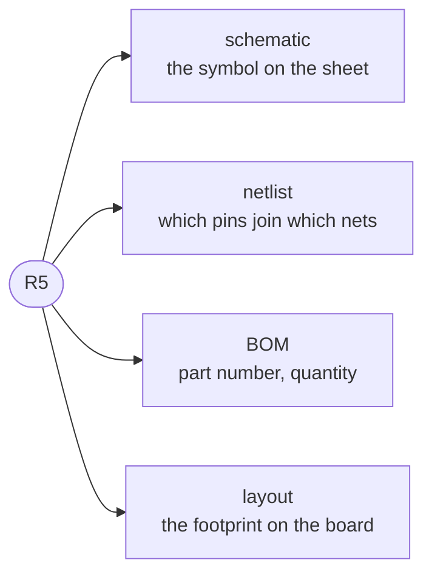

`R5`. `U1`. `C12`. A letter for the kind of part and a number that makes it unique on the board.

It looks like a cosmetic label and it is closer to a primary key. The schematic, the netlist, the bill
of materials, the layout and the assembly line all refer to the same physical component by this string,
and nothing else they carry is common to all of them.

Two consequences follow, and both show up in this tool.

Comparing two revisions matches components **by designator**, so a part that keeps its designator is
the same part and a part that gains one is a new part. Renumbering a board therefore reads as deleting
everything and adding it back, which is a real property of the identifier rather than a shortcoming of
the diff.

And a designator has to be unique, which is what [`duplicate-ref-des`](../../rules/duplicate-ref-des/)
checks. A board carrying two `R5`s has two parts that no downstream tool can tell apart. The exception
is a multi-unit part, where several symbols on the sheet are one physical component and share one
designator deliberately.

A part with no designator yet is *unannotated*, which is normal mid-design and a problem at handoff.

**Where the course teaches it:** nowhere yet. The course names parts as `R1` and `U3` from
[chapter 1](../../../learn/01-what-a-board-is-made-of/) onward without ever saying what the label is,
which is why this page exists.
