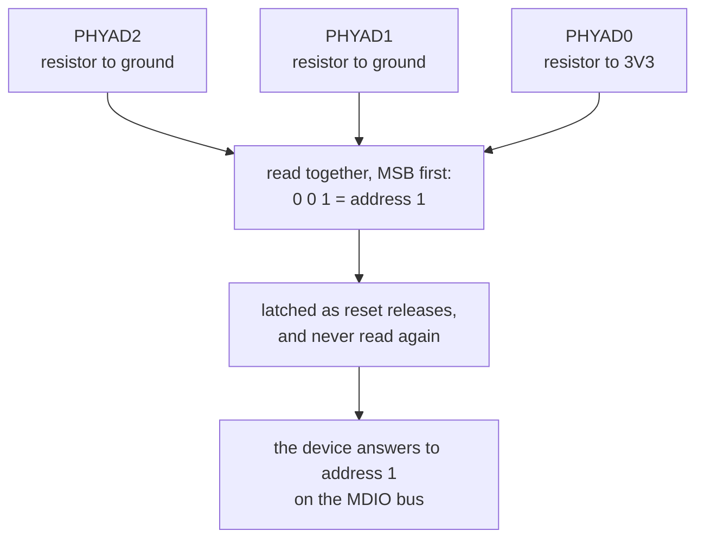

A configuration pin a part reads once, at the instant reset releases, and then never reads again. A
resistor ties it to a rail or to ground, and the level it sits at in that instant selects which address
the part answers to on a shared bus, which source it boots from, how wide its memory interface is, or
whatever else the vendor chose to make settable without a register write.

Straps usually come in groups that read together as one binary number. Which pin carries the high bit
is the datasheet's decision and datasheets differ on it, so the same three resistors encode 1 on one
part and 4 on another.

Two properties put strap mistakes in a class of their own. The value is latched and never re-read, so nothing
observable at runtime reports what was sampled, and a part configured wrongly simply behaves as a
different part. And a strap is a resistor to a rail, which on a schematic is indistinguishable from a
[pull-up](../pull-up/) that exists to hold a line at a defined level. Nothing in the drawing says
which of the two you are looking at.

The failure that most needs a rule is the one that spans two parts. Two PHYs on one MDIO bus, each
strapped to address 1, are individually correct on their own sheet. Every connectivity check passes,
every resistor is present and correctly valued, and the bus goes unreliable in a way that reads as
noise or marginal timing rather than as a wiring fault. Nothing on the page showing the first PHY says
anything about the second.

Rules that read it. [`intent-property-strap`](../../rules/intent-property-strap/) catches one net
biased to the opposite level from the one it is declared to latch.
[`intent-strap-group`](../../rules/intent-strap-group/) reads several nets together and compares the
number they encode against the declared one.
[`intent-strap-address-collision`](../../rules/intent-strap-address-collision/) is the cross-part case,
two devices on one declared bus strapping to the same address. All three need a declaration, because
nothing in a netlist marks a resistor as a strap rather than as a pull-up, and nothing states which
pin is the high bit.

**Where the course teaches it:**
[What a part reads on the way up](../../../learn/09-sequencing-and-straps/#what-a-part-reads-on-the-way-up-ee6)
in chapter 9, which reaches straps by way of the [power tree](../power-tree/) and the order its rails
come up in.
