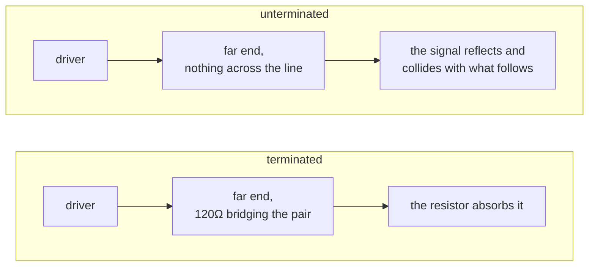

A bus long enough to matter is a transmission line, and a signal reaching the end of an unterminated
line does not simply stop. It reflects, travels back down the line, and collides with whatever is
following it.

A terminator is a resistor across the line at that end, sized to the line's characteristic impedance,
which absorbs the signal instead.

The value is not a choice. It is the impedance the bus standard specifies, which is why CAN
terminators are 120Ω on every board that has ever carried CAN. On a
[differential pair](../differential-pair/) the resistor bridges the two halves; on a single-ended bus
it goes to ground.

A profile declares the requirement rather than the board proving it, since a netlist cannot tell a
terminator from any other resistor of that value. See
[`profile-termination`](../../rules/profile-termination/).

**Where the course teaches it:** [chapter 1](../../../learn/01-what-a-board-is-made-of/) for the
resistor, [chapter 12](../../../learn/12-when-the-copper-matters/) for why the copper decides.
