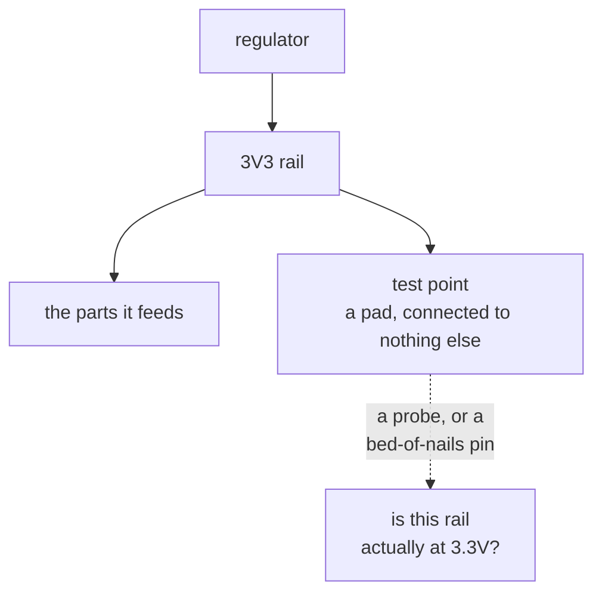

A pad whose only job is to be touchable. Nothing connects to it and nothing is built from it. It exists
so that someone holding a probe, or a bed-of-nails fixture on a production line, can reach a net that is
otherwise buried under a component or inside the board.

The question it answers is the first one anybody asks of a board that does not work: which rails came
up. Without a reachable point, answering that means finding a component leg to balance a probe on,
which is slow on a bench and impossible on a production fixture.

That is why [`test-point-coverage`](../../rules/test-point-coverage/) asks whether every rail carries
one. The rule only fires on a board that places test points **somewhere**, since a design with no
test-point convention is not wrong, it just has a different one.

For a software reader: a test point is a metrics endpoint, and the rule reads as "critical paths must
emit telemetry".

**Where the course teaches it:** nowhere yet. `test point` appears once in
[chapter 1](../../../learn/01-what-a-board-is-made-of/), inside a list of the part kinds a board
contains, and is never explained.
