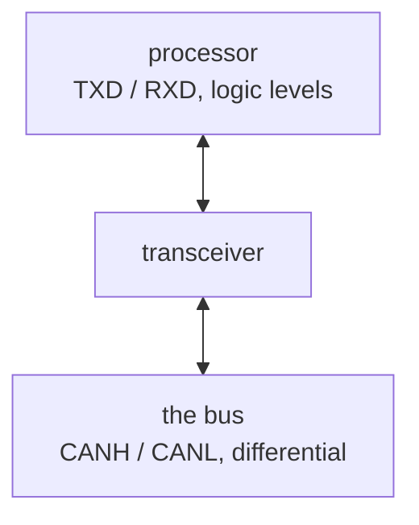

A processor talks in logic levels, a pin at 0V or at its rail. A bus standard rarely does. CAN uses a
differential voltage across two wires, RS-485 uses another, USB another again, and none of them are
something a general-purpose logic pin can drive or safely receive.

The transceiver sits between the two and translates.

It is the reason a bus interface is three or four nets at the processor and two on the connector, and
the reason a board can carry a bus without the processor knowing anything about the bus's electrical
spec.

Because it faces the outside world, a transceiver is usually the part that also carries the bus's
[protection](../port-protection/), or sits directly behind it.

**Where the course teaches it:**
[chapter 10](../../../learn/10-interfaces-and-what-they-require/), what an interface requires beyond
two wires.
