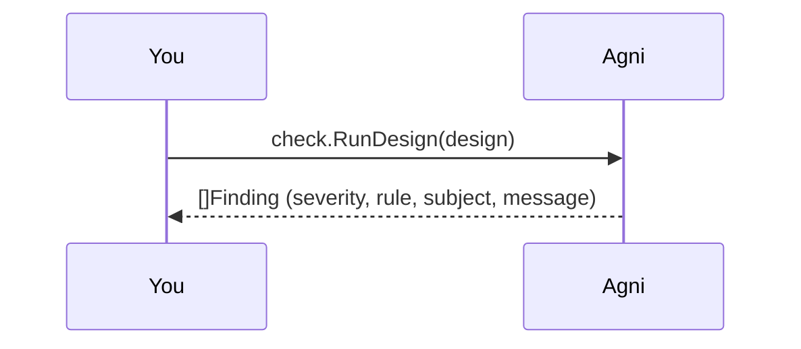

## Rules over the IR

agni's checks are rules evaluated over the neutral IR, not over source files, so they run the same on an EDIF netlist, a KiCad board, or an IPC-2581 export.

Each finding carries a severity (info, warning, error), the rule that fired, a subject (a net or a ref_des), and a message. This walkthrough runs the checks on a bundled design and reads them off.

## Pick a design {#pick}

> Give a path to any design (relative to this example folder), or your own file. The bundled designs live in ../common/designs: i2c-sensor.edn (built to trip one finding at each severity), two-resistors.edn (clean, no findings), demo-board.kicad_pcb, and demo-board.ipc2581.xml (each trips one rule). dangling-wire.kicad_sch is a schematic with wires drawn to empty space (see below).

## Run the checks {#run}

> check.Run applies the Phase-1 rule set and returns findings sorted by rule then subject. Nothing here reads a file: checks are pure IR operations, so a KiCad board and an EDIF netlist go through the exact same rules (CONSTRAINTS C1).

## What is not flagged

Two nets in i2c-sensor look wrong but are not. SDA is an I2C net, but it has a pull-up resistor (R1), so the i2c-pull-up rule stays quiet. NC_SPARE has a single pin, but its name marks it as an intentional no-connect, so single-pin-net skips it.

That no-connect awareness is what keeps the checks from drowning a real design in false positives (WS3-002). A rule that fires on every deliberate stub is a rule engineers turn off.

## Wires drawn to nothing

Run the checks on dangling-wire.kicad_sch to see the dangling-endpoint rule. A .kicad_sch stores connectivity as geometry: things connect only where their points coincide. A wire dropped a hair short of a pin looks connected but is not, and it never becomes a net, so no net-level rule can see it. The rule reports each such endpoint by its location.

The same fixture also shows what is not flagged: a wire ending on a junction dot, on a label, or meeting a second wire is connected, not dangling. Only the ends that touch nothing are reported.

## Pins that fight or float

Run the checks on driver-conflict.edn to see the pin-direction rules. output-output-conflict flags a net with two driving pins (two outputs, or two power sources) fighting each other; floating-input flags a net whose only pins are inputs, so nothing sets their level. Both read the pins' electrical direction, so they run on any reader that types its pins (EDIF here, KiCad schematics too).

These rules are deliberately conservative to stay quiet on real designs: a bidirectional bus is not an output-output conflict, and an input with a pull resistor or a driver is not floating. The related power-input-not-driven rule (a power pin with no source) is KiCad-specific, since it needs the power-in / power-out distinction EDIF does not carry.

## A check the reader catches, not the analysis

Run the checks on duplicate-refdes.kicad_sch to see duplicate-ref-des: two symbols both labelled U1 (unit 1) are a genuine duplicate. Notice where this one is decided. The IR keys components by ref-des and folds a multi-unit part into one component with sections, so by the time the netlist exists a duplicate is indistinguishable from a legitimate multi-gate part. Only the reader, mid-parse, can tell them apart (KiCad: the same unit claimed twice), so it records the collision as an input diagnostic and this rule just reports it. It is a "rule" in the catalog like any other, but its implementation site is the reader, not the analysis engine (see docs/19).

## Same thing from the CLI

This walkthrough is the narrated form of one command:

    agni check i2c-sensor.edn

The next rung on the ladder diffs two revisions of a design.
