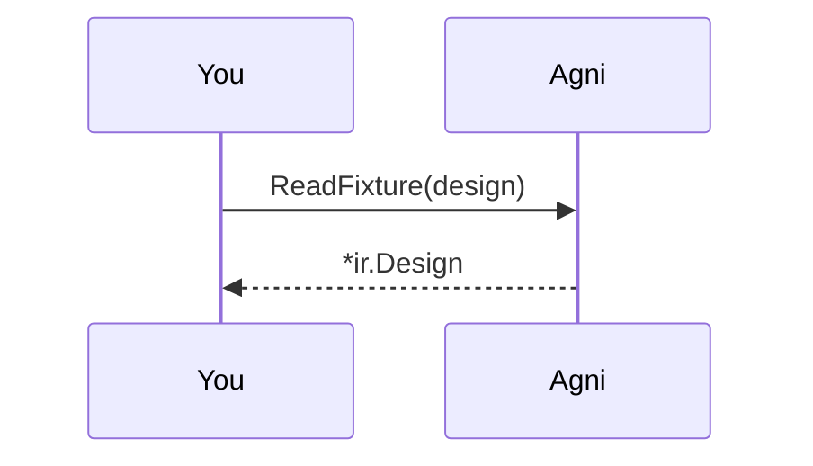
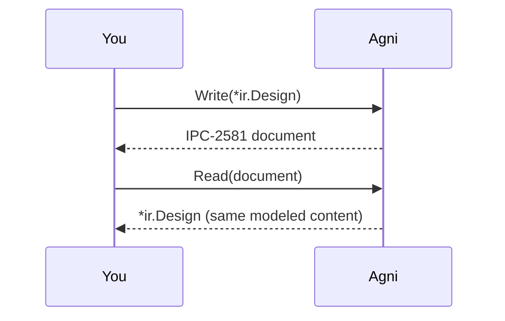

## One IR, many formats

Every reader normalizes its source format into the same neutral IR, and a writer emits from it. So converting format A to format B is just A -> IR -> B, with the IR as the pivot. This walkthrough reads any of three input formats and emits IPC-2581 from it.

## Pick an input design {#pick}

> Three synthetic fixtures, one per reader: a bare EDIF netlist, a KiCad board, and an IPC-2581 board (the two board formats also carry a physical tier). They all read into the same IR shape. That convergence is the point.

```inputs
- name: design
  prompt: Which input design?
  type: choice
  options: [two-resistors.edn, demo-board.kicad_pcb, demo-board.ipc2581.xml]
  default: demo-board.kicad_pcb
```

## Read it into the IR {#to-ir}

> The reader is chosen by extension (EDIF / KiCad / IPC-2581), the same dispatch agni's CLI does at its edge. Whatever the input, the result is one *ir.Design, so the stats below have the same shape regardless of source format.



## Choose an output format {#pick-format}

> The IR can be emitted back to a format. Today the writer is IPC-2581; more emitters slot in here as they land. Choosing it makes this an A -> IR -> IPC-2581 conversion, for example KiCad or EDIF into IPC-2581.

```inputs
- name: format
  prompt: Output format
  type: choice
  options: [ipc-2581]
  default: ipc-2581
```

## Emit, and prove the round-trip {#emit}

> Write the IR to the chosen format, then read the emitted document straight back. The re-read IR matches the input's on every modeled field, so the netlist and physical tier survive the round-trip. Geometry is not modeled yet (that is WS1-006), so this is a semantic round-trip, not byte-for-byte.



## Same thing from the CLI

This walkthrough is the narrated form of one command:

    agni emit demo-board.kicad_pcb             # IPC-2581 to stdout
    agni emit demo-board.kicad_pcb out.xml     # ... or to a file

So any format agni reads can be emitted as IPC-2581: KiCad -> IPC-2581, EDIF -> IPC-2581, or IPC-2581 -> IPC-2581 (the round-trip).
