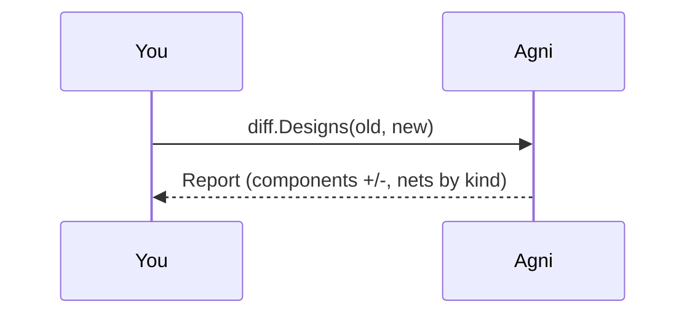

## Semantic diff over the IR

agni diffs two revisions over the neutral IR, not the source text, so it reports what changed electrically rather than which bytes moved. Nets are classified as renamed (same connectivity, new name), hard (connectivity changed), soft (attribute-only), new, or deleted. Components are added, removed, or changed.

Matching is on semantic keys: the net name, and the (ref_des, pin) connection set. A format-native id is never used, so a re-exported file with regenerated ids still diffs cleanly.

## Pick the old revision {#old}

> A path to the earlier revision, relative to this folder. Default: ../common/designs/rev-a.edn.

## Pick the new revision {#new}

> A path to the later revision. Default: ../common/designs/rev-b.edn. The bundled pair differs by one change of each class.

## Run the diff {#run}

> diff.Designs(a, b) matches nets by name first, then rename-detects the leftovers by identical connection signature. Only changes are reported; unchanged nets stay quiet.

## Same thing from the CLI

This walkthrough is the narrated form of one command:

    agni diff rev-a.edn rev-b.edn

The bundled rev-a to rev-b pair shows a rename (SIG to DATA), a hard change (CLK rewired), a new net, and a deleted net.
