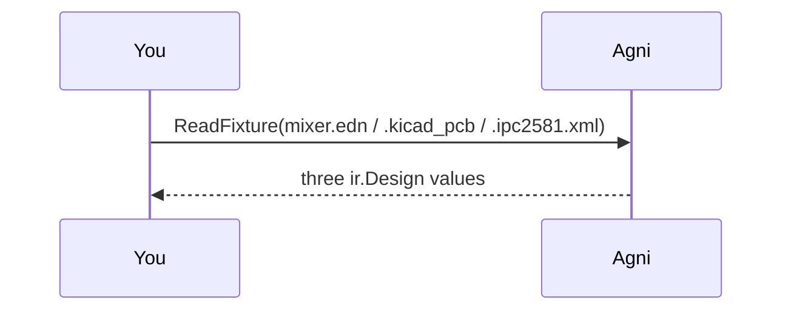

## Many readers, one IR

The platform bet is that many source formats normalize into one neutral IR, so everything downstream (diff, checks, analysis) is written once and works regardless of where the design came from.

This walkthrough proves it on one small board (R1, R2, U1; nets VCC, GND, SIG) authored three ways: an EDIF netlist, a KiCad PCB, and an IPC-2581 export. The bundled fixtures are the same board, hand-authored per format.

## Read the same board three ways {#read}

> Each reader normalizes its format into an ir.Design. The stats split into a netlist group and a format-detail group: the netlist block (components, nets, sections) is identical across all three — every component carries one section per placement, whether that section names a logical part (EDIF) or a footprint (KiCad/IPC) — while format detail (libraries for EDIF; footprints, layers, stackup, BOM for KiCad and IPC-2581) shows only what each format carries. That is the C9 promotion rule at work.

## Prove the netlists converge {#converge}

> Rather than eyeball it, use the diff engine as the oracle: diff.Designs(EDIF-read, KiCad-read) and diff.Designs(EDIF-read, IPC-read) should report zero net changes and the same component set. Same connectivity, keyed on (ref_des, pin), no matter which format it came from.

## What differs, and why

The netlists are identical, but the diff still reports component attribute changes (a Value, a part reference). That is expected: each format spells component metadata differently, and the physical tier only exists where the format carries it. The semantic netlist layer converges; the format-specific detail stays in attributes and the physical tier (CONSTRAINTS C9).

This is the whole thesis in one screen: write diff and checks against the IR once, and they work on EDIF, KiCad, and IPC-2581 alike.
