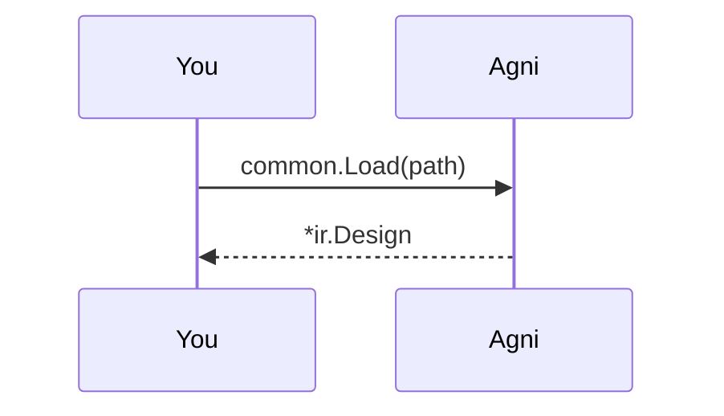

## The neutral IR

Every Agni reader normalizes one source format into the same neutral IR. It holds components (grouped by ref_des), sections, nets, and for board formats a physical tier of footprints, layers, and BOM lines.

Diff and checks run on that IR, so they never care which format you started from. This walkthrough reads a bundled design and shows what came back.

## Pick a design {#pick}

> Give a path to any design (relative to this example folder), or your own file. The bundled designs live in ../common/designs: two-resistors.edn (a bare netlist), demo-board.kicad_pcb, and demo-board.ipc2581.xml (both carry a physical tier, so the stats gain footprint and layer rows). No real boards ship in this repo.

## Read it into the IR {#read}

> Load picks a reader by extension: .edn goes to EDIF, .kicad_pcb to KiCad, .xml to IPC-2581. That is the same dispatch agni's CLI does at its I/O edge. File paths stay at the edge; the core readers only ever see an io.Reader (CONSTRAINTS C1).

## Look at the nets {#nets}

> A net is a set of connected pins. The (ref_des, pin) pair is the stable key that diff and checks match on across revisions and formats. A format-native id is regenerated per export, so it is never used as the key.

## Same thing from the CLI

This walkthrough is the narrated form of one command:

    agni stats two-resistors.edn

The next rungs on the ladder read the same IR to run structural checks and to diff two revisions.
