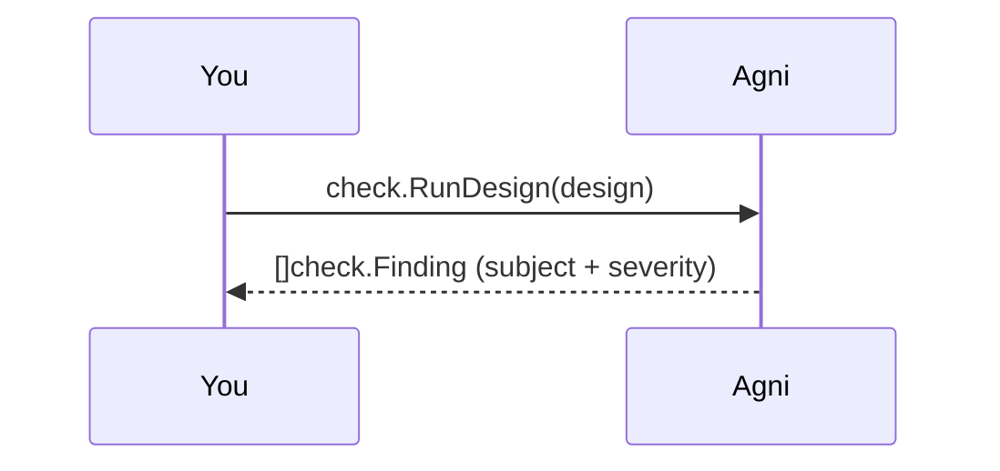
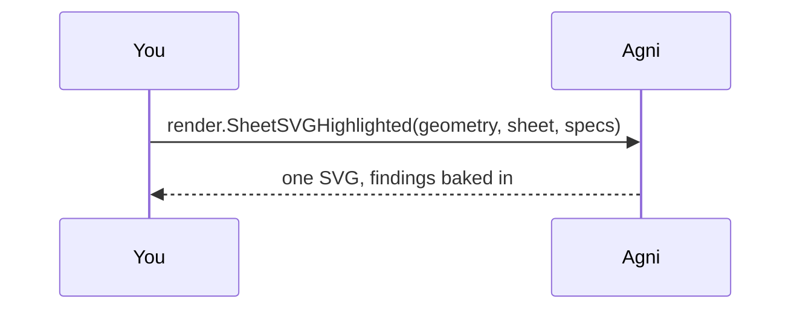

## A report finding, seen on the real design

A review report says "duplicate-ref-des on U1" but a reader still has to hunt for U1 on the schematic. This example closes that gap offline: it runs the rule catalog over a design, maps each finding's subject to a highlight, and bakes the highlights into one rendered SVG. The finding is now a picture. It is the static, no-server twin of the web viewer's click-to-locate, over the same HighlightSpec vocabulary the server projects as a live overlay.

Findings are computed on the netlist and located on the geometry by name (a net) or ref-des (a component), never merged as a second component source (CONSTRAINTS C21). So the picture is the design's own drawing with the flagged parts framed in place.

## Pick a design {#pick}

> Give a path to a schematic (relative to this example folder), or your own file. The default is a small KiCad schematic bundled in ../common/designs where two symbols share ref-des U1, so the run has one clear component finding whose subject draws on the faithful geometry.

## Run the rule catalog {#check}

> check.RunDesign builds the check.Model from the netlist and runs the built-in rules, returning a flat list of findings. Each finding names its subject: a net name, a ref-des, or a pin. Here it flags U1 as a duplicate ref-des.

## Bake the findings into the render {#render}

> Each finding's subject becomes one geom.HighlightSpec: a net draws as a PATH marker along its wire, a component or pin as a translucent bounding box, one box per matched placement, colored by severity. render.SheetSVGHighlighted draws the base sheet and composites those highlights onto ONE canvas, the same projection the server serves as a separate overlay, so the CLI static picture and the live viewer are one code path. It writes render.svg. Because U1 is duplicated, both offending symbols are framed.

## Same thing from the CLI

The render step is the narrated form of the `--highlight` flag: name a subject and it bakes into the SVG.

    agni render ../common/designs/duplicate-refdes.kicad_sch --highlight ref=U1,shape=rect -o render.svg

`--highlight` is repeatable, one subject per flag: `net=<name>`, `ref=<refdes>`, or `pin=<refdes>:<pin>`, with optional `shape=outline|rect|circle|path`, `color=#rrggbb`, and `alpha=0..1`. A net defaults to the PATH marker; a component or pin to an outline. This example builds the same specs from real findings instead of by hand, so the picture always matches what the checks found.
