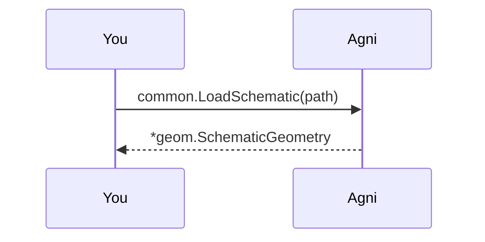

## Two renderers, one geometry

A schematic export carries geometry: symbol graphics, placements, wires, and pin locations. Agni reads it into a geometry sidecar, a separate artifact from the netlist IR, and renders it two ways over one render layer: an SVG backend for the offline and verification path, and a WebGL2 viewer for the browser. This walkthrough reads a bundled schematic and drives both.

Only EDIF `.eds` exports carry this geometry today, so this example is EDIF-only. KiCad and IPC-2581 produce the netlist IR instead (the `read-and-stats` example covers reading those); a KiCad-to-geometry reader would add another file type here.

## Pick a schematic {#pick}

> Give a path to a schematic .eds (relative to this example folder), or your own file. The default is a synthetic .eds bundled in ../common/designs, a small connector chain of a few parts, wires, and pins, so no real board ships here. Only .eds carries geometry today.

## Read it into the geometry sidecar {#read}

> common.LoadSchematic reads the .eds into a geom.SchematicGeometry (via edif.ReadSchematic): a symbol library drawn once, plus sheets of placements, wires, and labels. It is keyed to the netlist IR by stable ids and never contains the IR itself. File paths stay at the edge; the reader sees an io.Reader (CONSTRAINTS C1).

## Render a sheet to SVG {#svg}

> render.SheetSVG draws one sheet through the svg/ builder: symbols placed by their transform, pins landing on wire ends, wires, and labels. This is the offline and verification backend; it writes render.svg, which any viewer opens.

## Pack it for the WebGL viewer {#pack}

> render.PackSheet projects the sheet into the tier-2 columnar form (rebased int32 vertices plus fixed-width primitive records) that the browser uploads to the GPU once. This step writes the pack into web/ as a gitignored *.local.pb and prints the viewer URL: start the viewer with `cd web && pnpm dev`, then open the printed `http://localhost:5178/?src=...` to see the same geometry in WebGL2 (drag to pan, wheel to zoom).

## Same thing from the CLI

The two steps above are the narrated form of two commands:

    agni render      ../common/designs/demo-schematic.eds -o render.svg                        # faithful, SVG (both defaults)
    agni render --format=pack ../common/designs/demo-schematic.eds -o ../../web/demo-schematic.local.pb  # the pack the web/ viewer loads

Both backends read the one geometry sidecar, so the render logic stays in Go and the browser is a thin view (C1). The SVG path needs no browser; the WebGL path is the interactive one.
