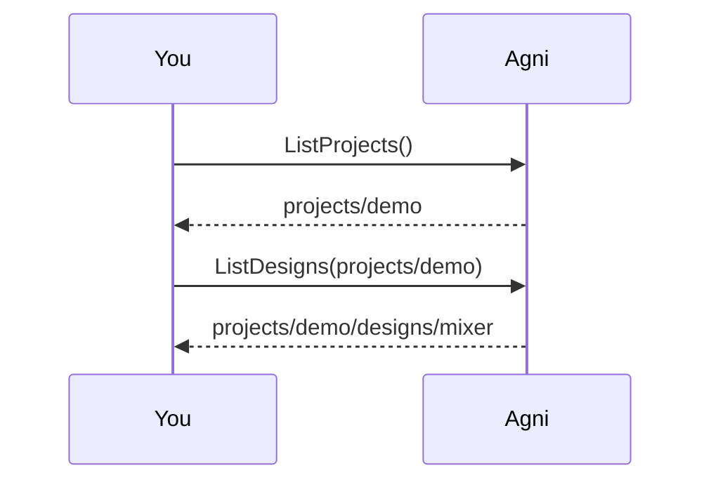
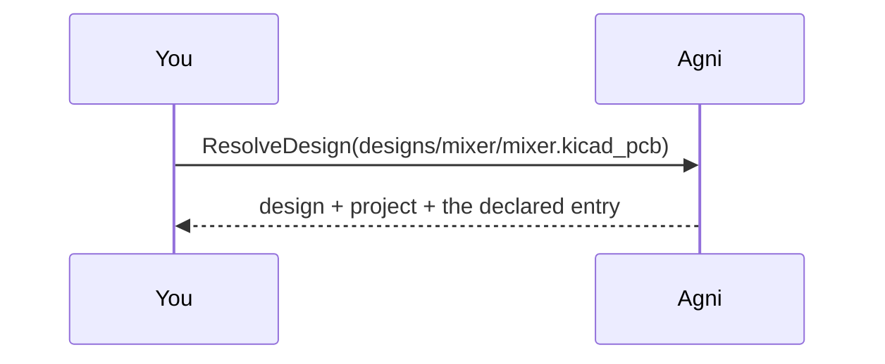

## A folder is not a design

Open a design folder and you find several files that all look openable: a netlist, a schematic export, a board. They are not interchangeable. The netlist is what the design team produces and what component and connectivity analysis has to read; the others are views of that same design, useful for drawing it and for pointing at where a finding lives.

Nothing on disk says which is which, so a tool opening the folder has to guess, and the guess is invisible. Reading the schematic export instead of the netlist gives a smaller component count with no error to explain it — on one real board, 565 against the netlist's 1385. A report built on the smaller number looks exactly like a report built on the right one.

Two small YAML files remove the guess. `project.yaml` names a set of designs that share configuration; `design.yaml` names one design, states which file is its `entry`, and lists the `companions` that are views of it.

## Pick a file to resolve {#pick}

> Give a path inside the bundled project (relative to its root), or press enter for the default. The bundled project is ../common/designs/demo-project: a `project.yaml` at the root and one design under designs/mixer, whose descriptor declares mixer.edn as the entry and mixer.kicad_pcb as a companion. The default is the BOARD, because that is the file whose resolution is interesting.

## What the tree declares {#list}

> The example builds the same ProjectService a server hosts, over a store pointed at the fixture folder instead of at mounts. Discovery walks down for descriptors and stops as soon as it finds one, so a design's own subfolders never turn into designs of their own. That the walk exists at all is a fact about this store, not about the service: a database-backed one answers the same questions without a directory anywhere.

## Resolve the file {#resolve}

> Resolution walks UP from the file, so the answer costs a few stats no matter how many designs the tree holds. A file belonging to no declared design is a MISS rather than an error, because that is the ordinary state of a mounted folder. A design with no project above it is NOT a miss: its declaration still says which file analysis reads, it just has no resource name, since a name needs a parent.

## Read both and compare {#read}

> On this fixture the two reads agree, and that is worth sitting with rather than engineering around. Neither answer carries any trace of which file produced it, so when they DO diverge — and on a real export they do, one observed board reading 565 components off the schematic view against the netlist's 1385 — the wrong report is indistinguishable from the right one. A guarantee that holds because the fixture is small is not a guarantee. That is why the fix is a declaration rather than a warning.

## Same thing from the CLI

The CLI resolves through the same descriptors:

    agni check designs/mixer                     # names the DESIGN: reads its entry, picks up the board companion
    agni check designs/mixer/mixer.kicad_pcb     # names a companion: reads the entry, says so on stderr
    agni check designs/mixer/mixer.kicad_pcb --as-named   # reads the file itself, for when that is the point

The last form exists because reading a companion as a netlist is a legitimate diagnostic: checking that two views of one design still agree means reading both and diffing them.
