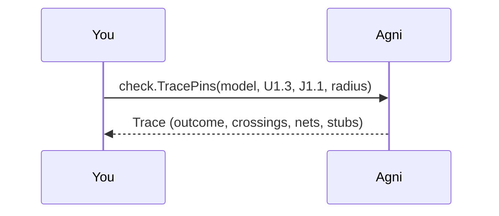

## A path is not a net

Two pins are joined by a net, which is the set of pins the copper connects. Put a resistor in the middle of a signal and the connection survives, but the net does not: the two ends of the part are electrically different points, so the netlist now holds two nets where a reader sees one wire.

That is why "is this pin connected to that one" is rarely a question about a net. It is a question about a path across however many parts happen to sit in the way, and a per-net query cannot see across a single resistor.

## Pick a design {#design}

> A path to the design, relative to this folder. Default: ../common/designs/i2c-sensor.edn, which carries an I2C bus with a pull-up resistor onto the supply rail. The other bundled fixtures live alongside it in ../common/designs/.

## Pick the two pins {#pins}

> Endpoints are pins, written as ref-des and pin designator. The defaults follow the sensor's SDA line from the device to the connector's supply pin, which runs through the pull-up.

```inputs
- name: from
  prompt: Start pin (ref-des.pin)
  type: string
  default: U1.3
- name: to
  prompt: End pin (ref-des.pin)
  type: string
  default: J1.1
```

## Walk it {#run}

> check.TracePins returns the outcome and the route from one call, so a caller cannot report a connection without the evidence for it. The walk crosses resistors, inductors, ferrites and fuses, which split a net without breaking the path. A capacitor is a DC block and is never crossed.



## Where the route stops {#terminus}

> The same trace, read for its last net. A supply rail touches almost every part on a real board, so a walk that continued through one would join everything to everything and prove nothing. The walk refuses to pass through such a net and will still stop on one, since a device pin sitting on a supply is an ordinary place to be asking about.
>
> Rail-scale is measured rather than assumed, from the global fact, the ground role, or a fan-out above the cutoff. This fixture has four pins on VCC, so it is a supply by name and not yet a rail by that measure, and the step below says which of the two reasons stopped the walk. Point the example at a real board and the other branch is the one you get.

## When there is no route {#noroute}

> Two pins with nothing between them. This is an ANSWER rather than a failure, so it names both nets and the radius it searched to. An endpoint that names nothing the design has is the different case, and it reports as unresolved rather than as a disconnection, because a pin spelled wrong and two pins genuinely not connected are opposite problems.

## Draw it {#draw}

> The route as text tells you R1 is in the way. It does not tell you where R1 is, what else hangs off the nets on either side of it, or whether the path you got is the one you meant. check.TracePins hands back the nets and the parts crossed, and those are exactly the subjects a highlight overlay takes, so drawing the answer is a conversion rather than a second walk.
>
> This writes route.svg beside the example. Open it in anything that shows an SVG. The design's own schematic is drawn where it has one, and an auto-layout of the netlist where it does not, which the command says so you never mistake the second for the first.

## Same thing from the CLI

This walkthrough is the narrated form of one command:

    agni trace ../common/designs/i2c-sensor --from U1.3 --to J1.1 --render route.svg

Add `--hops` to widen the search, and `--format json` for the machine-readable form. To look at the
whole design interactively rather than one route, `agni open ../common/designs/i2c-sensor` serves it
and prints a URL.
