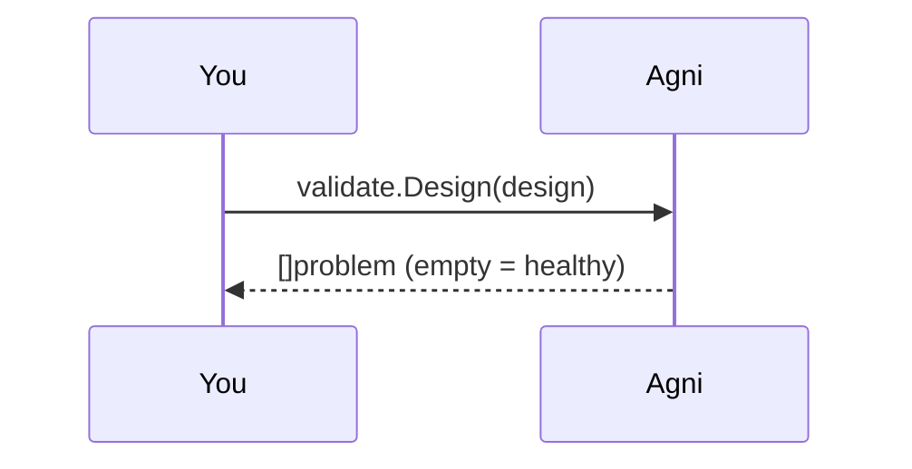

## Reader health, not design rules

`agni validate` answers a different question than `agni check`: not "is this design
correct" but "did the reader produce sane structure from this file". A reader regression
rarely errors; it silently drops nets or leaves placements pointing at symbols that do not
exist. The validate package holds those invariants as pure functions over the parsed
structures (CONSTRAINTS C1), and this walkthrough runs them the same way the CLI does.

## Pick a design {#pick}

> Give a path to any design (relative to this example folder), or your own file. The
> bundled i2c-sensor.edn is a healthy netlist; dangling-wire.kicad_sch is deliberately
> degenerate (wires drawn to empty space, no components), so it shows what failure looks
> like if you point the walkthrough at it.

## Validate the netlist tier {#netlist}

> validate.Design returns a problem list: empty means the netlist passed. The invariants
> are structural (components exist, nets exist), because "parsed fine but empty" is the
> classic silent-reader-regression shape.

## Validate the drawing tier {#geometry}

> Formats that carry a faithful schematic (EDIF .eds here) also get geometry invariants:
> sheets, symbols, placements, and wires exist, and at least 99% of placements resolve to
> a symbol definition. The resolution join is the same one the renderers draw by, so a
> broken cell/library normalization shows up here before anyone squints at a blank canvas.

## What failure looks like {#failure}

> An empty design fails with named problems rather than a boolean, so a corpus sweep's
> table tells you what broke per file. The CLI form (`agni validate <dir>`) walks whole
> corpus folders, prints this per file, and exits non-zero on any failure. It is the CI-shaped
> version of what this walkthrough just did.
