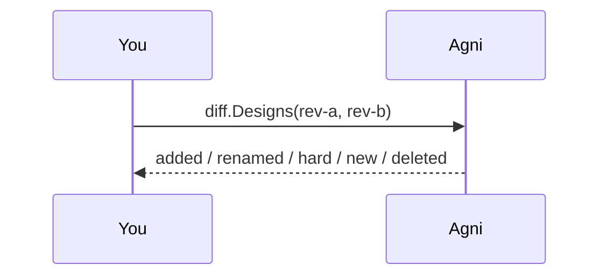
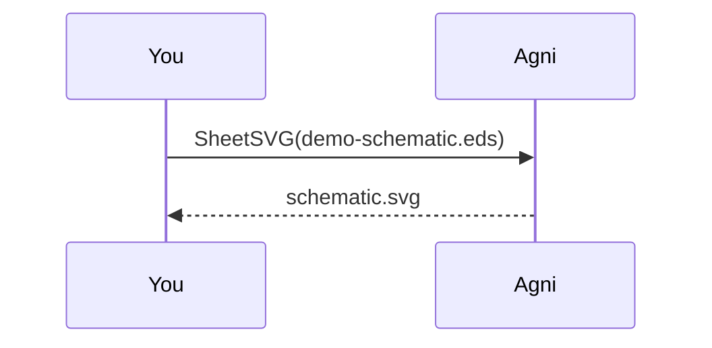

## What this shows

Agni reads many source formats into one neutral IR, and every tool runs over that IR, so it never matters which format you started from. This walkthrough runs the engine end to end on bundled synthetic designs: convergence across formats, structural checks, semantic diff, cross-format emit, and both renderers.

The copy/paste block under each step is the same thing at the CLI. They assume `agni` is on your PATH (`make install` from the repo root) and that you run them **from the repo root**, where `examples/common/designs/` holds the bundled fixtures. The `render` commands write their SVG into the current directory.

## Three formats, one netlist {#converge}

> The `mixer` board is bundled three ways: EDIF `.edn`, KiCad `.kicad_pcb`, and IPC-2581 `.xml`. We read all three and diff each against the EDIF. Zero net changes means the readers converged on the same netlist, which is the whole premise of the engine.

```mermaid
sequenceDiagram
You ->> Agni: read mixer.{edn, kicad_pcb, xml}
Agni -->> You: one IR each; the diffs are empty
```

```bash
agni stats examples/common/designs/mixer.kicad_pcb
agni diff  examples/common/designs/mixer.edn examples/common/designs/mixer.ipc2581.xml
```

## Structural checks {#check}

> `check.Run` applies structural rules to the netlist: single-pin nets, unconnected components, I2C pull-ups. The bundled i2c-sensor trips a few, and each finding carries provenance back to its source.

```bash
agni check examples/common/designs/i2c-sensor.edn
```

## Semantic diff of two revisions {#diff}

> The core of the review product. `rev-a` to `rev-b` is a hand-built revision pair: a component added, a net renamed with identical connectivity, a net rewired, one net added, one removed. The diff classifies each change by electrical impact and detects the rename instead of reporting it as an add plus a delete.



```bash
agni diff examples/common/designs/rev-a.edn examples/common/designs/rev-b.edn
```

## Emit: convert through the IR {#emit}

> Any format in, IPC-2581 out. We emit the mixer's EDIF netlist as IPC-2581 and read it straight back. The component and net counts survive, so the netlist round-trips. Geometry is a separate tier and is deferred.

```bash
agni emit examples/common/designs/mixer.edn                      # IPC-2581 to stdout
agni emit examples/common/designs/mixer.edn mixer.ipc2581.xml    # ... or to a file
```

## Render the schematic {#schematic}

> When a source carries schematic geometry (EDIF `.eds`), the engine renders a real sheet: symbols, wires, junctions, labels. This writes `schematic.svg`; open it to see the page. It is a faithful-geometry render, not an auto-layout.



```bash
agni render examples/common/designs/demo-schematic.eds -o schematic.svg
```

## Render the connectivity graph {#graph}

> When there is no schematic page (a board or a bare netlist), the engine lays the netlist out as a graph from the IR alone, so it works for every format. Layout is pluggable: `grid` is an edge-agnostic placeholder, `layered` ranks components into rows (Sugiyama-style) and reduces crossings. We score every layout by crossings, so a better layout is a smaller number, not an opinion. This step prints that quality table and writes the layered `graph.svg`.

> The payoff shows at scale. Run `--compare` on a real board and `layered` cuts crossings sharply against `grid`. More layouts (force-directed, orthogonal) are next, and the crossings metric is how we prove they help.

```bash
agni render --layout layered examples/common/designs/i2c-sensor.edn -o graph.svg
agni render --compare examples/common/designs/i2c-sensor.edn
agni render --compare path/to/your-board.edn   # the payoff at scale
```

## Go deeper

Each step above is its own example that accepts your own files: `read-and-stats`, `multi-format`, `checks`, `diff`, `convert`, `render-schematic`. This tour is rung 7 of that ladder.
