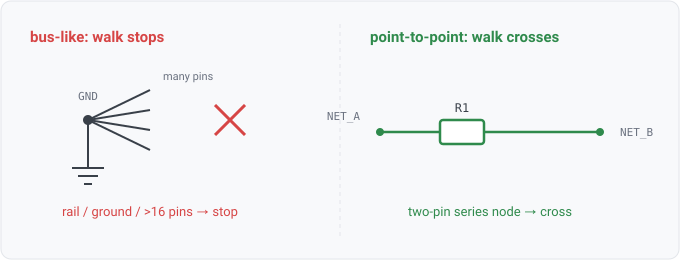

## net.bus_like

### What it is

`net.bus_like(net)` yields one row per net the engine treats as a shared-distribution node
rather than a point-to-point signal: a ground plane, a net marked global, or any net whose
fan-out is rail-scale. It is the named form of the exact predicate the series-reach walk
(`net.reaches`) refuses to cross, so "which nets are bus-scale?" is a query, not a constant buried
in the walk.

A net is bus-like when any one of three holds:

- it carries the `global` attribute (a power/ground rail resolved design-wide), or
- its name reads as ground (`GND`, `VSS`, `AGND`, ...), or
- more than 16 pins connect to it (rail-scale fan-out).

Distinct from `bus(label, kind)`, which reports a reader-detected *unmodeled bus label*
(WS1-034), a syntactic construct the reader saw but did not expand. `net.bus_like` is about a
solved net's electrical role, not a source-file token.

### For hardware engineers

These are the nets you would never trace a signal *through* to find what it drives. Ground,
global power distribution, and any net so heavily loaded that "what connects to it" is a distribution
question, not a path question. During a review you query it to sanity-check that the walk-based
rules (ESD, input-protection, feedback-probe) are stopping where you expect, and if a signal net you
thought was point-to-point shows up here, its fan-out is higher than intended, or its name
reads as a ground name.

### For software engineers

Think of a bus-like net as a **global singleton** in a dependency graph, where reachability analysis
must not follow an edge *into* it, or the whole graph collapses into one component. The series-reach
walk is a bounded BFS over pass elements (resistors, inductors, ferrites, fuses); `net.bus_like` is
its stop set. The relation is a projection over `Nets()` with a boolean filter, so rows are 1:1 with
nets that pass the predicate, and an empty result means the design is all point-to-point (no
global-marked nets, no ground-named nets, nothing over the fan-out ceiling).

### Go projector

`netBusLikeFacts` in `stdlib/relations/facts.go` walks `Model.Nets()` and emits a row for each net
where `check.IsBusLike(m, n)` holds. `IsBusLike` (in `core/check/reach.go`) is the single definition
shared with the `Reach` walk's stop check, so the relation and the walk cannot drift. One row per
bus-like net; empty for a purely point-to-point design.

### Datalog

List every bus-like net:

```
net.bus_like(?n) => ?n
```

Find components sitting on a bus-like net (the loads on rails and ground):

```
net.bus_like(?n), component.net(?r, ?n) => ?r
```

### Schematic


