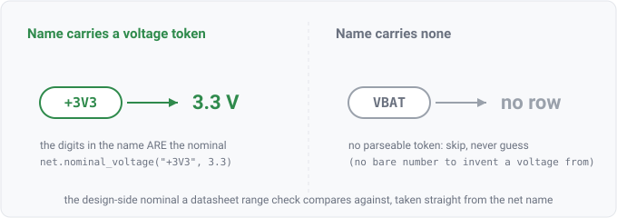

## net.nominal_voltage

### What it is

`net.nominal_voltage(net, volts)` yields the nominal voltage a rail's NAME declares — `+3V3` → 3.3,
`5V` → 5, `1V8` → 1.8. It reads only the net name (the same token grammar `net.max_voltage` falls
back to), so a net whose name carries no parseable voltage token, or whose tokens disagree
(`12V_TO_5V`), yields no row: the relation refuses to guess. Every row cites the net's IR source.

**Rails only.** The net must carry the rail role (ground counts) before its name is read. A non-rail
net whose name declares a level is on `net.signal_level` instead, and the two relations are
exhaustive and disjoint over the nets whose names parse.

That gate was missing until agni issue 194, and its absence is worth knowing about because the
relation still *worked*: the projector emitted a row for any net whose name parsed, so a team
encoding a signalling level into a signal net's name got that level back from a relation meaning
"rail nominal". A net named `U3_12_U7_4_3V3` yielded 3.3 while classifying as neither rail nor
ground. The number was right and the relation carrying it was not.



### For hardware engineers

This is the design's own statement of what a rail is supposed to be, taken from how the schematic
names it. It is not a measured or computed worst-case voltage — it is the label. That is enough to
compare a rail against a datasheet's recommended operating window: if a part wants 3.0–3.6 V on `VDD`
and the net feeding it is named `+5V`, the nominal alone tells you the rail is out of range. A rail
named without a voltage token (`VBAT`, `VBOOST`) simply has no nominal here.

### For software engineers

`net.nominal_voltage` is the design-side scalar a datasheet range check joins against. It is
deliberately split from `net.max_voltage`: `net.max_voltage` prefers an explicit `max_voltage`
attribute and only falls back to the name, so it can carry an engineer-annotated worst case;
`net.nominal_voltage` is name-only, the plain nominal, never the annotated max. Keeping them separate
means a rule states which evidence it wants. The projector wraps `nominalVoltageFromName`, the same
function `railMaxVoltage` and the rail rules already use.

**The rail gate is on the relation, not on that function.** `check.NominalVoltageFromName` takes a
bare name and has no net to ask about a role, so it cannot gate and does not try. A Go rule that
holds a net and means rails has to gate for itself with `Model.IsRailNet`; the pin-tracking rules are
the worked example. So the fact and the Go rules agree on the number but not automatically on the
SET, and that asymmetry is the thing to remember when authoring a rule against this relation.

### Go projector

`netNominalVoltageFacts` in `check/facts.go` iterates `Model.Nets()` and, for each net whose name
parses to a nominal via `nominalVoltageFromName`, emits one row with `Num` set to the voltage and a
citation to the net's IR provenance. Nets with no parseable name-nominal are skipped. This relation
is netlist-tier: it needs no `--params` and is populated on any read design.

### Datalog

List every rail with a name-derived nominal:

```
net.nominal_voltage(?net, ?v) => ?net, ?v
```

Join to a datasheet recommended window (needs `--params`) to compare a rail against the part it
feeds — see `param.range`:

```
component-on-net(?ref, ?net), net.nominal_voltage(?net, ?v),
component.mpn(?ref, ?mpn), param.range(?mpn, ?sym, "recommended_operating", ?min, ?max),
?v > ?max => ?ref, ?net, ?v
```
