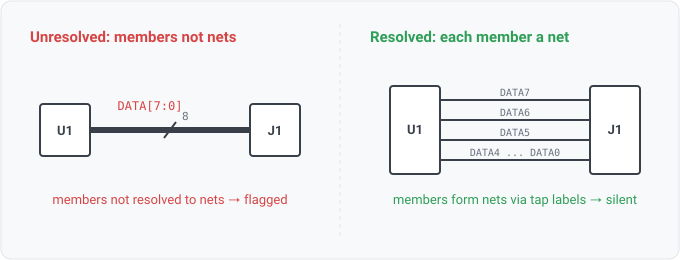

## bus-not-modeled

### What it means

A bus on the schematic (a gEDA `U` segment, a KiCad `bus` / `bus_alias`, an
xschem `NAME[n:0]` label, or an EDIF `array` port) whose member signals are NOT all resolved into
distinct nets. The bus names a set of members (a range `DATA[7:0]` expands to `DATA0..DATA7`, or a
`bus_alias` lists them); the finding fires when one or more of those members is not a net in the read.

### Why engineers want it

A bus is a drawing shorthand: one line stands for many signals. What
matters for every downstream answer (a diff, a rule, a highlight) is that each member ends up as its
own net. On a flat sheet that already happens: KiCad requires a member label on every bus tap, so the
members form nets by name and the bus is effectively modeled. The finding is SILENT there. It fires
where the members are genuinely unresolved, so the read-gap is visible instead of silent.

### Impact

Corrupt or missing connectivity for the unresolved members, with no other symptom until
a rule misfires or a diff lies. Info severity because the cause is the reader, not the design.

### The one subtlety

Resolution is checked by member NAME. A flat sheet's member labels are bare
(`DATA0`), so they match the bus's expanded members and the bus reads as resolved. A hierarchy read
qualifies a sheet-local member net per instance (`/amp1/DATA0`), which does NOT match the bare
`DATA0`, correctly flagging a bus whose members do not cross a sheet boundary (a hierarchical bus
port), the case where connectivity really is lost. Verified against `kicad-cli sch export netlist`:
a flat bussed sheet produces exactly the member nets, so the rule stays silent on it.

### Scope note

Detection + resolution-checking is where this rule stops. Actually EXPANDING a bus
across a sheet boundary (a hierarchical bus port) into crossing member nets is the remaining WS1-034
work; until then this rule flags those cases rather than silently mis-reading them. Drawing the bus
trunk on the canvas is a separate concern (WS7-042).

### Query structure

report each bus whose members are not all present as nets.

    select B in unmodeled_buses where exists M in members(B) : not net_exists(M)

Reads: bus.construct (a reader diagnostic), net.names. Tier P.
