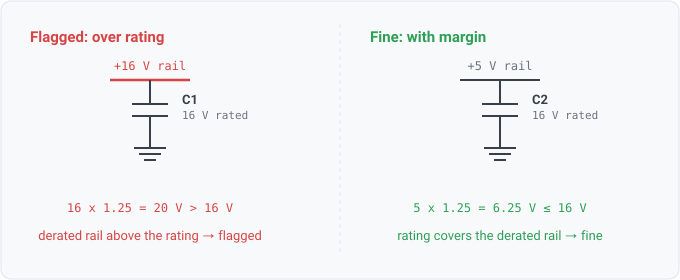

## cap-voltage

### What it means

A component classed as a capacitor, joined by MPN to a seeded datasheet
spec carrying a rated voltage (VDC/WV/VR-family symbol or a "Rated Voltage" row), sits on a
rail whose declared voltage times the derate factor (`1.25`) exceeds that rating.

### Why engineers want it

This rule turns the classic
review checklist item ("is every cap rated for its rail, with margin?") into a check
whose limit is the vendor's number with provenance, not a rule-of-thumb constant in code.
The finding cites the datasheet page/table so the margin is verifiable, on the datasheet layer's
whole posture (architecture/datasheet-layer.md).

### What it skips rather than guesses

Every untrusted input is a skip, never a guess: no MPN / unseeded MPN / no seeded corpus; no
machine-comparable rated-voltage row (architecture/datasheet-layer.md, "Comparison semantics");
units other than "V"; a rail with neither a max_voltage attribute nor a name-derived nominal. The
worst (highest) known rail among the cap's nets governs. Because a skip and a pass look the same to
the spec, the rule reports violations only and states no considered set.

### Query structure

Spec-authored (architecture/rules-and-checks.md, "A rule is a value"); the join and float
compare live in the cap_voltage_detail SpecFunc, which returns the violation sentence or "",
so the rule body stays AST and the derived Reads carry the param join as named relations.

    select C in components where class(C) == capacitor
      and cap_voltage_detail(C) != ""    // Vrated < worst_rail_V x 1.25, seeded and comparable

Reads: param.cap_rated_voltage, net.max_voltage, component.mpn, component.class, on_net. Tier R.