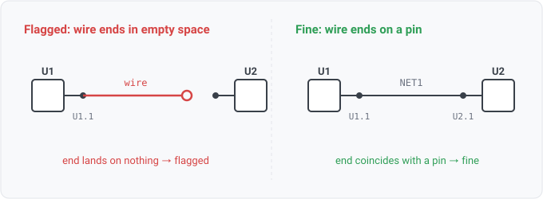

## dangling-endpoint

### What it means

A schematic wire whose end lands on empty space: no pin, no junction dot, no
label, and no other wire endpoint sits at that point. The author drew a connection and stopped a
hair short, so the wire connects nothing.

### Why engineers want it

A .kicad_sch (and xschem/gEDA) stores connectivity as geometry: two
things connect only when their points coincide. A wire dropped a grid step away from a pin looks
connected on screen but is not. This is the geometric sibling of single-pin-net: single-pin-net
catches a net wired to one pin, this catches a wire wired to zero, a link that never became a net
at all, so no net-level rule can see it.

### Impact

The connection the author meant to make is missing, and nothing downstream reveals it
because the wire produced no net. Every ERC ships a dangling-end check for exactly this reason.

### Scope

Endpoint-on-nothing only. The disguised sibling, a wire end landing mid-span on
another wire's body with no junction dot, is wire-no-junction (WS1-012).

### Query structure

the reader computes the dangling endpoints from wire geometry; the rule
reports them.

    select E in dangling_endpoints

Reads: wire.endpoint, wire.junction. Tier P.