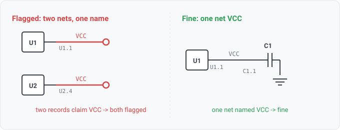

## duplicate-net-name

### What it means

More than one net in the design states the same non-empty name.

### Why engineers want it

On schematic formats connectivity IS naming, since same-named labels
join, so this cannot happen there by construction (the solver merges them; see
label-alias-conflict for the collapsed-alias hazards). It happens on formats with EXPLICIT
net lists (an EDIF netlist can state two (net VCC ...) entries) and wherever a tool export
or a reader gap splits one logical net into two records. Either way, every consumer that
keys on net names, whether diff identity, board joins or reviews, is now quietly wrong.

### Impact

A revision diff keyed by name sees one net where the design has two; a
schematic-vs-board join attaches findings to the wrong copper.

### Scope note

Fires once per claiming net (each is a place to fix). Synthesized stub
names (N$, unconnected-(...)) are per-net reader inventions and never collide; empty names
carry no claim. A firing on a fresh format's corpus is ALSO a read-health signal, so check
the reader before the design (the pin-net-conflict lesson).

### Query structure

select the nets whose exact name is stated by two or more nets.

    select N in nets where count(M : M in nets, M.name == N.name) >= 2

Reads: net.names. Tier R.