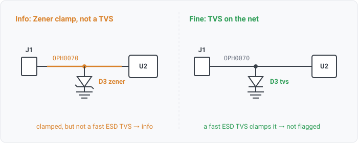

## esd-clamp-not-tvs

### What it means

An externally-exposed signal net (on a connector) has a **Zener clamp** in reach but no fast
**ESD TVS**. The net is not unprotected, it is protected by a different device class than the one
an ESD review usually asks for.

### Why engineers want it

ESD compliance (IEC 61000-4-2) is a nanosecond-scale event; a TVS is engineered to turn on that
fast and shunt the strike. A Zener diode clamps too, but slower and at higher clamping energy, so
it is commonly a load-dump / flyback clamp on an output rather than a signal-ESD device. Flagging
"clamped by a Zener, not a TVS" lets a reviewer decide, per their checklist, whether that satisfies
the ESD requirement for that pin or whether a dedicated TVS is still wanted. It is deliberately
**info** severity: the finding is a distinction to weigh, not a defect.

### Impact

Reported so a review can tell "this pin has a Zener clamp" apart from "this pin has nothing." An
ESD-specific checklist item may accept it or require a TVS; a load-dump item may consider it done.

    OPH0070 ---[ J1 ]---[ D3 zener ]---[ U2 ]   clamped, but not a fast TVS -> info
    OPH0070 ---[ J1 ]---[ D3 tvs   ]---[ U2 ]   fast ESD clamp              -> not flagged

### Scope note

This rule and `esd-protection` partition the same external-signal nets (connector member, no power
pins, no rail facts, no ground / power-rail name, and not on a power path; see `esd-protection` for
the shared definition). A net with **no** protection in reach is `esd-protection`; a net whose only
protection in reach is a **Zener clamp** (no TVS, no IC ESD rating) is this rule. The two are mutually
exclusive on any one net, so moving a net here removes it from the `esd-protection` count without
hiding it. A TVS or a datasheet IC-ESD rating in reach satisfies both rules (neither fires).

The Zener is recognized by classification: a part whose `Description` (or other part text) carries a
`zener` token classifies as the `zener` device class (distinct from `tvs`), the same
netlist-derived, config-extensible class lexicon that recognizes a TVS. As with the TVS check, the
clamp may sit one series hop away (the reach walk is 2-hop), so a series resistor between the
connector and the clamp does not hide it.

### For software readers

A Zener clamp is a slower, higher-energy pressure-relief valve than a TVS. Both sit *beside* the
signal path and shunt overvoltage to ground; the TVS is the one rated for the fast ESD spike. This
rule is a **classifier**, not a gate: it re-labels a subset of what `esd-protection` would otherwise
call "unprotected" as "protected by the wrong class," so a downstream policy (a review manifest) can
route it to pass or fail without the engine hard-coding that judgment.

### Query structure

select external signal nets with a Zener clamp in reach and no TVS / IC-ESD rating.

    select N in nets where exists C in N.connections where class(C) == connector
      and not exists P in N.connections where pin_dir(P) in {power_in, power_out}
      and not ground_name(N) and not rail_name(N) and not global(N) and not intentional_nc(N)
      and not tvs_reach(N) and not ic_esd_rated(N)
      and zener_reach(N)

Reads: component.class, net.attributes, net.names, on_net, pin.electrical_type, pin.no_connect,
param.esd_rating (the IC-ESD exemption, optional). Tier R.
